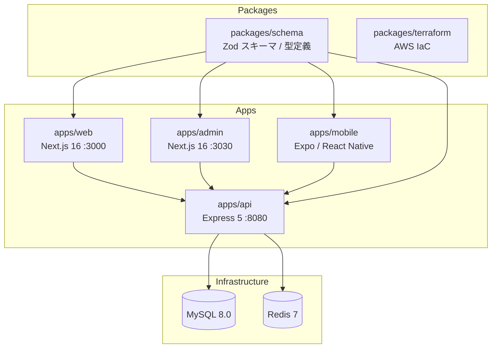

# project-template

Turborepo + pnpm monorepo を使用したフルスタックアプリケーションテンプレート

## プロジェクト概要


```mermaid
graph TB
    subgraph Apps
        Web["apps/web<br/>Next.js 16 :3000"]
        Admin["apps/admin<br/>Next.js 16 :3030"]
        Mobile["apps/mobile<br/>Expo / React Native"]
        API["apps/api<br/>Express 5 :8080"]
    end

    subgraph Packages
        Schema["packages/schema<br/>Zod スキーマ / 型定義"]
        Terraform["packages/terraform<br/>AWS IaC"]
    end

    subgraph Infrastructure
        MySQL[(MySQL 8.0)]
        Redis[(Redis 7)]
    end

    Web --> API
    Admin --> API
    Mobile --> API
    API --> MySQL
    API --> Redis
    Schema --> Web
    Schema --> Admin
    Schema --> Mobile
    Schema --> API
```

## 技術スタック

### モノレポ・ビルド


### バックエンド


### フロントエンド


### モバイル


### 認証


### データベース・キャッシュ


### インフラ・CI/CD


## ドキュメント

### アーキテクチャ

- [API サーバー](docs/architecture/api.md) — レイヤードアーキテクチャ、DB スキーマ、エンドポイント一覧
- [Web / Admin アプリ](docs/architecture/web.md) — App Router 構成、型共有パターン
- [Mobile アプリ](docs/architecture/mobile.md) — Expo / React Native 構成、ナビゲーション
- [インフラ構成](docs/architecture/infrastructure.md) — AWS 構成、Terraform モジュール、CI/CD

### 仕様書・設計

- [仕様書](docs/spec/) — 機能仕様書・設計ドキュメント

## 環境構築

1. 管理者に.env.keysをもらってルートに配置してください。（シンボリックはgitにpush済み）

2. 依存関係のインストール:
```bash
pnpm install
```

3. Docker 環境の起動（MySQL + Redis）:
```bash
docker compose up -d
```

4. スキーマパッケージのビルド:
```bash
cd packages/schema && pnpm build
```

5. 開発サーバーの起動:
```bash
pnpm dev
```

## 開発コマンド

### 基本コマンド

```bash
pnpm dev          # 全アプリを開発モードで起動
pnpm build        # 全アプリをビルド
pnpm lint         # ESLint 実行
pnpm lint:fix     # ESLint 自動修正
pnpm test         # テスト実行
```

### pnpm ワークスペースコマンド

```bash
# 特定のワークスペースでコマンドを実行
pnpm --filter <workspace-name> <command>

# 例: webアプリのみ起動
pnpm --filter web dev

# すべてのワークスペースに依存関係を追加
pnpm add -w <package-name>

# 特定のワークスペースに依存関係を追加
pnpm --filter <workspace-name> add <package-name>

# 特定のワークスペースのdevDependenciesに依存関係を追加
pnpm --filter web add -D @types/node

# 依存関係を削除
pnpm --filter <workspace-name> remove <package-name>

# すべての node_modules を削除して再インストール
pnpm clean && pnpm install
```

### Docker環境の起動

```bash
# Dockerコンテナを起動
docker compose up -d

# コンテナの状態を確認
docker compose ps

# ログを確認
docker compose logs -f

# コンテナを停止
docker compose down

# データを含めて完全に削除
docker compose down -v
```
