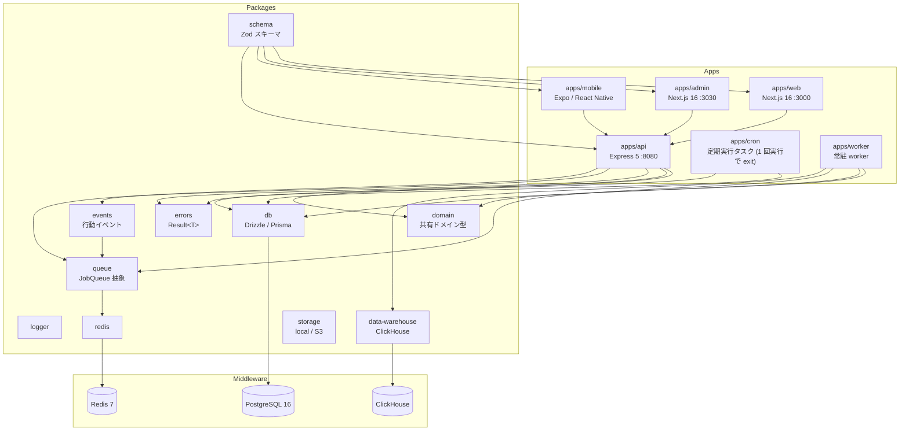

<!-- TODO: プロジェクト名に変更してください -->
# project-template

Turborepo + pnpm モノレポのフルスタックアプリケーションテンプレート。

Web / Admin / Mobile のフロントエンド、Express の API、定期実行タスク（cron）、常駐 worker と、それらが共有する DB / ロガー / エラー型 / キュー / 分析イベント基盤を最初から揃えています。AWS（ECS Fargate）へのデプロイ用 Terraform と GitHub Actions も含まれます。

- **このテンプレートから新しいプロジェクトを作る** → [新規プロジェクトを作る](#新規プロジェクトを作る)
- **既存プロジェクトの開発に参加する** → [ローカル開発を始める](#ローカル開発を始める) → [ドキュメント案内](#ドキュメント案内)

## 目次

- [新規プロジェクトを作る](#新規プロジェクトを作る)
  - [1. テンプレートをコピーする](#1-テンプレートをコピーする)
  - [2. プロジェクト名を置き換える](#2-プロジェクト名を置き換える)
  - [3. 環境変数の鍵を作り直す](#3-環境変数の鍵を作り直す)
  - [4. AWS にデプロイする（必要になったら）](#4-aws-にデプロイする必要になったら)
- [ローカル開発を始める](#ローカル開発を始める)
  - [前提ツール](#前提ツール)
  - [手順](#手順)
  - [ポート](#ポート)
  - [よく使うコマンド](#よく使うコマンド)
- [構成](#構成)
  - [技術スタック](#技術スタック)
- [ドキュメント案内](#ドキュメント案内)
  - [アーキテクチャと規約（まずここから）](#アーキテクチャと規約まずここから)
  - [セットアップ・運用](#セットアップ運用)
  - [各 app](#各-app)
  - [仕様・設計](#仕様設計)
  - [Claude Code](#claude-code)
- [開発のルール](#開発のルール)
  - [env は dotenvx で管理する](#env-は-dotenvx-で管理する)
  - [コーディング規約](#コーディング規約)

## 新規プロジェクトを作る

### 1. テンプレートをコピーする

```bash
# プロジェクト名を指定する
./scripts/setup/copy-template.sh ../my-new-app my-new-app

# プロジェクト名を省略すると、コピー先のディレクトリ名が使われる
./scripts/setup/copy-template.sh ~/workspace/my-new-app
```

git 管理のファイルのうちコミット済みの内容（HEAD）だけを、`.env.keys`（各 app の symlink）/ `pnpm-lock.yaml` / `.serena` を除いてコピーし、ルート `package.json` の `name` を置換します。コミットしていない変更はコピーされません。

### 2. プロジェクト名を置き換える

`project-template` という名前がコード内に残っています。`TODO: プロジェクト名に変更` のコメントが目印です。

```bash
git grep -n "project-template"
```

主な箇所は `README.md` / `docker-compose.yaml`（コンテナ名・DB 名）/ `infra/terraform/`（bootstrap の state バケット名など）/ `.github/workflows/` です。

### 3. 環境変数の鍵を作り直す

コピーした各 app の `.env.local` は、テンプレートの鍵で暗号化されたままです。新しいプロジェクト用の鍵で暗号化し直してください。コマンドは **必ずプロジェクトルートで** 実行します（理由は [env は dotenvx で管理する](#env-は-dotenvx-で管理する) を参照）。

```bash
# 1. テンプレートの .env.keys を一時的にルートへ置き、平文に戻す
for app in api web admin mobile cron worker; do
  npx dotenvx decrypt -f apps/$app/.env.local
done
rm .env.keys

# 2. 新しい鍵で暗号化する（ルートに新しい .env.keys が生成される）
for app in api web admin mobile cron worker; do
  npx dotenvx encrypt -f apps/$app/.env.local
done

# 3. 各 app からルートの .env.keys を参照する symlink を張り直す
for app in api web admin mobile cron worker; do
  ln -s ../../.env.keys apps/$app/.env.keys
done
```

生成された `.env.keys` は git に入りません。チームメンバーにはリポジトリ外の安全な経路で渡してください。

### 4. AWS にデプロイする（必要になったら）

初回セットアップ（bootstrap → account → GitHub Environments → env apply → DNS 委任 → seed-secrets → image push）は [docs/setup/infra.md](docs/setup/infra.md) の手順に従います。

## ローカル開発を始める

### 前提ツール

- Node.js >= 18
- pnpm >= 9
- Docker（Postgres / Redis / ClickHouse をローカルで起動するため）

### 手順

```bash
# 1. 依存をインストールする
pnpm install

# 2. 管理者から受け取った .env.keys をプロジェクトルートに置く
#    （各 app の .env.keys はルートへの symlink として git 管理されている）

# 3. Postgres / Redis / ClickHouse を起動する
docker compose up -d

# 4. Prisma Client を生成し、Drizzle の migration を適用する
pnpm --filter @repo/db prisma:generate
pnpm --filter api db:migrate

# 5. ClickHouse に CDC の view を作る（テーブルが migrate で作られた後にしか作れないため）
docker exec project-template-clickhouse bash /docker-entrypoint-initdb.d/03-postgres-cdc-views.sh

# 6. 全アプリを起動する
pnpm dev
```

app 単体で起動するときは `pnpm --filter <app> dev`（例: `pnpm --filter web dev`）を使います。API のテスト実行や seed 投入などの詳細は [docs/setup/api.md](docs/setup/api.md) を参照してください。

### ポート

| サービス | URL / 接続先 |
|---|---|
| web | http://localhost:3000 |
| admin | http://localhost:3030 |
| api | http://localhost:8080 |
| Postgres | `localhost:5433` |
| Redis | `localhost:6380` |
| ClickHouse | `localhost:8124`（HTTP）/ `localhost:9003`（native） |

ミドルウェアのポートは、他プロジェクトとの衝突を避けるため既定値からずらしています。変えたい場合は `POSTGRES_PORT` などの環境変数で上書きできます（`docker-compose.yaml` を参照）。

### よく使うコマンド

```bash
pnpm dev          # 全アプリを dev 起動
pnpm build        # 全アプリをビルド
pnpm lint         # ESLint
pnpm lint:fix     # ESLint 自動修正（ファイル変更後に実行する）
pnpm test         # テスト
```

## 構成


```mermaid
graph TB
    subgraph Apps
        Web["apps/web<br/>Next.js 16 :3000"]
        Admin["apps/admin<br/>Next.js 16 :3030"]
        Mobile["apps/mobile<br/>Expo / React Native"]
        API["apps/api<br/>Express 5 :8080"]
        Cron["apps/cron<br/>定期実行タスク (1 回実行で exit)"]
        Worker["apps/worker<br/>常駐 worker"]
    end

    subgraph Packages
        Schema["schema<br/>Zod スキーマ"]
        Domain["domain<br/>共有ドメイン型"]
        DB["db<br/>Drizzle / Prisma"]
        Logger["logger"]
        Errors["errors<br/>Result&lt;T&gt;"]
        RedisPkg["redis"]
        Queue["queue<br/>JobQueue 抽象"]
        Events["events<br/>行動イベント"]
        DWH["data-warehouse<br/>ClickHouse"]
        Storage["storage<br/>local / S3"]
    end

    subgraph Middleware
        PostgreSQL[(PostgreSQL 16)]
        Redis[(Redis 7)]
        ClickHouse[(ClickHouse)]
    end

    Web --> API
    Admin --> API
    Mobile --> API

    Schema --> Web
    Schema --> Admin
    Schema --> Mobile
    Schema --> API

    API --> Domain
    API --> DB
    API --> Errors
    API --> Events
    API --> Queue
    Cron --> DB
    Cron --> Errors
    Worker --> Domain
    Worker --> DB
    Worker --> Queue
    Worker --> DWH

    Events --> Queue
    Queue --> RedisPkg
    DB --> PostgreSQL
    RedisPkg --> Redis
    DWH --> ClickHouse
```

矢印は「左が右を使う」の向きです。`logger` はすべての server-side app と大半の package が使うため省略しています。`storage` は現時点ではどの app からも使われていません（必要になった app で DI して使います）。

| パッケージ | 役割 |
|---|---|
| [packages/schema](packages/schema/README.md) | API のリクエスト / レスポンスの Zod スキーマ（`@repo/api-schema`）。フロントと API で共有する |
| [packages/domain](packages/domain/README.md) | api / cron / worker が共有するドメイン型と純粋関数 |
| [packages/db](packages/db/README.md) | DB スキーマ / migration / client factory。Drizzle を使い、Prisma は repository 実装の切り替え先として併存 |
| [packages/logger](packages/logger/README.md) | `ILogger` と pino / winston / console / silent 実装 |
| [packages/errors](packages/errors/README.md) | `Result<T>` / `ApiError` / 業務エラー生成ヘルパ |
| [packages/redis](packages/redis/README.md) | `createRedisClient` |
| [packages/queue](packages/queue/README.md) | `JobQueue` / `JobConsumer` の抽象と BullMQ 実装 |
| [packages/events](packages/events/README.md) | 行動イベントの型と `EventTracker`（fire-and-forget で送出） |
| [packages/data-warehouse](packages/data-warehouse/README.md) | `DataWarehouse` 抽象と ClickHouse 実装 |
| [packages/storage](packages/storage/README.md) | `createStorage` と local / S3 実装 |
| [packages/eslint-config](packages/eslint-config/README.md) / [packages/typescript-config](packages/typescript-config/README.md) | 共有 lint / tsconfig |

### 技術スタック

#### モノレポ・ビルド


#### バックエンド


#### フロントエンド


#### モバイル


#### 認証


#### データベース・キャッシュ・分析


#### テスト


#### ロギング・環境変数


#### インフラ・CI/CD


## ドキュメント案内

### アーキテクチャと規約（まずここから）

初めて参加する人が、アーキテクチャとコーディング規約を最短でキャッチアップするためのドキュメントです。[docs/onboarding/README.md](docs/onboarding/README.md) から読む順番に沿って進めてください。

| ドキュメント | 内容 |
|---|---|
| [architecture.md](docs/onboarding/architecture.md) | ディレクトリ構成（モノレポ全体 / API レイヤード / フロントの features 分離） |
| [infrastructure.md](docs/onboarding/infrastructure.md) | インフラ構成（AWS / ECS / RDS / Terraform 3 層 / デプロイフロー） |
| [naming.md](docs/onboarding/naming.md) | ファイル名 / 変数名 / 関数名の命名規則 |
| [error-handling.md](docs/onboarding/error-handling.md) | エラーハンドリング（`Result<T>` / 業務エラーと想定外エラー） |
| [testing.md](docs/onboarding/testing.md) | テスト戦略 / 正常系・異常系の分類 / モック方針 |
| [auth.md](docs/onboarding/auth.md) | 認証（JWT / httpOnly cookie / middleware ガード） |

### セットアップ・運用

| ドキュメント | 内容 |
|---|---|
| [docs/setup/api.md](docs/setup/api.md) | API のローカル起動・テスト実行の詳細 |
| [docs/setup/infra.md](docs/setup/infra.md) | AWS インフラの初回セットアップ |
| [infra/README.md](infra/README.md) | インフラ構成 / dev と prd の差分 / デプロイフロー / 日常運用コマンド |

### 各 app

設計と運用方針は各 app の README、実装時の規約は各 app の `CLAUDE.md` にあります。

| app | 内容 |
|---|---|
| [apps/api](apps/api/README.md) | レイヤードアーキテクチャ / Result 型 / DI / テスト戦略 |
| [apps/web](apps/web/README.md) | Web アプリ |
| [apps/admin](apps/admin/README.md) | 管理画面 |
| [apps/mobile](apps/mobile/README.md) | モバイルアプリ |
| [apps/cron](apps/cron/README.md) | 定期実行タスク（本番は EventBridge 等で起動） |
| [apps/worker](apps/worker/README.md) | Queue を処理する常駐 worker |

### 仕様・設計

| ドキュメント | 内容 |
|---|---|
| [docs/spec/README.md](docs/spec/README.md) | 機能仕様の一覧。新機能は実装前にここへ設計書を作る |

### Claude Code

| ドキュメント | 内容 |
|---|---|
| [CLAUDE.md](CLAUDE.md) | Claude Code 向けのプロジェクト全体ガイド |
| [.claude/README.md](.claude/README.md) | Agents / Commands / Skills の設定 |
| [docs/mcp.md](docs/mcp.md) | MCP サーバーの一覧・使い方・追加方法 |

MCP サーバーの設定はルートの `.mcp.json` にあります。起動時に読み込ませるには `claude --mcp-config=./.mcp.json` を使います。

## 開発のルール

### env は dotenvx で管理する

env を必要とする app / package は、例外なく [dotenvx](https://dotenvx.com/) で管理します。

- 値は各 app の `.env.local` に置き、ルートの `.env.keys` で暗号化してコミットする
- 起動スクリプトは `dotenvx run -f .env.local -- <command>` を経由する。スクリプトに `DATABASE_URL=...` のように env を直書きしたり、独自の env ローダを持ち込まない
- 本番はコンテナ / CI 側が env を渡す。dotenvx は既にセットされた env を上書きしないため、`dotenvx run` を経由したままでも本番の値が優先される

値の追加・更新は **必ずプロジェクトルートで** 実行します。app のディレクトリに `cd` して実行すると、symlink の `.env.keys` が実体ファイルで上書きされ、app ごとに別の鍵が生成されてしまいます。

```bash
npx dotenvx set KEY "value" -f apps/<app>/.env.local   # 値を追加・更新する
npx dotenvx get -f apps/<app>/.env.local               # 復号した値を確認する
```

新しく env を必要とする app / package を追加したら、`ln -s ../../.env.keys <dir>/.env.keys` で symlink を張り、`.env.local` を作って `dotenvx run` 経由で起動します。

### コーディング規約

命名・コメント・関数の書き方など、lint で強制できない規約は [CLAUDE.md](CLAUDE.md#code-style) と [docs/onboarding/](docs/onboarding/README.md) にまとめています。ファイルを変更したら `pnpm lint:fix` を実行してください。
