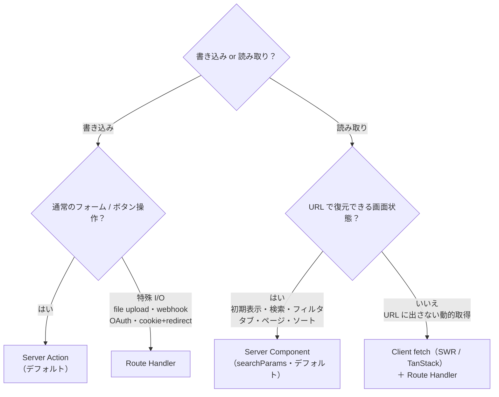

# Web Application

Next.js 16 (App Router) を使用した Web アプリケーション

## 目次

- [アーキテクチャ](#アーキテクチャ)
  - [ディレクトリ構成](#ディレクトリ構成)
  - [依存の方向](#依存の方向)
  - [API型の利用ルール](#api型の利用ルール)
  - [設計原則](#設計原則)
  - [コンポーネントの分類基準](#コンポーネントの分類基準)
  - [Server Action の配置](#server-action-の配置)
  - [hooks の配置](#hooks-の配置)
- [データフェッチ戦略](#データフェッチ戦略)
  - [前提](#前提)
  - [4つの手段は2ペアで捉える](#4つの手段は2ペアで捉える)
  - [読み取りの分岐点](#読み取りの分岐点)
  - [判断フロー](#判断フロー)
  - [使い分け早見表](#使い分け早見表)
- [開発コマンド](#開発コマンド)

## アーキテクチャ

### ディレクトリ構成

```
src/
  app/                        # ルーティング + ページ構成（薄く保つ）
    (auth)/                   # Route Group（認証関連）
    dashboard/                # ダッシュボード
      categories/             #   1 route = 1 ディレクトリ
        page.tsx              #     ページ（薄いグルー。componentsを組むだけ）
        actions.ts            #     Server Action（このページ専用・featuresに委譲）
    api/                      # Route Handler（認証cookie/redirect・Client fetch用のprivate BFFのみ）
  components/
    ui/                       # 汎用UIコンポーネント（Button, Input等）
    layout/                   # レイアウト系（Header, Footer等）
    features/                 # 機能固有のUIコンポーネント
      {feature}/              #   例: auth/LoginForm.tsx
  features/                   # ロジックのみ（レンダリングなし）
    {feature}/
      {feature}.api.ts        #   API通信（Server Component側でのfetch）
      {feature}.entity.ts     #   型・エンティティ
      {feature}.state.ts      #   状態管理
  hooks/                      # カスタムフック（基本はここ。UI挙動系が中心）
  libs/                       # ユーティリティ（APIクライアント等）
  constants/                  # 定数
  middleware.ts               # ミドルウェア（認証チェック等）
```

### 依存の方向

```
app/ → components/ → features/(ロジック)
                   → hooks/
                   → constants/
```

上位から下位への一方向のみ。`features/`（ロジック）はUIに依存しない。

### API型の利用ルール

- APIのリクエスト・レスポンスの型は、ローカルで独自定義せず `@repo/api-schema` からインポートして使用する
- `@repo/api-schema` には Zod スキーマと推論された TypeScript 型がエクスポートされているため、バリデーションと型安全性の両方が得られる
- これにより API とフロントエンドの型が常に一致し、型の不整合によるバグを防げる

```typescript
// OK: @repo/api-schema から型をインポート
import { GetUserResponse } from "@repo/api-schema"
type User = GetUserResponse

// NG: ローカルで独自に型を定義
type User = {
  id: number
  email: string | null
  name: string | null
}
```

### 設計原則

| 原則 | 内容 |
|---|---|
| **ルートファイルは薄く** | `app/`にはビジネスロジックを書かず、コンポーネントの組み合わせのみ |
| **features/ = ロジック層** | API通信・状態管理・型定義を機能単位で凝集。レンダリングは持たない |
| **components/ = UI層** | 見た目を担当。`features/`のロジックはprops経由で受け取る |
| **状態管理はfeatures内** | stateは各featureに配置 |

### コンポーネントの分類基準

| 層 | 配置するもの | 依存ルール |
|---|---|---|
| **ui/** | propsだけで動く汎用パーツ。ビジネスロジックを持たない | 他の層に依存しない |
| **features/** | 特定のドメイン・機能に紐づくコンポーネント | `ui/`と`layout/`を使ってよい |
| **layout/** | ページの構造やレイアウトを決めるコンポーネント | `ui/`を使ってよい |

**判断基準:** ドメイン知識なしで動く → `ui/` / レイアウト系 → `layout/` / それ以外 → `features/{domain}/`

### Server Action の配置

- 対応するページと同じディレクトリに `actions.ts` として置く（例: `app/(dashboard)/categories/actions.ts`）。中身は 検証 → `features/*.api.ts` に委譲 → revalidate/redirect のみの薄いグルーに保つ。
- **グローバルな共通 actions ディレクトリ（`src/actions/` / `app/actions/`）は作らない。** 再利用したいロジックは `features/*.api.ts` にあり、action は revalidate/redirect が route 固有の薄いグルーなので、共通化しても feature の凝集を横断で割るだけでメリットが無い。

### hooks の配置

- **基本はすべて `src/hooks/` に置く。** このアーキテクチャでは自作フックの大半が UI 挙動系の汎用フック（`useDisclosure` / `useDebounce` / `useMediaQuery` 等）になるため、種類で悩まずまず `hooks/` でよい。
- 例外は 2 つだけ:
  - **Zustand セレクタ**（`useCartStore` 等のドメイン状態）→ store と同居させ `features/{feature}/{feature}.state.ts`
  - **SWR/TanStack を包む client-fetch フック**（`useNotifications` 等のドメイン API 依存）→ `features/{feature}/{feature}.hooks.ts`
- サーバーデータは Zustand や自作フックに溜めない（→ Server Component / SWR。「データフェッチ戦略」を参照）。

## データフェッチ戦略

✅ next.jsにはデータ取得・更新手段が以下の４つが存在する。
1. `Server Component`
2. `Server Action`
3. `Route Handler`
4. `Client Fetch`

### 前提
基本的にはAPIサーバー（apps/api）が外部通信を行うので、Route Handler（apps/web/src/app/api）では主に以下の２つが主な役割

1. 認証系の cookie セット + redirect（`app/api/auth/callback/google`・`app/api/dev/login`）
2. 自分の Client Component（SWR / TanStack Query）専用の private エンドポイント

### 4つの手段は2ペアで捉える

| | デフォルト | 例外（逃げ道） |
|---|---|---|
| **読み取り (read)** | Server Component（`apiClient.get()`） | Client fetch（SWR / TanStack）＋ Route Handler |
| **書き込み (write)** | Server Action（`"use server"`） | Route Handler（file upload / webhook / OAuth / cookie+redirect） |

- **Client fetch と Route Handler がペアな理由** 
  - ブラウザは httpOnly cookie の JWT を JS から読めず、Express APIを認証付きで直接叩けないから、同一オリジンの Route Handler にサーバー側で Bearer 付与を代行させる必要があるから

### 読み取りの分岐点

> 判断基準：**いまの状態を URL で共有したら、相手も同じ画面を見るべきか？**

- **Yes** → その状態は URL に属する → **Server Component**（`searchParams` を読んで再取得）
- **No** → 一時的な入力補助・ライブ更新 → **Client fetch（SWR / TanStack）＋ Route Handler**

同じ「検索」でも、**結果がページ本体の一覧なら Server Component**、**入力中のサジェスト候補なら Client fetch** と分かれる。URL 共有テストがこれを一発で切り分ける。

（補足: 検索ボックスで履歴を汚したくないだけなら `router.replace()` を使えばよく、それだけでは Route Handler の理由にならない。）

### 判断フロー



### 使い分け早見表

| 機能 | 判定 | 手段 |
|---|---|---|
| 一覧の初期表示 | URL 共有すべき | Server Component |
| `?status=paid` フィルタ | URL 共有すべき | Server Component |
| `?page=2` ページネーション | URL 共有すべき | Server Component |
| 検索ボックス（結果が一覧本体） | URL 共有すべき | Server Component（`router.replace` でデバウンス） |
| `?tab=profile`（タブごとに別データ） | URL 共有すべき | Server Component |
| タブ（取得済みデータの表示切替だけ） | fetch 不要 | Client state のみ |
| 検索のサジェスト候補ドロップダウン | 共有しない | Client fetch ＋ Route Handler |
| 通知バッジの未読数ポーリング | 共有しない | Client fetch ＋ Route Handler |
| 無限スクロールの追加読み込み | 共有しない | Client fetch ＋ Route Handler |
| いいね / カート追加 / 削除 | 書き込み | Server Action |
| ユーザー登録・プロフィール更新フォーム | 書き込み | Server Action |
| CSV / 画像アップロード | 特殊 I/O | Route Handler |
| Google OAuth コールバック | cookie + redirect | Route Handler |


## 開発コマンド

```bash
# 開発サーバー起動（ホットリロード）
pnpm dev

# ビルド
pnpm build

# 本番サーバー起動
pnpm start

# リント
pnpm lint
pnpm lint:fix
```
