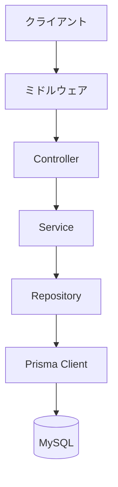
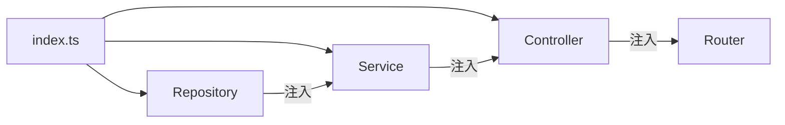
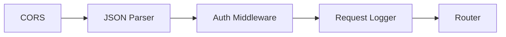

# API サーバー アーキテクチャ

## 採用技術

| カテゴリ | 技術 | バージョン |
|---------|------|-----------|
| ランタイム | Node.js | >= 18 |
| フレームワーク | Express | 5.x |
| 言語 | TypeScript | 5.x |
| ORM | Prisma | 7.x |
| バリデーション | Zod（@repo/api-schema） | - |
| 認証 | JWT + Google OAuth | - |
| ログ | Winston / Pino | - |
| DB | MySQL 8.0 | - |
| テスト | Jest + Supertest | - |

## アーキテクチャ概要

レイヤードアーキテクチャを採用し、関心の分離を実現しています。



### レイヤー責務

| レイヤー | 責務 |
|---------|------|
| **Middleware** | 認証チェック（JWT）、リクエストログ |
| **Controller** | HTTP リクエスト/レスポンスの処理、Zod バリデーション |
| **Service** | ビジネスロジック |
| **Repository** | データアクセス（Prisma 経由） |

## ディレクトリ構成

```
apps/api/src/
├── index.ts                  # エントリーポイント（Express 初期化、DI、ルート登録）
├── client/
│   └── google-oauth.ts       # Google OAuth クライアント
├── const/
│   └── index.ts              # 定数定義
├── controller/
│   └── auth/
│       ├── google.ts          # OAuth 開始
│       ├── google-callback.ts # OAuth コールバック
│       └── me.ts              # 認証ユーザー取得
├── lib/
│   └── jwt.ts                # JWT トークン生成・検証
├── log/
│   ├── logger-factory.ts     # ロガーファクトリ
│   ├── winston-logger.ts     # Winston 実装
│   ├── pino-logger.ts        # Pino 実装
│   └── console-logger.ts     # Console 実装
├── middleware/
│   ├── auth.ts               # JWT 認証ミドルウェア
│   └── request-logger.ts     # リクエストロギング
├── prisma/
│   ├── schema.prisma         # DB スキーマ定義
│   ├── prisma.client.ts      # Prisma クライアント初期化
│   ├── migrations/           # マイグレーションファイル
│   └── seed.ts               # シードデータ
├── repository/
│   └── mysql/
│       ├── user-repository.ts
│       ├── auth-account-repository.ts
│       └── aggregate/
│           └── user-registration-repository.ts
├── routes/
│   └── auth-router.ts        # ルート定義
├── service/
│   ├── auth-service.ts       # 認証ビジネスロジック
│   └── user-service.ts       # ユーザービジネスロジック
└── types/
    └── domain/
        ├── user.ts
        ├── auth-account.ts
        └── user-character.ts
```

## DI（依存性注入）パターン

エントリーポイント（`index.ts`）でインスタンスを生成し、コンストラクタ経由で注入します。



## ミドルウェア構成

リクエストは以下の順序でミドルウェアを通過します。



| ミドルウェア | 説明 |
|-------------|------|
| CORS | `FRONTEND_URL` からのリクエストを許可 |
| JSON Parser | `express.json()` によるボディパース |
| Auth | JWT トークンの検証、`req.user` への格納 |
| Request Logger | リクエスト/レスポンスのログ出力 |

## API エンドポイント

| メソッド | パス | 説明 | 認証 |
|---------|------|------|------|
| GET | `/api/auth/google` | Google OAuth 開始 | 不要 |
| GET | `/api/auth/google/callback` | OAuth コールバック | 不要 |
| GET | `/api/auth/me` | 認証ユーザー情報取得 | 必要 |
