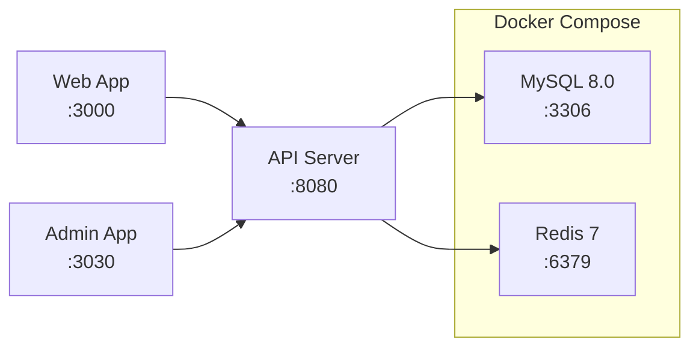
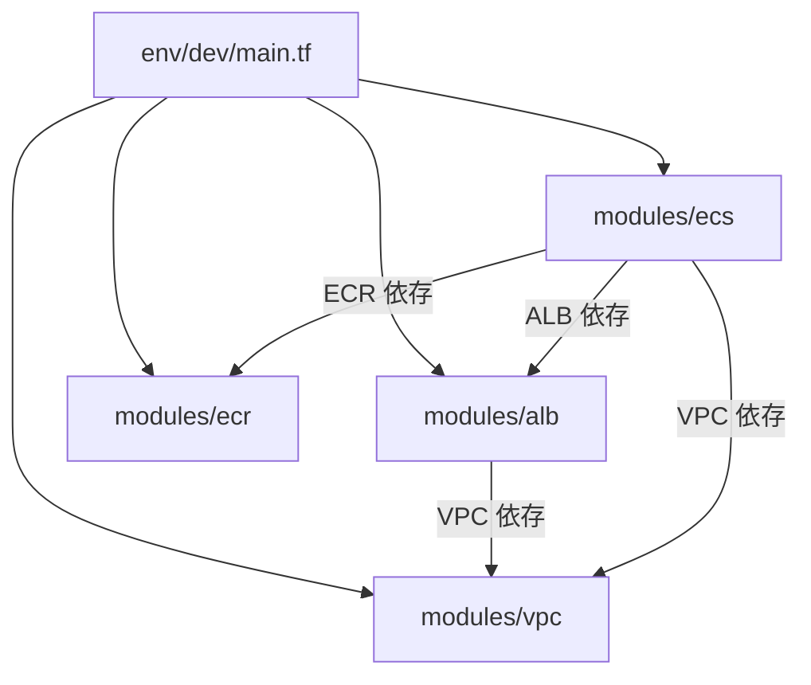
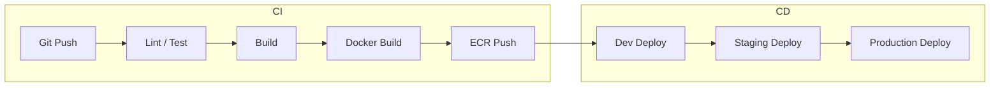

# インフラ構成

## AWS 構成概要

```mermaid
graph TB
    subgraph Internet
        Client[クライアント]
    end

    subgraph AWS
        subgraph VPC
            subgraph Public Subnet
                ALB[Application Load Balancer]
                NAT[NAT Gateway]
            end

            subgraph Private Subnet
                subgraph ECS Cluster
                    API[API Server<br/>Fargate]
                    Web[Web App<br/>Fargate]
                    Admin[Admin App<br/>Fargate]
                end
                RDS[(RDS MySQL)]
                Redis[(ElastiCache Redis)]
            end
        end

        ECR[ECR<br/>コンテナレジストリ]
        S3[S3<br/>静的アセット]
    end

    Client --> ALB
    ALB --> API
    ALB --> Web
    ALB --> Admin
    API --> RDS
    API --> Redis
    ECR --> ECS Cluster
```

## 主要 AWS サービス

| サービス | 用途 |
|---------|------|
| **VPC** | ネットワーク分離（Public/Private サブネット） |
| **ALB** | ロードバランシング、パスベースルーティング |
| **ECS (Fargate)** | コンテナオーケストレーション（サーバーレス） |
| **ECR** | Docker イメージレジストリ |
| **RDS (MySQL)** | リレーショナルデータベース |
| **ElastiCache (Redis)** | キャッシュ、セッション管理 |
| **S3** | 静的ファイル、Terraform ステート保存 |
| **CloudWatch** | ログ、メトリクス、アラーム |

## ローカル開発環境

Docker Compose でデータベースとキャッシュを起動します。



| サービス | ポート | 設定 |
|---------|--------|------|
| MySQL 8.0 | 3306 | DB: `project_template_dev`, charset: `utf8mb4` |
| Redis 7 | 6379 | AOF 永続化有効 |
| API Server | 8080 | `ts-node-dev` によるホットリロード |
| Web App | 3000 | `next dev` |
| Admin App | 3030 | `next dev` |

```bash
# 起動
docker compose up -d

# 状態確認
docker compose ps

# 停止
docker compose down

# データ含め完全削除
docker compose down -v
```

## Terraform モジュール構成

```
packages/terraform/
├── .checkov.yml              # セキュリティポリシーチェック
├── .tflint.hcl               # Terraform リンター設定
├── .trivy.yml                # 脆弱性スキャン設定
└── aws/
    ├── bootstrap/            # ステート管理基盤
    │   ├── provider.tf
    │   ├── s3.tf             # S3 バックエンド
    │   ├── dynamodb.tf       # ステートロック
    │   ├── variables.tf
    │   └── outputs.tf
    ├── env/
    │   └── dev/              # 開発環境
    │       ├── provider.tf
    │       ├── backend.tf    # S3 バックエンド参照
    │       ├── main.tf       # モジュール呼び出し
    │       ├── variables.tf
    │       └── outputs.tf
    └── modules/
        ├── vpc/              # VPC、サブネット、SG
        ├── alb/              # ロードバランサー
        ├── ecr/              # コンテナレジストリ
        └── ecs/              # ECS クラスタ、タスク定義
```

### モジュール関係



### セキュリティ・品質ツール

| ツール | 用途 |
|-------|------|
| **tflint** | Terraform コードの静的解析 |
| **checkov** | セキュリティポリシー準拠チェック |
| **trivy** | 脆弱性スキャン |
| **terraform validate** | 構文検証 |
| **terraform fmt** | コードフォーマット |

## CI/CD パイプライン概要



| ステージ | 内容 |
|---------|------|
| **Lint / Test** | ESLint、型チェック、ユニットテスト |
| **Build** | Next.js ビルド、TypeScript コンパイル |
| **Docker Build** | 各アプリの Docker イメージビルド |
| **ECR Push** | ECR へのイメージプッシュ |
| **Deploy** | ECS サービスの更新（ローリングデプロイ） |
