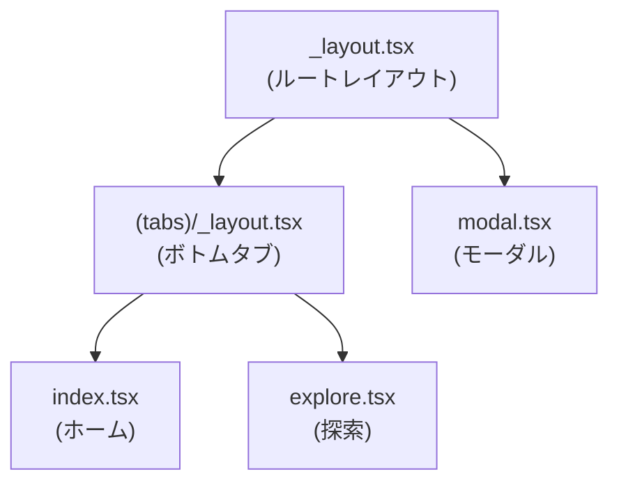
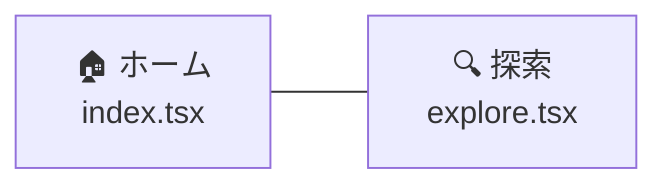
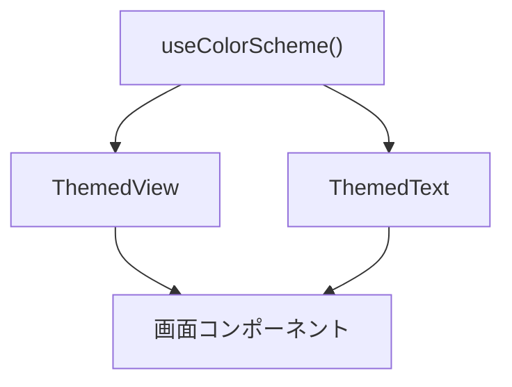
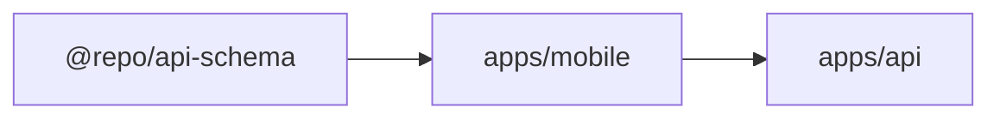

# Mobile アプリ アーキテクチャ

## 採用技術

| カテゴリ | 技術 | バージョン |
|---------|------|-----------|
| フレームワーク | Expo | 54.x |
| UI | React Native | 0.81.x |
| 言語 | TypeScript | 5.x |
| ルーティング | expo-router | 6.x |
| ナビゲーション | React Navigation | 7.x |
| アニメーション | react-native-reanimated | 4.x |
| スタイリング | Tailwind CSS（NativeWind） | 3.x |
| バリデーション/型 | Zod（@repo/api-schema） | - |

## ディレクトリ構成

```
apps/mobile/
├── app/                      # ルーティング（ファイルベース）
│   ├── _layout.tsx           # ルートレイアウト
│   ├── modal.tsx             # モーダル画面
│   └── (tabs)/               # タブナビゲーション
│       ├── _layout.tsx       # タブレイアウト
│       ├── index.tsx         # ホームタブ
│       └── explore.tsx       # 探索タブ
├── components/               # 共有コンポーネント
│   ├── themed-text.tsx       # テーマ対応テキスト
│   ├── themed-view.tsx       # テーマ対応ビュー
│   ├── hello-wave.tsx        # アニメーション付きウェーブ
│   ├── parallax-scroll-view.tsx
│   ├── external-link.tsx
│   ├── haptic-tab.tsx        # ハプティクス対応タブ
│   └── ui/
│       ├── icon-symbol.tsx       # アイコン（Android/Web）
│       ├── icon-symbol.ios.tsx   # アイコン（iOS）
│       └── collapsible.tsx       # 折りたたみ
├── hooks/                    # カスタム Hooks
│   ├── use-color-scheme.ts       # カラースキーム取得
│   ├── use-color-scheme.web.ts   # Web 用カラースキーム
│   └── use-theme-color.ts       # テーマカラー取得
├── constants/                # 定数
├── assets/                   # 画像・フォント
├── app.json                  # Expo 設定
└── package.json
```

## ナビゲーション構成

expo-router によるファイルベースルーティングと React Navigation を組み合わせています。



### ルートグループ

| パターン | 説明 |
|---------|------|
| `(tabs)/` | ボトムタブナビゲーションでグルーピング |
| `modal.tsx` | モーダルとして表示される画面 |

### ボトムタブ構成



## コンポーネント設計

### テーマ対応コンポーネント

ダーク/ライトモードに対応したコンポーネントを提供しています。



### プラットフォーム固有ファイル

React Native の規約に従い、プラットフォーム別のファイルを使い分けます。

| ファイル | 対象 |
|---------|------|
| `icon-symbol.tsx` | Android / Web |
| `icon-symbol.ios.tsx` | iOS |
| `use-color-scheme.ts` | ネイティブ |
| `use-color-scheme.web.ts` | Web |

## Hooks 構造

| Hook | 用途 |
|------|------|
| `useColorScheme` | デバイスのカラースキーム（dark/light）を取得 |
| `useThemeColor` | テーマに応じた色を取得 |

## 型共有

Web/Admin アプリと同様に、`@repo/api-schema` から型を import して API 通信の型安全性を担保します。


