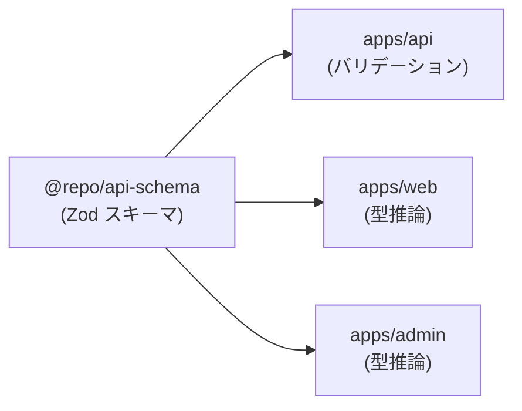
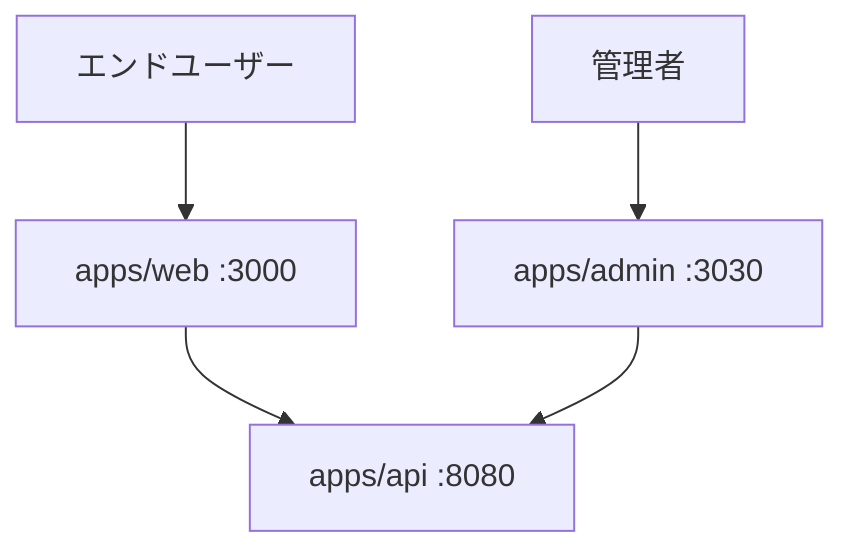

# Web / Admin アプリ アーキテクチャ

## 採用技術

| カテゴリ | 技術 | バージョン |
|---------|------|-----------|
| フレームワーク | Next.js | 16.x |
| UI ライブラリ | React | 19.x |
| 言語 | TypeScript | 5.x |
| スタイリング | Tailwind CSS | v4 |
| バリデーション/型 | Zod（@repo/api-schema） | - |
| リンター | ESLint（eslint-config-next） | 9.x |

## アプリ構成

本プロジェクトでは Web アプリと Admin アプリの 2 つの Next.js アプリを運用しています。

| アプリ | ポート | 用途 |
|-------|--------|------|
| **apps/web** | 3000 | エンドユーザー向け Web アプリ |
| **apps/admin** | 3030 | 管理者向けダッシュボード |

両アプリは同一の技術スタックを使用し、`@repo/api-schema` を共有しています。

## App Router ディレクトリ構成

Next.js 16 の App Router を使用したファイルベースルーティングです。

```
apps/web/
├── app/
│   ├── layout.tsx        # ルートレイアウト
│   ├── page.tsx          # ホームページ（/）
│   ├── globals.css       # グローバルスタイル
│   └── favicon.ico
├── public/               # 静的ファイル
├── next.config.ts        # Next.js 設定
├── postcss.config.mjs    # PostCSS 設定（Tailwind）
├── tsconfig.json
└── package.json
```

### App Router の規約

| ファイル | 役割 |
|---------|------|
| `layout.tsx` | 共有レイアウト（ネスト可能） |
| `page.tsx` | ルートの UI |
| `loading.tsx` | ローディング UI |
| `error.tsx` | エラーバウンダリ |
| `not-found.tsx` | 404 ページ |

## 型共有パターン

`@repo/api-schema` パッケージにより、API との型安全な通信を実現しています。



### 使用例

```typescript
// @repo/api-schema で定義
import { z } from 'zod'

export const getUserResponseSchema = z.object({
  id: z.string(),
  message: z.string(),
  timestamp: z.string(),
})

export type GetUserResponse = z.infer<typeof getUserResponseSchema>
```

```typescript
// apps/web で使用
import type { GetUserResponse } from '@repo/api-schema'

const response = await fetch('/api/users/1')
const data: GetUserResponse = await response.json()
```

## スタイリング

Tailwind CSS v4 を PostCSS 経由で使用しています。

```
globals.css
  └── @import "tailwindcss"   # Tailwind v4 のエントリーポイント
```

- ダークモード対応（`dark:` プレフィックス）
- レスポンシブデザイン（`sm:`, `md:`, `lg:` 等）
- CSS カスタムプロパティによるテーマ管理

## Web と Admin の使い分け



| 観点 | Web | Admin |
|------|-----|-------|
| 対象ユーザー | エンドユーザー | 管理者・運用者 |
| ポート | 3000 | 3030 |
| 主な機能 | サービス利用画面 | データ管理・モニタリング |
| 認証 | ユーザー認証 | 管理者認証 |
| デプロイ | 独立デプロイ可能 | 独立デプロイ可能 |
