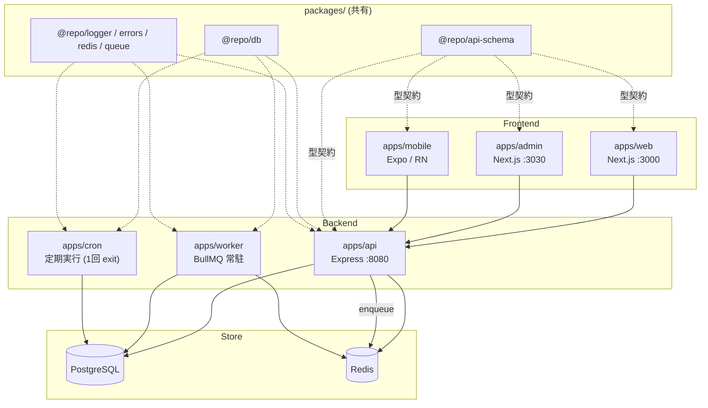

# オンボーディング（まずここから）

このプロジェクトに初めて参加する人が、**アーキテクチャとコーディング規約を最短でキャッチアップする**ための入口です。トピックごとに 1 ファイルにまとまっており、各ファイルは単体で読み切れます。

## 読む順番

上から順に読むと、全体像 → 細かい規約の流れで理解できます。急ぐ場合は「一言でいうと」だけ拾えば要点は掴めます。

| # | ドキュメント | 一言でいうと |
|---|---|---|
| 1 | [architecture.md](./architecture.md) | Turborepo モノレポのディレクトリ構成と、API のレイヤード / フロントの `features` 分離 |
| 2 | [infrastructure.md](./infrastructure.md) | AWS (ECS Fargate / RDS / ElastiCache) を Terraform 3 層で管理。dev は rolling / prd は Blue/Green |
| 3 | [naming.md](./naming.md) | ファイル名は kebab-case（Component だけ PascalCase）。変数・関数・型の命名規則 |
| 4 | [error-handling.md](./error-handling.md) | API は `Result<T>`。業務エラー(4xx)は `err()` で返し、想定外は `throw` して分離する |
| 5 | [imports.md](./imports.md) | import は builtin → external → `@repo` → 相対 の順。バレルエクスポートとパッケージ間 import の方向 |
| 6 | [testing.md](./testing.md) | Service はユニット / Controller は実 DB・Redis を使う統合テスト。`正常系` / `異常系` で分類 |
| 7 | [auth.md](./auth.md) | Google OAuth + 自前 JWT (access 15分 / refresh 7日)。httpOnly cookie + middleware ガード |

## このドキュメント群の位置づけ

- **人間向けのキャッチアップ**を目的に、各トピックを 1 ファイルで完結させています。
- 詳細・網羅的な正典は各ディレクトリの `CLAUDE.md`（AI・実装者向け）にあります。矛盾を見つけた場合は `CLAUDE.md` 側を正とし、本ドキュメントを更新してください。
- 各ファイル末尾の「関連ドキュメント」から、より深い一次情報へ辿れます。

## 全体像（1 枚図）

