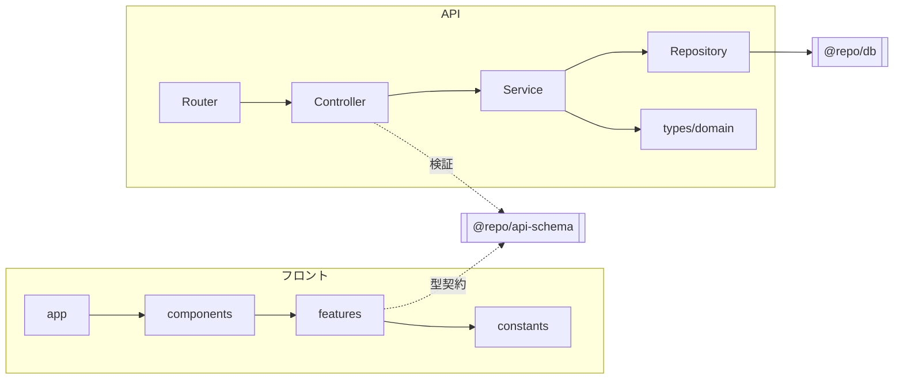

# アーキテクチャ（ディレクトリ構成）

Turborepo + pnpm のモノレポ。`apps/`（実行可能なアプリ）と `packages/`（共有ライブラリ）に分かれ、`infra/` に IaC がある。

## 目次

- [トップレベル構成](#トップレベル構成)
- [apps（アプリ）](#appsアプリ)
- [packages（共有パッケージ）](#packages共有パッケージ)
- [API のレイヤードアーキテクチャ](#api-のレイヤードアーキテクチャ)
- [server-side app（cron / worker）の構成](#server-side-appcron--worker-の構成)
- [フロントエンド（web / admin / mobile）の構成](#フロントエンドweb--admin--mobile-の構成)
- [依存の方向](#依存の方向)
- [関連ドキュメント](#関連ドキュメント)

## トップレベル構成

```
project-template/
├── apps/
│   ├── web/       # Next.js 16 web (:3000)
│   ├── admin/     # Next.js 16 admin dashboard (:3030)
│   ├── mobile/    # Expo / React Native
│   ├── api/       # Express 5 API server (:8080)
│   ├── cron/      # 定期実行タスク（1回実行して exit）
│   └── worker/    # BullMQ ベースの常駐 worker
├── packages/
│   ├── schema/    # @repo/api-schema : Zod による API 契約
│   ├── db/        # @repo/db : Prisma schema + createPrismaClient factory
│   ├── logger/    # @repo/logger : ILogger + pino/winston/console/silent
│   ├── errors/    # @repo/errors : Result<T> + ApiError
│   ├── redis/     # @repo/redis : createRedisClient factory
│   └── queue/     # @repo/queue : JobQueue<T> 抽象 + BullMQ 実装
├── infra/
│   └── terraform/ # AWS Infrastructure as Code
└── docs/          # 仕様書・設計書・セットアップ手順
```

## apps（アプリ）

| app | 役割 | 実行モデル |
|---|---|---|
| **web** | エンドユーザー向け Web。Next.js App Router | 常駐（Next.js server） |
| **admin** | 管理ダッシュボード。web と同じ App Router / API 通信ルール | 常駐 |
| **mobile** | Expo / React Native。expo-router のファイルベースルーティング | ネイティブアプリ |
| **api** | Express の API サーバー。全リクエスト/レスポンスを Zod で検証 | 常駐 |
| **cron** | 定期実行タスク群。**タスク 1 回実行で exit** するモデル。本番は EventBridge / CronJob 等で起動 | 単発起動 |
| **worker** | BullMQ からジョブを取り出して処理する**常駐型** worker。Queue 実装は `@repo/queue` の抽象越しに DI され、SQS / Cloud Tasks 等に差し替え可能 | 常駐 |

## packages（共有パッケージ）

server-side app（api / cron / worker）を横断して使う共通基盤。**Prisma / Redis は factory のみを export** し、各 app の `src/index.ts` で 1 回だけ生成して Repository に DI する。

| package | import 名 | 提供するもの |
|---|---|---|
| **schema** | `@repo/api-schema` | API のリクエスト/レスポンス Zod スキーマ。フロント・API で共有する型契約の単一情報源 |
| **db** | `@repo/db` | Prisma schema / migrations / 生成 client + `createPrismaClient` factory |
| **logger** | `@repo/logger` | `ILogger` インターフェース + pino/winston/console/silent 実装 + AsyncLocalStorage コンテキスト |
| **errors** | `@repo/errors` | `Result<T>` + `ApiError` + 業務エラー生成ヘルパ |
| **redis** | `@repo/redis` | `createRedisClient` factory（BullMQ / Pub-Sub 対応） |
| **queue** | `@repo/queue` | `JobQueue<T>` / `JobProcessor<T>` / `JobConsumer` 抽象 + BullMQ 実装 + Job 型 |

> **ビルド順の注意**: スキーマパッケージは依存アプリより先にビルドする。スキーマ変更時は `cd packages/schema && pnpm build`。

## API のレイヤードアーキテクチャ

`apps/api/src/` は「1 リクエストが上から下へ流れる」レイヤードで構成する。新機能は必ず既存実装（例: `memo`, `health`）を読んでパターンを合わせる。

```
Router → Controller → Service → Repository → (Prisma / Redis)
                         ↓
                   types/domain（ドメイン型）
```

| レイヤ | ディレクトリ | パターン | 役割 |
|---|---|---|---|
| **Router** | `src/routes/` | `export const {feature}Router = (controllers) => Router` | エンドポイントを登録。controllers はオプショナルオブジェクト |
| **Controller** | `src/controller/{feature}/` | `class` + `execute(req, res)`。API と 1 対 1 | Zod で入出力を検証し、Service を呼ぶ。**try-catch は書かない** |
| **Service** | `src/service/` | `export const` のアロー関数 | 業務ロジック。戻り値は必ず `Promise<Result<T>>` |
| **Repository** | `src/repository/prisma/`・`repository/redis/` | `interface` + `class Prisma{X}Repository implements` | DB / Redis アクセスを集約。`_toDomain()` でドメイン型へ変換 |
| **Domain 型** | `src/types/domain/` | 機能ごとにファイル + `index.ts` バレル | Repository / Service が参照する型。`@repo/api-schema` に依存しない |

- **DI**: `src/index.ts` で Repository → Controller → Router の順にインスタンス化して組み立てる。
- **Service の引数**: Repository は単一でも複数でも必ず `repo: { xxxRepository }` というオブジェクト引数にまとめる（将来 Repository が増えてもシグネチャを変えずに済む）。
- **Admin API**: すべて `/api/admin/` 配下に配置してユーザー向け API と分離。Controller / Service は共通、Router (`admin-router.ts`) でマッピングする。

## server-side app（cron / worker）の構成

cron / worker も **api と同じ思想のレイヤード**（Repository interface + class、Service はアロー関数 + `repo:` オブジェクト引数）で書く。ただしエントリポイントの形が違う。

**cron**（`apps/cron/src/`）:
```
index.ts              # 起動確認用エントリ（本番では使わない）
env.ts                # Zod で env 検証（safeParse → process.exit(1)）
task/<name>.ts        # 1 ファイル = 1 cron。env 組み立て → Repository 生成 → service を呼ぶだけ
service/<domain>/     # 業務ロジック（アロー関数 + repo: オブジェクト引数）
repository/prisma/     # DB アクセス
runtime/graceful-shutdown.ts  # SIGTERM/SIGINT で Prisma を切断して exit
```

**worker**（`apps/worker/src/`）:
```
index.ts              # Prisma/Redis 生成 → 各 startXxxWorker 起動 → graceful shutdown 登録
env.ts                # Zod で env 検証
workers/<name>-worker.ts  # Queue 実装（startBullMQWorker）とハンドラを結線する層
jobs/<name>.ts        # 純粋なジョブハンドラ。BullMQ / ioredis を直接 import しない
repository/prisma/     # DB アクセス
runtime/graceful-shutdown.ts  # consumers.close() → Prisma/Redis 切断
```

- **Repository の interface は app ごとに分離**する。api は CRUD、cron は batch 削除など操作セットが違うため、共有 interface を作ると不要なメソッドが漏れる。
- **worker のジョブハンドラは冪等**に書く（stalled 検出 / リトライ / SIGKILL で同じジョブが複数回実行されうる）。

## フロントエンド（web / admin / mobile）の構成

3 アプリ共通で、**機能単位**（技術単位ではなく）にディレクトリを分ける。ロジックは `features/`、UI は `components/` と `app/` に置いて依存方向を明確にする。

```
src/
  app/                    # ルーティング + ページ構成（薄く保つ）
  components/
    ui/                   # 汎用 UI（Button, Input 等）
    layout/               # レイアウト系（Header, Sidebar 等）
    features/{name}/      # 機能固有の UI コンポーネント
  features/{name}/        # ロジックのみ（レンダリングなし）
    {name}.api.ts         # API 通信
    {name}.entity.ts      # 型・エンティティ
    {name}.state.ts       # 状態管理（zustand）
  hooks/                  # 共有カスタムフック
  constants/              # 定数
```

- **依存の方向**: `app/ → components/ → features/ → constants/`
- **`features/` は UI 非依存**。web / admin / mobile でロジックを共有しやすくする。zustand の state も `features/` に置く（Context には出さない）。
- **型・スキーマは `@repo/api-schema` から import**。ローカル独自定義は禁止（API 側の変更に追従できず型不整合バグの原因になる）。

## 依存の方向



- API・フロントとも **`@repo/api-schema` が request/response 契約の単一情報源**。ここを起点に型を共有する。
- server-side app は `@repo/db` / `logger` / `errors` / `redis` を依存に追加し、各 app の `src/index.ts` で client を生成して Repository に DI する。

## 関連ドキュメント

| ドキュメント | 内容 |
|---|---|
| [`../../CLAUDE.md`](../../CLAUDE.md) | プロジェクト全体のアーキテクチャ概要 |
| [`../../apps/api/CLAUDE.md`](../../apps/api/CLAUDE.md) | API レイヤードアーキテクチャの詳細（正典） |
| [`../../apps/cron/CLAUDE.md`](../../apps/cron/CLAUDE.md) / [`worker`](../../apps/worker/CLAUDE.md) | cron / worker のレイヤード設計 |
| [`../../apps/web/CLAUDE.md`](../../apps/web/CLAUDE.md) | web の App Router / API 通信ルール |
| [`../../CLAUDE.md`](../../CLAUDE.md) | 共通パッケージ（`@repo/db` / `logger` / `errors` / `redis`）の設計方針 |
