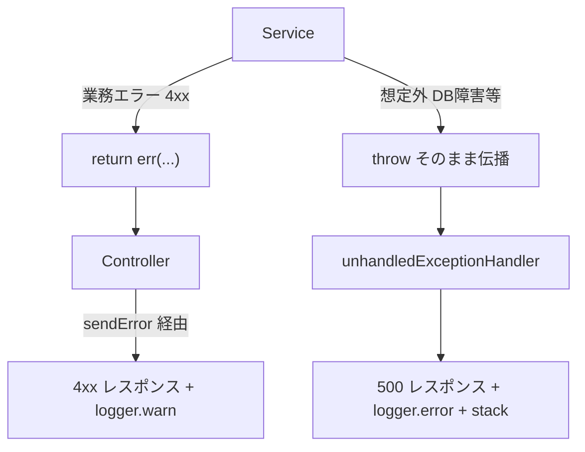

# エラーハンドリング（Result 型）

API（`apps/api`）のエラーハンドリングの中核ルール。**業務エラー（4xx 系）は `Result<T>` で返却し、想定外の例外（DB 障害等）は throw する**。この 2 つを経路レベルで分離するのが設計の要。

## 目次

- [基本方針](#基本方針)
- [Result 型](#result-型)
- [Service の実装ルール](#service-の実装ルール)
- [Controller の実装ルール](#controller-の実装ルール)
- [責務分担（どの経路がどう処理されるか）](#責務分担どの経路がどう処理されるか)
- [try/catch を書いてよいケース](#trycatch-を書いてよいケース)
- [関連ドキュメント](#関連ドキュメント)

## 基本方針



- **業務エラー**（NotFound / Conflict / Unauthorized 等）は値 = `Result.err` として扱い、`sendError` ヘルパ経由で返す。
- **想定外エラー**（TCP 切断 / Prisma 例外等）は catch せず throw し、`unhandledExceptionHandler` に委譲する。
- Controller / Service では原則 **try-catch を書かない**（throw の伝播を壊さない）。

## Result 型

```typescript
export type ApiError = {
  statusCode: number
  type: "BAD_REQUEST" | "CONFLICT" | "FORBIDDEN" | "NOT_FOUND" | "UNAUTHORIZED"
  message: string
}

export type Result<T> =
  | { ok: true; value: T }
  | { error: ApiError; ok: false }
```

ヘルパー関数で生成する:

```typescript
import { ok, err, notFoundError, conflictError, badRequestError } from "../types/result"

return ok(user)                                          // 成功
return err(notFoundError("User not found"))              // 404
return err(conflictError("Same file already uploaded"))  // 409
return err(badRequestError("Invalid category_id"))       // 400
```

## Service の実装ルール

- **戻り値は必ず `Promise<Result<T>>`**（`Promise<T>` ではない）。
- **業務エラー**は `return err(...)` で返す。
- **想定外エラー**は DB 呼び出し等での `throw` をそのまま伝播させる（catch しない）。

```typescript
export const createFoo = async (
  input: CreateFooInput,
  repo: { fooRepository: FooRepository }
): Promise<Result<Foo>> => {
  const existing = await repo.fooRepository.findByKey(input.key)
  if (existing) {
    return err(conflictError("Already exists"))  // 業務エラー → 値で返す
  }
  const foo = await repo.fooRepository.create(input)  // DB 障害時は throw（catch しない）
  return ok(foo)
}
```

## Controller の実装ルール

- `@repo/api-schema` のスキーマで `req.params` / `req.body` / `req.query` を検証し、レスポンスを parse する。
- **Service の `Result` は必ず `sendError` ヘルパ経由で返却する**（`res.status().json()` を直接書かない）。`sendError` は `logger.warn("API business error", ...)` を出してから `ErrorResponse` を返すため、ログの書き忘れを構造的に防げる。
- **try-catch は書かない**。Service が throw した想定外エラーは `unhandledExceptionHandler` が 500 で処理する。

```typescript
import { parseRequest, parseResponse } from "../../lib/parse-schema"
import { sendError } from "../../lib/send-error"

async execute(req: Request, res: Response) {
  const { id } = parseRequest(deleteMemoPathParamSchema, req.params)

  const result = await service.memo.deleteMemo(id, { memoRepository: this._memoRepository })

  if (!result.ok) {
    return sendError(req, res, result.error)  // 業務エラーは必ずこの経路
  }

  const response = parseResponse(deleteMemoResponseSchema, { message: "OK" })
  return res.status(200).json(response)
}
```

- Service の statusCode をそのまま透過返却するのが基本。**再解釈が必要な場合のみ** Controller で新しい `ApiError` を作って `sendError` に渡す（例: pre-condition check の 404 を 400 に変換）。

## 責務分担（どの経路がどう処理されるか）

| 経路 | 例 | ログ | ステータス |
|---|---|---|---|
| Service の `Result.err` | NotFound / Conflict / Unauthorized 等の業務エラー | `sendError` が `logger.warn` | `result.error.statusCode`（4xx） |
| ルート内の throw（想定外） | TCP 切断 / Prisma 例外 | `unhandledExceptionHandler` が `logger.error` + stack | 500 |
| リクエストスキーマ違反 | `RequestSchemaMismatchError` | `logger.warn` | 400 |
| レスポンススキーマ違反 | `ResponseSchemaMismatchError` | `logger.error` | 500 |
| アクセスログ | 全リクエスト | `requestLogger` が `info` / `warn` | - |

`unhandledExceptionHandler` は全ルート登録後に `app.use(...)` で登録する。業務 4xx は `sendError` 経由で返るためこのハンドラを通らない。

## try/catch を書いてよいケース

「try-catch を書かない」は**想定外エラーを握りつぶすな**という意味。以下 2 ケースのみ局所 try/catch を許容する。

| ケース | 例 | 扱い |
|---|---|---|
| **副次処理の意図的な握りつぶし** | 通知送信の失敗等、メイン処理を成功扱いにしたい副次処理 | `try { ... } catch (err) { logger.warn(...) }` で続行。**catch 内で再 throw しない** |
| **エラーを値に変換する必要** | `health-service` のサービスチェック（個別失敗を `status: "error"` に集約） | `try { ... } catch (err) { return { status: "error", ... } }` |

これ以外（fallback / リトライ / 業務エラーの隠蔽）は `Result` で表現するか、そのまま throw して `unhandledExceptionHandler` に委譲する。

## 関連ドキュメント

| ドキュメント | 内容 |
|---|---|
| [`../../apps/api/CLAUDE.md`](../../apps/api/CLAUDE.md) | エラーハンドリング（Result 型）の詳細・sendError・想定外例外ハンドラ（正典） |
| [testing.md](./testing.md) | Result 型の構造だけを検証するテストの書き方（文言に依存しない） |
