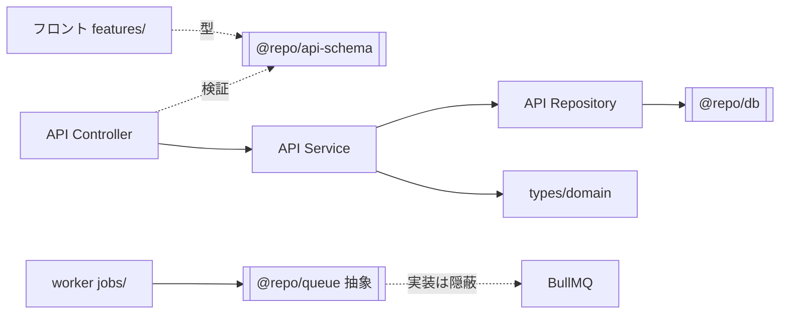

# import ルール

import の並び順・バレルエクスポート・パッケージ間の import 方向についての規約。ESLint（`import/order` ほか）で強制され、`pnpm lint:fix` で自動整形される。

## 目次

- [import の並び順](#import-の並び順)
- [バレルエクスポート（index.ts）](#バレルエクスポートindexts)
- [パッケージ間 import の方向](#パッケージ間-import-の方向)
- [関連ドキュメント](#関連ドキュメント)

## import の並び順

**builtin → external → internal（`@repo`）→ parent → sibling → index** の順で、**グループ間に空行**を入れる。

```typescript
import { readFile } from "node:fs/promises"        // 1. builtin

import express from "express"                        // 2. external
import { z } from "zod"

import { logger } from "@repo/logger"                // 3. internal (@repo)
import type { Result } from "@repo/errors"

import { parseRequest } from "../../lib/parse-schema" // 4. parent

import { toDomain } from "./mapper"                   // 5. sibling

import { config } from "."                            // 6. index
```

## バレルエクスポート（index.ts）

- `index.ts` の re-export は **ファイル名のアルファベット順**に並べる。
- API の Service は `service/index.ts` で `export * as {feature} from "./{feature}-service"` の形にまとめ、呼び出し側は `service.{feature}.{method}(...)` で使う。
- Repository / Domain 型 / cron の task なども `index.ts` でバレルエクスポートする。

```typescript
// service/index.ts（ファイル名アルファベット順）
export * as auth from "./auth-service"
export * as health from "./health-service"
export * as memo from "./memo-service"
```

## パッケージ間 import の方向

「どこから何を import してよいか」を守ることで、レイヤーの独立性と型契約の一貫性を保つ。

| import する側 | import してよいもの | してはいけないもの |
|---|---|---|
| フロント（web / admin / mobile） | 型・スキーマは **`@repo/api-schema` から**（`admin/` は `@repo/api-schema/admin/`） | 型のローカル独自定義（API 変更に追従できず型不整合バグの原因） |
| API の `types/domain` | 自ドメイン型 | `@repo/api-schema`（ドメイン層は Zod スキーマに依存しない。同じ値で独立定義する） |
| API の Repository / Service | `types/domain` の型 | `@repo/api-schema`（検証はレイヤ外で行う） |
| worker の `jobs/<name>.ts` | `@repo/queue` の `JobProcessor<T>` / `JobMessage<T>` | **BullMQ / ioredis を直接 import**（Queue 実装の差し替えを不能にする） |
| server-side app 全般 | `@repo/db` / `logger` / `errors` / `redis` の **factory** | client の直接生成（`src/index.ts` で 1 回だけ生成して DI する） |



- **`@repo/api-schema` が request/response 契約の単一情報源**。フロントも API もここを起点に型を共有する。
- worker のジョブハンドラは Queue 実装（BullMQ）を knows しないので、将来 SQS / Cloud Tasks 等に乗り換えてもハンドラ本体は無変更で済む。

## 関連ドキュメント

| ドキュメント | 内容 |
|---|---|
| [`../../CLAUDE.md`](../../CLAUDE.md) | Import ordering / バレルエクスポートの規約（正典） |
| [architecture.md](./architecture.md) | パッケージ構成と依存の方向 |
| [`../../apps/worker/CLAUDE.md`](../../apps/worker/CLAUDE.md) | Queue 実装を差し替え可能にする import 境界の詳細 |
