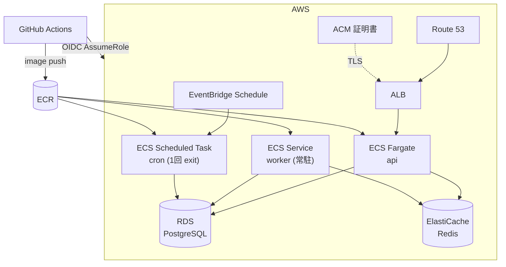

# アーキテクチャ（インフラ構成）

AWS 上に Terraform (Infrastructure as Code) でデプロイする。ECS Fargate 上で api / worker を動かし、データは RDS (PostgreSQL) と ElastiCache (Redis) に持つ。

## 目次

- [全体像](#全体像)
- [Terraform の 3 層構造](#terraform-の-3-層構造)
- [dev / prd の差分](#dev--prd-の差分)
- [デプロイフロー](#デプロイフロー)
- [IAM ポリシーの記述規約](#iam-ポリシーの記述規約)
- [state 管理](#state-管理)
- [関連ドキュメント](#関連ドキュメント)

## 全体像



- **api**: ALB 配下の ECS Fargate サービス。`api.<domain>`（prd）/ `api.dev.<domain>`（dev）で公開。
- **worker**: 常駐する ECS Service（long-running）。BullMQ のジョブを Redis から取り出して処理。
- **cron**: EventBridge Schedule → ECS Scheduled Task で単発起動（`dist/task/<name>.js` を直接実行）。
- **CI/CD**: GitHub Actions が OIDC で IAM role を AssumeRole し、ECR に image を push → ECS を更新。

## Terraform の 3 層構造

`infra/terraform/aws/` はリソースの「生存期間」で 3 層に分かれ、apply の頻度と権限境界が異なる。

```
infra/terraform/aws/
├── bootstrap/   # tfstate 置き場 (S3) のみ。1 度だけ apply。local state
├── account/     # OIDC provider / GitHub Actions IAM role / ECR。アカウント単位で共有。remote state
├── env/
│   ├── dev/     # dev 環境（VPC / ECS / RDS / ALB / ACM / Route53 A レコード ...）
│   └── prd/     # prd 環境
└── modules/     # 再利用モジュール（vpc / alb / ecs-cluster / ecs-workload / rds / elasticache / acm / route53 / secrets）
```

| 層 | 何を作るか | apply 頻度 | state |
|---|---|---|---|
| `bootstrap` | tfstate 置き場 (S3) | 1 度だけ | local（chicken-and-egg のため） |
| `account` | OIDC / IAM role / ECR | アカウント共有資源を増やす時のみ | remote |
| `env/*` | VPC / ECS / RDS / ALB / ACM / Route53 | 機能追加のたび | remote |

> **Route 53 hosted zone は Terraform 管理外**。Route 53 Domains でドメインを購入すると同名 hosted zone が自動作成され NS も自動で向くため、`env/*` は `data "aws_route53_zone"` で参照するだけで済む。

## dev / prd の差分

| 項目 | dev | prd |
|---|---|---|
| デプロイ戦略 | rolling（deployment_circuit_breaker 付き） | **Blue/Green**（トラフィックシフト前に承認待機） |
| 承認ゲート | 無し | GitHub Environment `prd-api-approval` の Required reviewers |
| ALB test listener (:9000) | 無し | 有り（CIDR 制限可） |
| API FQDN | `api.dev.<domain>` | `api.<domain>` |
| ACM 証明書 | `*.dev.<domain>` | `*.<domain>` |
| VPC CIDR | `10.0.0.0/16` | `10.1.0.0/16` |
| state key | `dev/terraform.tfstate` | `prd/terraform.tfstate` |
| Route53 hosted zone | dev / prd で同一 zone を共有 | 同左 |

## デプロイフロー

両環境とも GitHub Actions の `workflow_dispatch` 起動。

- **dev**: `build → migrate → deploy-api / deploy-worker（rolling 完走）` の素直なフロー。承認ゲートなし。
- **prd**: `build → migrate → deploy-api（Blue/Green 投入）→ approve-api（GitHub UI で Required reviewers が承認）→ 本番トラフィックシフト + 5 分 bake` の Blue/Green フロー。承認 reject 時は `reject-api` job が SSM を `rejected` に書き換えて自動 rollback。

```bash
# env apply をローカルから流す場合
cd infra/terraform/aws/env/<dev|prd>
terraform plan
terraform apply

# fmt / lint / security チェック
cd infra/terraform
terraform fmt -check -recursive -diff
tflint --init && tflint --chdir=aws/env/dev --config=$(pwd)/.tflint.hcl --recursive
trivy config aws/env/dev -c .trivy.yml
```

prd の Blue/Green 承認は通常 GitHub Actions UI の "Review pending deployments" から行う。UI が使えない緊急時のみ SSM を直接書き換える:

```bash
aws ssm put-parameter --name "/my-app-prd-api/deploy/approval" --value "approved"  --overwrite  # 承認
aws ssm put-parameter --name "/my-app-prd-api/deploy/approval" --value "rejected" --overwrite  # 拒否 → rollback
```

## IAM ポリシーの記述規約

IAM の trust policy / permission policy は `jsonencode()` のインライン記述を使わず、必ず `data "aws_iam_policy_document"` に切り出して resource 名で識別できるようにする。

- **trust policy**: `data "aws_iam_policy_document" "{role名}_trust"`（attach 先 role の resource 名 + `_trust` suffix）
- **permission policy**: attach 先の `aws_iam_policy` / `aws_iam_role_policy` と同じ resource 名（suffix なし）
- data source は参照する resource の**直前**に配置する
- permission policy の statement には `sid` を付けて自己文書化する
- ECR lifecycle policy など IAM policy document ではない JSON は対象外（`jsonencode` のまま）

```hcl
data "aws_iam_policy_document" "scheduler_trust" {
  statement {
    effect  = "Allow"
    actions = ["sts:AssumeRole"]
    principals {
      type        = "Service"
      identifiers = ["scheduler.amazonaws.com"]
    }
  }
}

resource "aws_iam_role" "scheduler" {
  name               = "${var.name}-scheduler"
  assume_role_policy = data.aws_iam_policy_document.scheduler_trust.json
}
```

## state 管理

- Terraform state は **S3 + S3 ネイティブロック**（`use_lockfile = true`、Terraform 1.10+）構成（bootstrap で構成済み）。
- `account/` の GitHub Actions IAM role を作成・変更するときは CI が assume する role 自身を書き換えるため、**初回（および role の rename/replace）はローカルで `terraform apply`** する。apply 後、新しい role ARN を GitHub の Environment Secret `AWS_ROLE_ARN` に再登録する。
- OIDC role の trust policy を壊すと CI 経由の apply が不可能になる。その場合はローカルから AWS root 資格情報で `cd infra/terraform/aws/account && terraform apply` して復旧する。

## 関連ドキュメント

| ドキュメント | 内容 |
|---|---|
| [`../../infra/README.md`](../../infra/README.md) | インフラ構成 / dev・prd 差分 / デプロイフロー / 日常運用（正典） |
| [`../../infra/terraform/CLAUDE.md`](../../infra/terraform/CLAUDE.md) | Terraform 層構造 / CI ワークフロー / IAM 規約 / OIDC role 復旧手順 |
| [`../setup/infra.md`](../setup/infra.md) | 初回セットアップ手順（bootstrap → account → env apply → DNS → seed-secrets → image push） |
