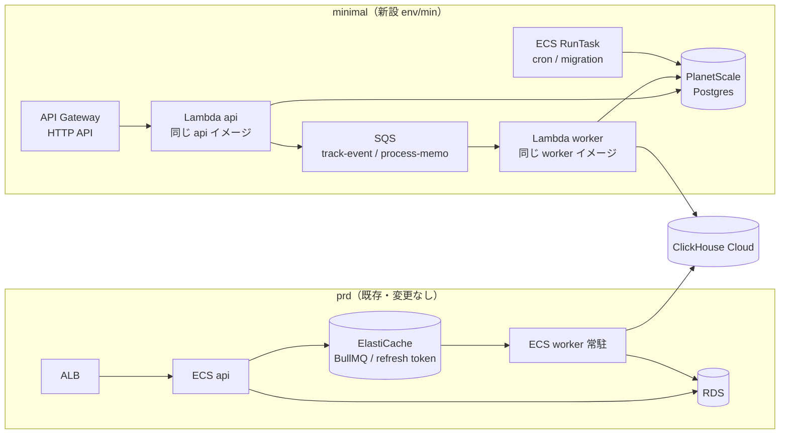
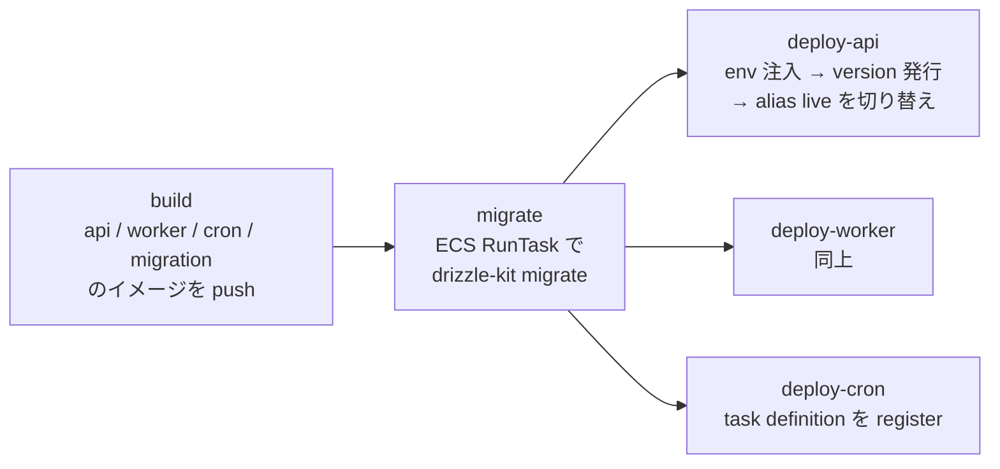
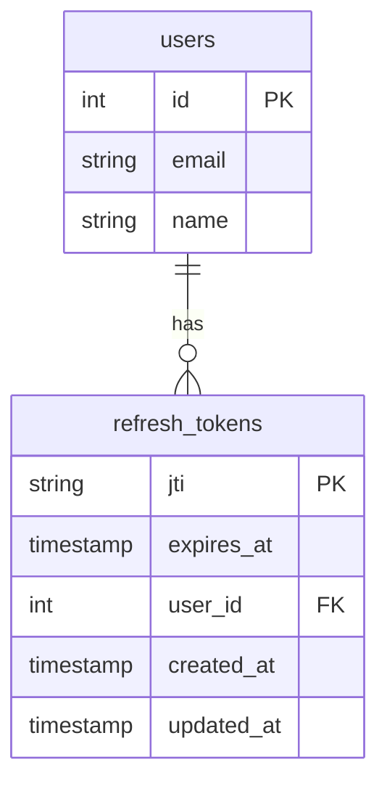
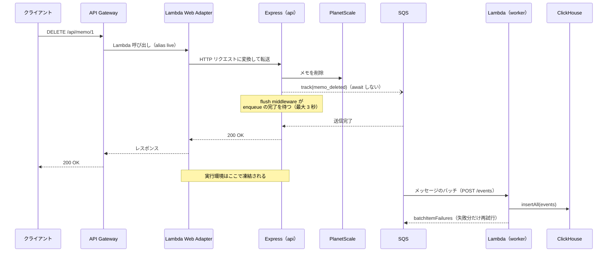
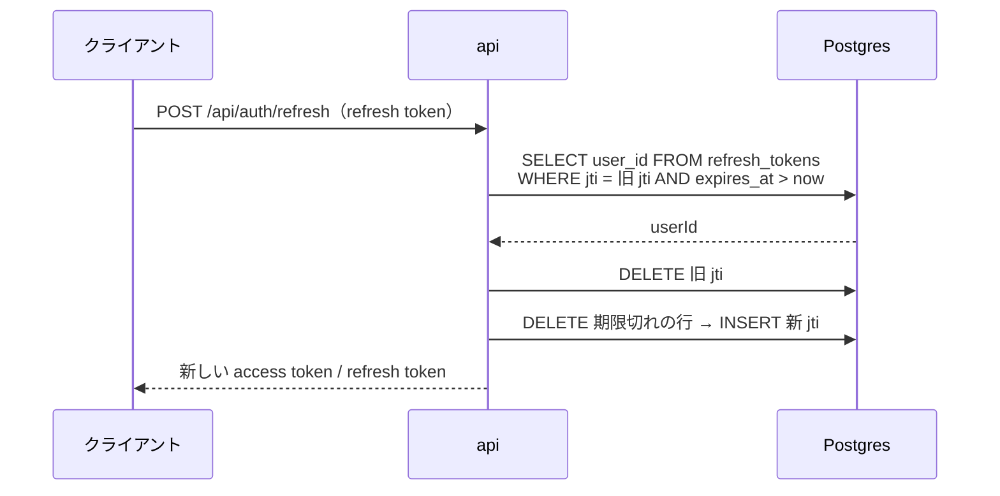

# ミニマム構成デプロイ（minimal）

リクエストが無いときのインフラ費用をほぼゼロにした本番構成（以下 **minimal**）を用意し、初期リリースをこの構成で行えるようにする。

現在の prd 構成（ECS Fargate + ALB + NAT Gateway + RDS + ElastiCache）は、トラフィックが無くても 1 環境あたり月 $140 前後（約 2.1 万円）の固定費がかかる。常時起動しているコンテナと、それを支えるネットワーク（NAT / ALB / Public IPv4）が費用の大半を占めるためである。minimal では api と worker を Lambda に載せ、Redis を廃止し、DB を外部の安価な Postgres に置くことで、固定費を月 $7 前後に抑える。

**アプリケーションは 1 つのまま、minimal と prd の両方にデプロイできるようにする。** 実装の違いは環境変数で切り替え、同じコミット・同じ Dockerfile から作ったイメージをそのまま両方に載せる。既存の prd / dev は、新しい環境変数の既定値が現在の挙動になるため何も変わらない。

このドキュメントは **仕様（What）** と **設計（How）** を分けて記述する：

- **仕様**：minimal の位置づけ、利用者から見える挙動、互換性の約束、コスト目標、制約
- **設計**：実装の切り替え方、Lambda での動かし方、インフラ構成、デプロイ手順

## 関連 spec

- [`../user-behavior-events/README.md`](../user-behavior-events/README.md) — `track-event` の配送経路（Queue）を minimal では SQS に差し替える。同 spec の「欠落の扱い」の方針を minimal でも守る
- [`./deferred-migrate-to-standard.md`](./deferred-migrate-to-standard.md) — MVP 対象外。minimal から prd（ECS）への移行手順

## 目次

- [仕様](#仕様)
  - [位置づけ](#位置づけ)
  - [互換性の約束](#互換性の約束)
  - [コスト目標](#コスト目標)
  - [minimal で変わること（制約）](#minimal-で変わること制約)
  - [スコープ外](#スコープ外)
- [設計](#設計)
  - [全体構成](#全体構成)
  - [環境変数による実装の切り替え](#環境変数による実装の切り替え)
  - [api を Lambda で動かす](#api-を-lambda-で動かす)
  - [worker を SQS と Lambda で動かす](#worker-を-sqs-と-lambda-で動かす)
  - [refresh token の保存先](#refresh-token-の保存先)
  - [Lambda の凍結とイベント送出](#lambda-の凍結とイベント送出)
  - [readiness チェック](#readiness-チェック)
  - [DB（PlanetScale Postgres）](#dbplanetscale-postgres)
  - [secret と環境変数の注入](#secret-と環境変数の注入)
  - [cron と migration](#cron-と-migration)
  - [IaC の構成](#iac-の構成)
  - [デプロイ](#デプロイ)
  - [ローカル開発とテスト](#ローカル開発とテスト)
  - [リスクと実装時の確認事項](#リスクと実装時の確認事項)
  - [MVP 対象外（将来検討）](#mvp-対象外将来検討)
- [必要な画面](#必要な画面)
- [必要な API](#必要な-api)
- [必要な DB 設計](#必要な-db-設計)
- [フロー図](#フロー図)
- [実装ステップ](#実装ステップ)

---

## 仕様

### 位置づけ

| 構成 | 用途 | 公開ドメイン |
| --- | --- | --- |
| **minimal**（新設） | 初期リリースの本番。トラフィックが小さいうちはこれで運用する | `api.<domain>` |
| **prd**（既存） | 成長後の本番。トラフィックや可用性の要件が minimal の制約を超えたら移行する | `api.<domain>` |
| **dev**（既存） | 開発環境。変更しない | `api.dev.<domain>` 等（既存のまま） |

- minimal と prd は**同じドメインを使うため、同時に本番として公開しない**。両方が同時に存在するのは prd への移行期間だけ
- minimal から prd への移行手順は [`./deferred-migrate-to-standard.md`](./deferred-migrate-to-standard.md) にまとめる

### 互換性の約束

- **アプリのコードは minimal と prd で同じ。** 環境ごとのコード分岐やブランチは作らない。違いは環境変数だけで表現する
- **同じコミットから同じ Dockerfile でイメージを作る。** api / worker / cron / migration のどのイメージも、minimal 用の別 Dockerfile は作らない
- **API の外部契約は変えない。** URL、リクエスト / レスポンスの形、認証フロー（Google OAuth → JWT → refresh token）は minimal でも prd と同じ
  - 例外: `GET /api/health/ready` の `services.redis` は、Redis を使わない構成（minimal）では省略される。prd のレスポンスは変わらない（項目を optional にするだけの追加的な変更）
- **既存の prd / dev は何も変わらない。** 新しく追加する環境変数はすべて既定値が現在の挙動で、`env/prd` / `env/dev` の Terraform・deploy workflow・Secrets Manager には手を入れない
  - 環境をまたいで共有する `account/` には、minimal 用の IAM role と ECR の pull 許可を**追加するだけ**で、既存のリソースは変えない
  - `refresh_tokens` テーブルはマイグレーションで prd / dev の DB にも作られるが、使われない（`REFRESH_TOKEN_STORE=redis` の間）

### コスト目標

リクエストが無い状態の月額。東京リージョン、$1 = 150 円の概算。

| | prd（現状） | minimal |
| --- | --- | --- |
| 実行環境 | Fargate 常駐 2 タスク ~$22 | Lambda（無料枠内）~$0 |
| 入口 | ALB ~$19 + Public IPv4 ~$11 | API Gateway（従量）~$0 |
| 外向き通信 | NAT Gateway ~$45 | 不要（Lambda は VPC 外） |
| DB | RDS db.t4g.micro ~$21 | PlanetScale PS-5 ~$5 |
| Queue | ElastiCache ~$18 | SQS（無料枠内）~$0 |
| その他 | Container Insights / Logs / Secrets 等 ~$5–10 | Secrets / Logs / Route53 ~$1–2 |
| **合計** | **~$140（約 2.1 万円）** | **~$7（約 1,000 円）** |

トラフィックが増えると minimal は従量で増える（API Gateway は 100 万リクエストあたり ~$1.3、Lambda は無料枠を超えた分）。月数百万リクエストを超える、または下記の制約が問題になったら prd への移行を検討する。

### minimal で変わること（制約）

| 項目 | prd | minimal |
| --- | --- | --- |
| しばらくアクセスが無かった後の初回リクエスト | 遅延なし | **1〜2 秒のコールドスタート** |
| 1 リクエストの最大処理時間 | ALB の idle timeout（60 秒） | **30 秒**（API Gateway の上限） |
| IP 単位のレート制限 | 1 分 300 リクエスト（インスタンス単位） | **実質効かない**。API Gateway 全体のスロットリングで代替する |
| デプロイ | Blue/Green + GitHub 上の承認ゲート | **即時切り替え**。直後のヘルスチェックに失敗したら自動で、それ以外は 1 コマンドで前のバージョンに戻す |
| バックグラウンドジョブの再試行間隔 | 5 秒から指数バックオフ（最大 3 回） | **一定間隔（6 分）**で最大 3 回 |
| ジョブの重複排除（`jobId`） | 同じ `jobId` の enqueue は捨てられる | **効かない**（best-effort の契約どおり。ハンドラは元々冪等） |
| DB | RDS（AWS 東京、単一 AZ） | PlanetScale（東京、単一ノード） |

### スコープ外

- **web / admin のホスティング**: 現状どおり（このリポジトリの AWS 構成には含まれていない）
- **ClickHouse Cloud の費用**: worker の書き込み先は prd と同じ扱い。必要になるまでは `DATA_WAREHOUSE_TYPE=none` にもできるが、イベントが記録されなくなるため本番で使うかはプロダクトごとに判断する（`apps/worker/CLAUDE.md`）
- **dev の minimal 化**: dev も同じ固定費がかかっているが、本 spec では扱わない。`env/min` を雛形にすれば同じ構成で作れる

---

## 設計

### 全体構成

| 構成要素 | prd | minimal | アプリの変更 |
| --- | --- | --- | --- |
| api | ECS Service + ALB | Lambda + API Gateway HTTP API | Dockerfile に Lambda Web Adapter を追加（ECS 上では何もしない）。Queue / refresh token / イベントの flush を env で切り替える |
| worker | ECS Service（BullMQ 常駐） | Lambda（SQS イベントソース） | Lambda 用の入口ファイルを追加。ジョブハンドラは共通 |
| Queue | BullMQ（ElastiCache） | SQS + DLQ | `packages/queue` に SQS 実装を追加 |
| refresh token | Redis | Postgres（`refresh_tokens` テーブル） | DB 実装を追加 |
| cron / migration | ECS RunTask（private subnet + NAT） | ECS RunTask（public subnet、NAT なし） | なし |
| DB | RDS | PlanetScale Postgres（PS-5） | なし（`DATABASE_URL` を差し替えるだけ） |
| secret | Secrets Manager → ECS の `valueFrom` | Secrets Manager → deploy workflow が Lambda の環境変数に注入 | なし |

### 環境変数による実装の切り替え

既存の `DATA_WAREHOUSE_TYPE=clickhouse|none` / `LOGGER_TYPE` と同じく、**どの実装を使うかを env で選ぶ**。選ぶのは各 app の composition root（`src/index.ts` 等）だけで、service / ジョブハンドラは interface しか知らないため変更しない。

| 変数 | 対象 | 既定値（= prd / dev） | minimal | 説明 |
| --- | --- | --- | --- | --- |
| `QUEUE_TYPE` | api / worker | `bullmq` | `sqs` | Queue の実装 |
| `SQS_QUEUE_URL_PREFIX` | api / worker | なし | `https://sqs.ap-northeast-1.amazonaws.com/<account>/project-template-min-` | queue 名を後ろに付けると queue の URL になる。`QUEUE_TYPE=sqs` のとき必須 |
| `REFRESH_TOKEN_STORE` | api | `redis` | `database` | refresh token の保存先 |
| `FLUSH_EVENTS_BEFORE_RESPONSE` | api | `false` | `true` | レスポンスを返す前にイベント送出の完了を待つ（[後述](#lambda-の凍結とイベント送出)） |
| `REDIS_URL` | api / worker | 現状どおり | 設定しない | `QUEUE_TYPE=bullmq` か `REFRESH_TOKEN_STORE=redis` のときだけ Redis に接続する |
| `PORT` | worker | `8080` | `8080` | Lambda 用の入口が待ち受けるポート（常駐の入口は使わない） |
| `AWS_LWA_*` | api / worker（Lambda のみ） | - | [後述](#api-を-lambda-で動かす) | Lambda Web Adapter の設定。アプリは読まない |

- **queue の URL を queue ごとの env にしない。** `SQS_QUEUE_URL_PREFIX` + queue 名（`TRACK_EVENT_QUEUE_NAME` 等）で組み立てることで、queue を増やしても env を足さずに済む
- **組み合わせの妥当性は `env.ts` で検証する。** `QUEUE_TYPE=sqs` なのに `SQS_QUEUE_URL_PREFIX` が無い、`QUEUE_TYPE=bullmq` なのに worker に `REDIS_URL` が無い、などは起動時に `process.exit(1)` する
- prd の `env/prd/main.tf` の `secret_keys` には新しいキーを足さない。足さなければ既定値が使われ、現在の挙動のまま動く

### api を Lambda で動かす

**[Lambda Web Adapter](https://github.com/awslabs/aws-lambda-web-adapter)（LWA）を使い、Express アプリを書き換えずに Lambda で動かす。**

- LWA は Lambda の extension として `/opt/extensions/lambda-adapter` に置くバイナリで、Lambda のイベントを HTTP リクエストに変換して `localhost:8080` の Express に流す。Express は今までどおり `app.listen(8080)` するだけ
- **ECS 上では LWA は起動しない**（`/opt/extensions` を読むのは Lambda の実行環境だけ）。そのため api の Dockerfile に `COPY` を 1 行足すだけで、同じイメージが ECS と Lambda の両方で動く
- 入口は **API Gateway HTTP API**（`$default` ルートで Lambda に全リクエストを流す）。ALB と違い時間課金が無い。独自ドメイン（`api.<domain>`）と ACM 証明書を付ける
- `trust proxy = 1` はそのまま使える（API Gateway が `X-Forwarded-For` にクライアント IP を付ける）
- Lambda の設定: アーキテクチャ x86_64（現行イメージと同じ `linux/amd64`）、メモリ 1024 MB（コールドスタートを縮めるため。無料枠 40 万 GB 秒に対して十分小さい）、タイムアウト 29 秒

| LWA の環境変数 | 値 | 意味 |
| --- | --- | --- |
| `AWS_LWA_PORT` | `8080` | Express の待ち受けポート |
| `AWS_LWA_READINESS_CHECK_PATH` | `/api/health` | 起動完了の判定に使うパス（liveness。DB に依存しない） |

**レート制限**: `express-rate-limit` は in-memory のカウンタなので、短命で並列に増える Lambda では実質効かない。コードは変えずに残し、**API Gateway のステージ全体のスロットリング**（burst 100 / rate 50 req/s）で上限をかける。IP 単位の制限が必要になったら WAF（固定費 ~$6/月）か prd への移行を検討する。

**デプロイと切り戻し**: API Gateway は Lambda の alias `live` を呼ぶ。デプロイは「新しいイメージで version を発行 → `live` を新 version に向ける」で、切り戻しは `live` を前の version に戻すだけ。prd の Blue/Green と承認ゲートに相当するものは minimal では持たないが、切り替え直後に readiness を叩き、失敗したら自動で前の version に戻す（step8）。

### worker を SQS と Lambda で動かす

**ジョブハンドラ（`apps/worker/src/jobs/*.ts`）は変更しない。** `packages/queue` の抽象（`JobQueue<T>` / `JobProcessor<T>`）は元々 SQS への差し替えを想定した作りなので、実装を足すだけで済む。

- **producer（api）**: `packages/queue` に `SqsJobQueue<T>` を追加し、`createJobQueue()` で `QUEUE_TYPE` に応じて BullMQ / SQS を選ぶ
- **consumer（worker）**: SQS のバッチを `JobProcessor` に渡すアダプタ `handleSqsEvent()` を `packages/queue` に置き、worker に Lambda 用の入口 `src/lambda-server.ts` を足す
- **worker も LWA で動かす。** LWA は HTTP 以外のイベント（SQS 等）を `POST /events` としてアプリに渡せる。worker の Lambda 用入口は小さな HTTP サーバーで、`POST /events` を受けて `handleSqsEvent()` を呼ぶ。これにより **worker も既存の Dockerfile のまま**（LWA の `COPY` を足すだけ）で、Lambda 側は起動コマンドだけを `node dist/lambda-server.js` に上書きする
  - 代案の「zip + esbuild でバンドル」は、pino の transport などバンドルで壊れやすい依存があり、成果物も 1 系統増えるため採らない
- **1 つの Lambda 関数で全 queue を処理する。** queue ごとに SQS のイベントソースを張り、どの queue のメッセージかはレコードの `eventSourceARN` から queue 名を引いて `JobProcessor` を選ぶ

**リトライと失敗**: BullMQ の「3 回まで、5 秒から指数バックオフ」を、SQS の機能で次のように置き換える。

| | BullMQ（prd） | SQS（minimal） |
| --- | --- | --- |
| 再試行回数 | `attempts: 3` | redrive policy の `maxReceiveCount: 3` |
| 再試行間隔 | 指数バックオフ（5 秒〜） | visibility timeout（360 秒 = Lambda タイムアウト 60 秒の 6 倍。AWS の推奨値） |
| 最終失敗したジョブ | failed セットに 1 日残る | DLQ に 14 日残る（手動で redrive できる） |
| バッチ内の一部失敗 | - | `ReportBatchItemFailures` で失敗したメッセージだけを再試行させる |
| `attemptsMade` | BullMQ の値（0 オリジン） | `ApproximateReceiveCount - 1`（0 オリジン） |
| `id` | BullMQ の job id | SQS の `messageId` |

- `EnqueueOptions.delayMs` は SQS の `DelaySeconds`（最大 900 秒）に変換する。900 秒を超える指定はエラーにする（黙って短くしない）
- `EnqueueOptions.jobId` は SQS 標準キューでは使わない。`EnqueueOptions` の型コメントにある「実装によっては一部が無視される（best-effort）」の範囲内で、ハンドラは元々冪等（`apps/worker/CLAUDE.md`「冪等性は必須」）
- **同時実行数**: イベントソースの `maximum_concurrency = 2`（設定できる最小値）に絞り、DB の接続数を抑える

### refresh token の保存先

prd は refresh token を Redis に保存している（`IoRedisRefreshTokenRepository`）。minimal では Redis を持たないため、**Postgres に保存する実装を足し、`REFRESH_TOKEN_STORE` で選ぶ。**

- interface（`RefreshTokenRepository`: `save` / `findUserId` / `delete`）は変えない。service 以降は無変更
- Redis の TTL は `expires_at` 列で表す。`findUserId` は期限切れの行を返さない
- **期限切れの行は `save` のたびに消す。** 掃除用の cron とスケジュールを増やさずに済ませるため。`expires_at` に index を張るので、minimal の規模なら負荷は無視できる
- `apps/api/CLAUDE.md` の規約どおり Drizzle / Prisma の両方に実装し、契約テスト（`test/repository/`）では **Redis 実装も含めた 3 実装**が同じ振る舞いをすることを確かめる
- `refresh_tokens` テーブルは prd の DB にもマイグレーションで作られるが、`REFRESH_TOKEN_STORE=redis` の間は使われない
- Upstash（外部の Redis）を使えばアプリ変更なしで済むが、外部サービスが 1 つ増えるうえ、Redis を使うのが refresh token だけになるため採らない

### Lambda の凍結とイベント送出

`QueueEventTracker` は enqueue の完了を待たずにレスポンスを返す（`void this._queue.enqueue(...)`）。ECS ではプロセスが動き続けるので問題ないが、**Lambda はレスポンスを返した時点で実行環境を凍結する**。送信中の enqueue は次のリクエストが来るまで止まり、実行環境がそのまま回収されると失われる。

失われるのは「アクセスが途切れる直前のイベント」に偏るため、[`user-behavior-events`](../user-behavior-events/README.md#欠落の扱い) の「欠落が特定の状況に偏るのは避ける」に反する。そこで次のように対処する。

- `EventTracker` に `flush(): Promise<void>` を足す。`QueueEventTracker` は未完了の enqueue を保持し、`flush()` で全部の完了を待つ（失敗は従来どおり catch 済みなので、`flush()` は reject しない）
- api に「レスポンスを返す前に `flush()` を待つ」middleware を足し、`FLUSH_EVENTS_BEFORE_RESPONSE=true` のときだけ登録する。待つ時間には上限（3 秒）を設け、SQS が遅くてもレスポンスを止めすぎない
- prd は `false`（既定値）なので、レスポンスの速さは今と変わらない
- service 側の「送出は `await` しない」（`apps/api/CLAUDE.md`）という規約は変えない。待つのは middleware だけ

### readiness チェック

`GET /api/health/ready` は DB と Redis の両方を ping している。Redis を使わない構成では Redis の確認を省き、レスポンスの `services.redis` を省略する。

- `healthReadinessResponseSchema` の `services.redis` を optional にする（prd は従来どおり含まれる）
- 全体の `status` は「存在するサービスがすべて ok なら ok」
- Lambda では LB のヘルスチェックが無いため、このエンドポイントを定期的に叩くものは無い。LWA の起動判定には DB に依存しない liveness（`/api/health`）を使う

### DB（PlanetScale Postgres）

- **PlanetScale for Postgres の PS-5**（月 $5、単一ノード、東京リージョン `ap-northeast`）を使う。通常の Postgres なので、`pg` / Drizzle / Prisma / drizzle-kit はそのまま動き、**アプリの変更は `DATABASE_URL` の差し替えだけ**
- 検討した他の候補と、採らなかった理由:

| 候補 | 採らなかった理由 |
| --- | --- |
| Neon | 東京リージョンが無い（最寄りはシンガポール）。クエリ 1 回ごとに ~70ms の往復が乗る |
| Prisma Postgres | 東京にあるが操作回数課金で、トラフィック次第で費用が読みにくい |
| Aurora Serverless v2（0 ACU） | 停止からの復帰に最大 15 秒かかる。Lambda を VPC 外に置くには Data API が必要で、DB ドライバの切り替え（アプリ変更）が増える |
| RDS を public にする | 固定費が ~$21 残る。VPC 外の Lambda は IP が固定されないため、5432 をインターネットに開ける必要がある |

- **接続はインターネット越しの TLS**（`sslmode=verify-full`）。Lambda を VPC 外に置くので NAT は要らない
- **接続は PlanetScale に内蔵の PgBouncer（port 6432）経由にする。** 料金は PS-5 の $5 に含まれる。別料金の dedicated PgBouncer は replica への振り分けやリサイズ中の接続維持のためのもので、単一ノードの minimal では使わない
  - 凍結された Lambda の実行環境は DB 接続を握ったまま残るが、PgBouncer 経由なら PgBouncer の client 枠（既定 100）を使うだけで、Postgres の接続は消費しない
  - Lambda は 1 実行環境 = 1 リクエストなので、1 環境が張る接続は数本で済む。Lambda の同時実行数の上限（新規アカウントは 10）× 数本なら client 枠に収まる
  - PgBouncer は transaction pooling 固定で、トランザクションをまたいで状態を持つ機能（セッション単位の `SET`、`LISTEN` / `NOTIFY`、一時テーブル、advisory lock）は使えない。api / worker / cron / `packages/db` はいずれも使っていない
  - `packages/db` の Pool は接続時に `options=-c TimeZone=UTC` を送る。PgBouncer は 1.20 以降この `options` を受け付け、`TimeZone` は既定でクライアントごとに引き継ぐので、接続を使い回しても UTC のまま。PS-5 での実機確認は step7 で行う（[リスク](#リスクと実装時の確認事項)参照）
  - migration（drizzle-kit）も同じ接続文字列で流す。Drizzle は migration 全体を 1 トランザクションで実行するため、transaction pooling でも問題ない
- **バックアップ**: PlanetScale の自動バックアップに任せる（保持期間は実装時に確認して README に追記する）
- **リージョン**: アプリ（Lambda）も DB も東京。ClickHouse Cloud は prd と同じ接続先

### secret と環境変数の注入

ECS は Secrets Manager のキーを `valueFrom` で直接環境変数にできるが、**Lambda にはこの仕組みが無い。** アプリに Secrets Manager を読むコードを足さずに済ませるため、**deploy workflow が Secrets Manager の値を Lambda の環境変数に書き込む。**

- 正本は prd と同じく Secrets Manager の `/project-template-min/app`（JSON）。値の投入は `scripts/seed-secrets.sh min` で行う
- deploy workflow が secret の JSON と、環境ごとに固定の値（`QUEUE_TYPE=sqs` / `AWS_LWA_*` 等。workflow に直書き）を合成し、`aws lambda update-function-configuration --environment` で丸ごと設定する
- Terraform は Lambda の `environment` を `ignore_changes` にし、env の正本を deploy workflow に一本化する（Terraform と workflow が互いに上書きしないため）
- **トレードオフ**: Lambda の環境変数は KMS で暗号化して保存されるが、`lambda:GetFunctionConfiguration` 権限を持つ IAM プリンシパルからは平文で見える。minimal ではこれを許容し、閲覧できる権限を絞って運用する

### cron と migration

**ECS RunTask のまま残す**（アプリ・イメージとも変更なし）。

- 1 回動いて終了するタスクなので、課金は動いた秒数だけ（1 日 1 回 1 分なら月 1 円未満）
- minimal の VPC は public subnet だけにし、タスクに public IP を付けて（`assign_public_ip = true`）ECR / Secrets Manager / PlanetScale に直接出る。**NAT は作らない**。public IP の課金もタスクが動いている間だけ
- タスクの security group は inbound を一切開けない（外から接続する用途が無い）
- cron は `modules/ecs-schedule-task` の EventBridge Scheduler で起動する（prd と同じ）。migration は deploy workflow が `aws ecs run-task` で起動する

### IaC の構成

既存の 3 層構成（`bootstrap/` / `account/` / `env/`）に沿って、**`infra/terraform/aws/env/min/` を新設する。** `env/prd` / `env/dev` には手を入れない。

| 層 | 変更 |
| --- | --- |
| `account/` | GitHub Actions 用 IAM role `github_actions_min`（`environment:min` からのみ assume 可）を追加。ECR の repository policy に Lambda からの pull を許可する statement を追加 |
| `env/min/`（新設） | VPC（public subnet のみ）/ ECS cluster（cron・migration 用）/ SQS / Lambda / API Gateway / ACM / Route53 / Secrets Manager |
| `modules/`（追加） | `lambda-container`（コンテナイメージの Lambda + alias `live` + ロググループ）/ `http-api`（API Gateway HTTP API + 独自ドメイン）/ `sqs-queue`（queue + DLQ） |
| `modules/`（既存の流用） | `vpc` / `ecs-cluster` / `ecs-workload`（`create_service = false`）/ `ecs-schedule-task` / `acm` / `secrets` |

- 命名は `project-template-min-*`。prd（`project-template-prd-*`）と衝突しないので、移行期間に両方が同時に存在できる
- `api.<domain>` の Route53 レコードは `env/min` に直接書く。`modules/route53` は ALB 向け（`evaluate_target_health = true` 固定）なので使わない
- Lambda の `image_uri` / `environment` / alias の `function_version` は deploy workflow が更新するため `ignore_changes` にする

### デプロイ

`deploy-aws-min.yml`（`workflow_dispatch`）を新設する。prd の workflow と同じく、コミット SHA のタグでイメージを作る。

- **イメージは `--provenance=false` で build する。** buildx が既定で付ける provenance は OCI image index になり、Lambda はこれを受け付けない
- 切り戻しは `aws lambda update-alias --function-version <前の version>`。ECR の lifecycle（`account/ecr.tf`）は `v` で始まるタグと untagged しか消さないため、コミット SHA タグのイメージは残り、過去の version に戻せる。`--provenance=false` で build するので、untagged の子 manifest が消されて version が壊れることもない
- 初回は Lambda の作成にイメージが必要なため、「イメージだけ push → `terraform apply` → 通常デプロイ」の順にする（手順は step8）

### ローカル開発とテスト

- **ローカルは変えない。** 新しい env の既定値は現在の挙動（BullMQ + Redis）なので、`docker compose` も `.env.local` もそのまま
- SQS 実装は `packages/queue` のユニットテストで、AWS SDK の client をモックして検証する。`apps/api/CLAUDE.md` の「モックしてよいのは外部 SaaS だけ」に照らすと、SQS は S3 と同じく AWS のマネージドサービスで、ローカルに実体を持たないため対象に含める
- refresh token の DB 実装は、既存の契約テスト（実 Postgres / 実 Redis）に乗せて検証する
- Lambda 上での動作（LWA、凍結、SQS イベントソース）は minimal 環境へのデプロイ後に確認する（step8 の動作確認）

### リスクと実装時の確認事項

| リスク | 確認方法 | だめだった場合 |
| --- | --- | --- |
| PS-5 で内蔵 PgBouncer が使えない、または `packages/db` の Pool が送る `options=-c TimeZone=UTC` を PgBouncer が拒否する | step7 で port 6432 に `PGOPTIONS='-c TimeZone=UTC'` 付きで接続し、拒否されず `SHOW TimeZone` が `UTC` を返すか確認する | port 5432 に直接つなぐ。その場合は `SHOW max_connections` が「Lambda の同時実行数の上限 × 1 実行環境あたりの接続数」を上回っているかも確認する |
| 凍結から戻った Lambda が、切れた DB 接続を使って 1 リクエスト失敗する | step8 で、30 分以上アクセスしなかった後の初回リクエストが成功するか確認する | `packages/db` の Pool に `idleTimeoutMillis` を設定する（ECS でも無害な変更） |
| Lambda が LWA 経由で worker の `POST /events` のレスポンス（`batchItemFailures`）を正しく SQS に返さない | step8 で、わざと失敗させたメッセージだけが再試行されることを確認する | worker を zip + esbuild の Lambda ハンドラにする（代案） |
| 既存の api / worker イメージが Lambda でそのまま起動しない（`ENTRYPOINT` の tini、`USER node`、`/tmp` 以外が読み取り専用） | step8 の初回デプロイで、両方の関数が起動して readiness / `/healthz` が通るか確認する | Lambda の `image_config` で `entry_point` を `["node"]` に上書きする（イメージは変えない） |

### MVP 対象外（将来検討）

以下は MVP では実装しない。minimal のトラフィックや可用性の要件が制約を超えたときに着手する。

- minimal から prd（ECS）への移行（DB の移し替え、Queue の切り替え、DNS の切り替え）
- IP 単位のレート制限（WAF）
- minimal でのデプロイ承認ゲート

詳細：[`./deferred-migrate-to-standard.md`](./deferred-migrate-to-standard.md)

---

## 必要な画面

なし（インフラとアプリ基盤の変更のみ）。

## 必要な API

新しいエンドポイントは無い。既存エンドポイントの変更は次の 1 つだけ。

| メソッド | パス | 変更 |
| --- | --- | --- |
| GET | `/api/health/ready` | `services.redis` を optional にする。Redis を使わない構成（minimal）では省略され、全体の `status` は存在するサービスだけで判定する |

## 必要な DB 設計

`REFRESH_TOKEN_STORE=database` のときに使う `refresh_tokens` テーブルを追加する。prd でもマイグレーションで作られるが、`REFRESH_TOKEN_STORE=redis` の間は使われない。

| テーブル | 主要カラム | 説明 |
| --- | --- | --- |
| `refresh_tokens` | `jti(PK)`, `expires_at`, `user_id(FK)`, `created_at`, `updated_at` | refresh token の jti と userId の対応。Redis 実装の `refresh_token:{jti}` キーと同じ役割で、TTL を `expires_at` で表す |

| カラム | 型 | 制約 | 説明 |
| --- | --- | --- | --- |
| `jti` | `text` | PK | JWT ID |
| `expires_at` | `timestamp(3)` | NOT NULL、index | 有効期限（UTC）。これを過ぎた行は無効 |
| `user_id` | `integer` | NOT NULL、FK → `users.id`（ON DELETE CASCADE）、index | トークンの持ち主 |
| `created_at` / `updated_at` | `timestamp(3)` | NOT NULL | 共通の `timestamps` |

## フロー図

### minimal でのリクエストとイベント送出

### refresh token のローテーション（REFRESH_TOKEN_STORE=database）

---

## 実装ステップ

1 step = 1 PR を想定。step1〜6 はアプリの変更で、**マージしても prd / dev の挙動は変わらない**（既定値が現在の挙動のため）。step7〜8 で minimal 環境を作ってデプロイする。

| step | 内容 |
| --- | --- |
| [step1-db-refresh-tokens](./tasks/step1-db-refresh-tokens.md) | `refresh_tokens` テーブル（Drizzle スキーマ + マイグレーション + Prisma モデル） |
| [step2-api-refresh-token-store](./tasks/step2-api-refresh-token-store.md) | refresh token の DB 実装（Drizzle / Prisma）と契約テスト、`REFRESH_TOKEN_STORE` |
| [step3-queue-sqs](./tasks/step3-queue-sqs.md) | `packages/queue` の SQS 実装（`SqsJobQueue` / `createJobQueue` / `handleSqsEvent`） |
| [step4-api-queue-type-and-readiness](./tasks/step4-api-queue-type-and-readiness.md) | api の `QUEUE_TYPE`、Redis 無しでの起動、readiness の `services.redis` を optional に |
| [step5-api-event-flush-and-lwa](./tasks/step5-api-event-flush-and-lwa.md) | `EventTracker.flush()` と flush middleware、api の Dockerfile に LWA |
| [step6-worker-lambda-entry](./tasks/step6-worker-lambda-entry.md) | worker の Lambda 用入口（`lambda-server.ts`）と env、worker の Dockerfile に LWA |
| [step7-infra-env-min](./tasks/step7-infra-env-min.md) | Terraform（`account/` の追加、新 module、`env/min`）、`seed-secrets.sh` の min 対応 |
| [step8-ci-deploy-min](./tasks/step8-ci-deploy-min.md) | `deploy-aws-min.yml`、初回デプロイ手順、Lambda 上での動作確認 |
