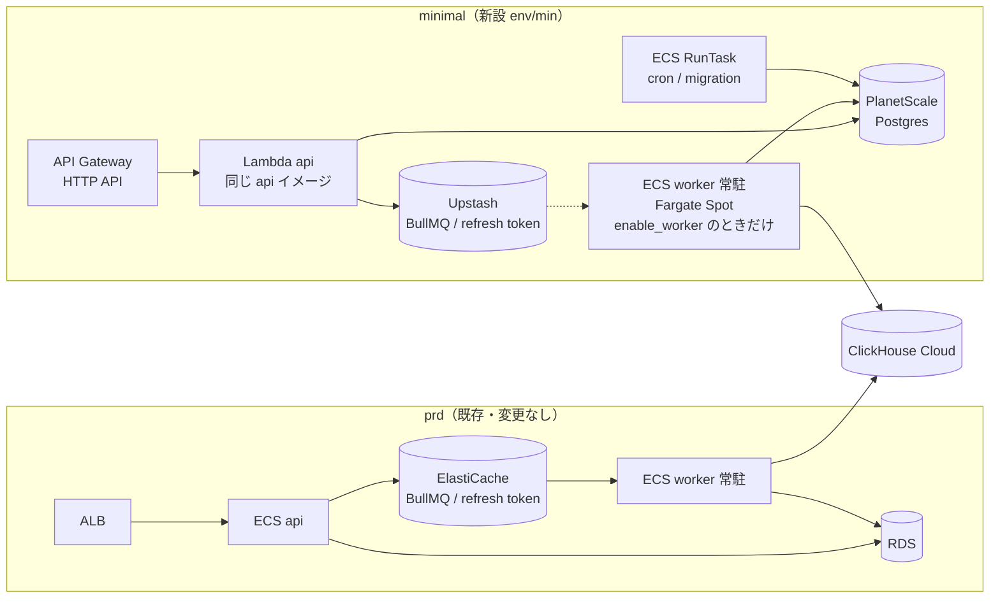
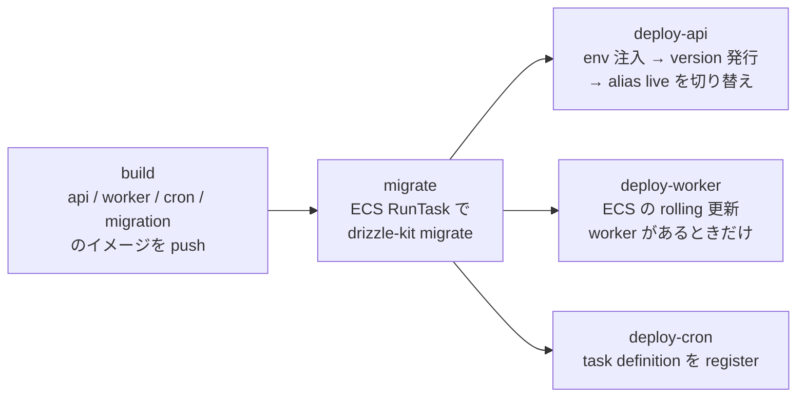
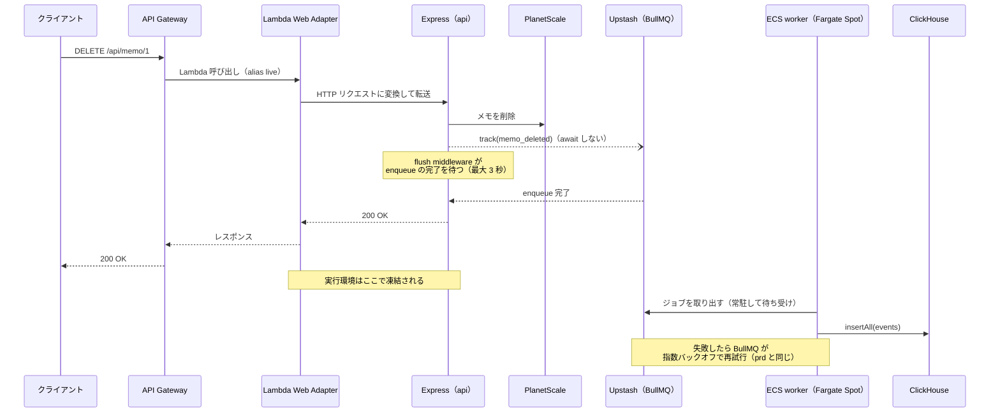

# ミニマム構成デプロイ（minimal）

リクエストが無いときのインフラ費用をほぼゼロにした本番構成（以下 **minimal**）を用意し、初期リリースをこの構成で行えるようにする。

現在の prd 構成（ECS Fargate + ALB + NAT Gateway + RDS + ElastiCache）は、トラフィックが無くても 1 環境あたり月 $140 前後（約 2.1 万円）の固定費がかかる。常時起動しているコンテナと、それを支えるネットワーク（NAT / ALB / Public IPv4）が費用の大半を占めるためである。minimal では api を Lambda に載せ、Redis を Upstash に、DB を外部の安価な Postgres（PlanetScale）に置き換えることで、固定費を月 $7 前後に抑える。worker（BullMQ）は必要になるまで作らず、作るときは Fargate Spot で動かす（そのときは月 $24 前後）。

**アプリケーションは 1 つのまま、minimal と prd の両方にデプロイできるようにする。** 実装の違いは環境変数で切り替え、同じコミット・同じ Dockerfile から作ったイメージをそのまま両方に載せる。既存の prd / dev は、新しい環境変数の既定値が現在の挙動になるため何も変わらない。

このドキュメントは **仕様（What）** と **設計（How）** を分けて記述する：

- **仕様**：minimal の位置づけ、利用者から見える挙動、互換性の約束、コスト目標、制約
- **設計**：実装の切り替え方、Lambda での動かし方、インフラ構成、デプロイ手順

## 関連 spec

- [`../user-behavior-events/README.md`](../user-behavior-events/README.md) — minimal で worker を作らない間は行動イベントを記録しない（`EVENT_TRACKER_TYPE=none`）。worker を作る場合は、同 spec の「欠落の扱い」の方針を minimal でも守る
- [`./deferred-migrate-to-standard.md`](./deferred-migrate-to-standard.md) — MVP 対象外。minimal から prd（ECS）への移行手順

## 目次

- [仕様](#仕様)
  - [位置づけ](#位置づけ)
  - [互換性の約束](#互換性の約束)
  - [コスト目標](#コスト目標)
  - [minimal で変わること（制約）](#minimal-で変わること制約)
  - [スコープ外](#スコープ外)
- [設計](#設計)
  - [全体構成](#全体構成)
  - [環境変数による実装の切り替え](#環境変数による実装の切り替え)
  - [api を Lambda で動かす](#api-を-lambda-で動かす)
  - [worker を Fargate Spot で動かす](#worker-を-fargate-spot-で動かす)
  - [worker を作るかどうかの切り替え](#worker-を作るかどうかの切り替え)
  - [Redis（Upstash）](#redisupstash)
  - [Lambda の凍結とイベント送出](#lambda-の凍結とイベント送出)
  - [DB（PlanetScale Postgres）](#dbplanetscale-postgres)
  - [secret と環境変数の注入](#secret-と環境変数の注入)
  - [cron と migration](#cron-と-migration)
  - [IaC の構成](#iac-の構成)
  - [デプロイ](#デプロイ)
  - [ローカル開発とテスト](#ローカル開発とテスト)
  - [リスクと実装時の確認事項](#リスクと実装時の確認事項)
  - [MVP 対象外（将来検討）](#mvp-対象外将来検討)
- [必要な画面](#必要な画面)
- [必要な API](#必要な-api)
- [必要な DB 設計](#必要な-db-設計)
- [フロー図](#フロー図)
- [実装ステップ](#実装ステップ)

---

## 仕様

### 位置づけ

| 構成 | 用途 | 公開ドメイン |
| --- | --- | --- |
| **minimal**（新設） | 初期リリースの本番。トラフィックが小さいうちはこれで運用する | `api.<domain>` |
| **prd**（既存） | 成長後の本番。トラフィックや可用性の要件が minimal の制約を超えたら移行する | `api.<domain>` |
| **dev**（既存） | 開発環境。変更しない | `api.dev.<domain>` 等（既存のまま） |

- minimal と prd は**同じドメインを使うため、同時に本番として公開しない**。両方が同時に存在するのは prd への移行期間だけ
- minimal から prd への移行手順は [`./deferred-migrate-to-standard.md`](./deferred-migrate-to-standard.md) にまとめる

### 互換性の約束

- **アプリのコードは minimal と prd で同じ。** 環境ごとのコード分岐やブランチは作らない。違いは環境変数だけで表現する
- **同じコミットから同じ Dockerfile でイメージを作る。** api / worker / cron / migration のどのイメージも、minimal 用の別 Dockerfile は作らない
- **API の外部契約は変えない。** URL、リクエスト / レスポンスの形、認証フロー（Google OAuth → JWT → refresh token）は minimal でも prd と同じ
- **DB のスキーマは変えない。** minimal のためのテーブルやカラムは追加しない
- **既存の prd / dev は何も変わらない。** 新しく追加する環境変数はすべて既定値が現在の挙動で、`env/prd` / `env/dev` の Terraform・deploy workflow・Secrets Manager には手を入れない
  - 環境をまたいで共有する `account/` には、minimal 用の IAM role と ECR の pull 許可を**追加するだけ**で、既存のリソースは変えない
  - 共有の module（`ecs-cluster` / `ecs-workload`）には Fargate Spot 用の変数を足すが、既定値は現在の挙動で、prd / dev の plan に差分は出ない

### コスト目標

リクエストが無い状態の月額。東京リージョン、$1 = 150 円の概算。

| | prd（現状） | minimal（worker なし） | minimal（worker あり） |
| --- | --- | --- | --- |
| 実行環境 | Fargate 常駐 2 タスク ~$22 | Lambda（無料枠内）~$0 | Lambda ~$0 + Fargate Spot 1 タスク ~$3.5 |
| 入口 | ALB ~$19 + Public IPv4 ~$11 | API Gateway（従量）~$0 | 同左 |
| 外向き通信 | NAT Gateway ~$45 | 不要（Lambda は VPC 外） | worker の Public IPv4 ~$3.6（NAT は不要） |
| DB | RDS db.t4g.micro ~$21 | PlanetScale PS-5 ~$5 | 同左 |
| Redis（Queue / refresh token） | ElastiCache ~$18 | Upstash Pay as You Go ~$0 | Upstash Fixed $10 |
| その他 | Container Insights / Logs / Secrets 等 ~$5–10 | Secrets / Logs / Route53 ~$1–2 | 同左 |
| **合計** | **~$140（約 2.1 万円）** | **~$7（約 1,000 円）** | **~$24（約 3,600 円）** |

トラフィックが増えると minimal は従量で増える（API Gateway は 100 万リクエストあたり ~$1.3、Lambda は無料枠を超えた分、Upstash は Pay as You Go の間 10 万コマンドあたり $0.2）。月数百万リクエストを超える、または下記の制約が問題になったら prd への移行を検討する。

### minimal で変わること（制約）

| 項目 | prd | minimal |
| --- | --- | --- |
| しばらくアクセスが無かった後の初回リクエスト | 遅延なし | **1〜2 秒のコールドスタート** |
| 1 リクエストの最大処理時間 | ALB の idle timeout（60 秒） | **30 秒**（API Gateway の上限） |
| IP 単位のレート制限 | 1 分 300 リクエスト（インスタンス単位） | **実質効かない**。API Gateway 全体のスロットリングで代替する |
| デプロイ | Blue/Green + GitHub 上の承認ゲート | **即時切り替え**。直後のヘルスチェックに失敗したら自動で、それ以外は 1 コマンドで前のバージョンに戻す |
| 行動イベントの記録 | する | worker を作らない間は**しない**（[後述](#worker-を作るかどうかの切り替え)） |
| worker の稼働 | Fargate（常時） | Fargate Spot。AWS の都合で止められることがあり、起動し直すまでジョブの処理が遅れる（ジョブは失われない） |
| DB | RDS（AWS 東京、単一 AZ） | PlanetScale（東京、単一ノード） |
| Redis（Queue / refresh token） | ElastiCache（AWS 東京、VPC 内） | Upstash（東京、インターネット越しの TLS） |

### スコープ外

- **web / admin のホスティング**: 現状どおり（このリポジトリの AWS 構成には含まれていない）
- **ClickHouse Cloud の費用**: worker の書き込み先は prd と同じ扱い。必要になるまでは `DATA_WAREHOUSE_TYPE=none` にもできるが、イベントが記録されなくなるため本番で使うかはプロダクトごとに判断する（`apps/worker/CLAUDE.md`）
- **dev の minimal 化**: dev も同じ固定費がかかっているが、本 spec では扱わない。`env/min` を雛形にすれば同じ構成で作れる

---

## 設計

### 全体構成

| 構成要素 | prd | minimal | アプリの変更 |
| --- | --- | --- | --- |
| api | ECS Service + ALB | Lambda + API Gateway HTTP API | Dockerfile に Lambda Web Adapter を追加（ECS 上では何もしない）。イベントの flush と送出先を env で切り替える |
| worker | ECS Service（Fargate、BullMQ 常駐） | ECS Service（Fargate Spot、BullMQ 常駐）。`enable_worker` で作るかを選ぶ | なし |
| Queue | BullMQ（ElastiCache） | BullMQ（Upstash） | なし |
| refresh token | Redis（ElastiCache） | Redis（Upstash） | なし（`REDIS_URL` を差し替えるだけ） |
| cron / migration | ECS RunTask（private subnet + NAT） | ECS RunTask（public subnet、NAT なし） | なし |
| DB | RDS | PlanetScale Postgres（PS-5） | なし（`DATABASE_URL` を差し替えるだけ） |
| secret | Secrets Manager → ECS の `valueFrom` | api: deploy workflow が Lambda の環境変数に注入 / worker・cron・migration: ECS の `valueFrom`（prd と同じ） | なし |

### 環境変数による実装の切り替え

既存の `DATA_WAREHOUSE_TYPE=clickhouse|none` / `LOGGER_TYPE` と同じく、**どの実装を使うかを env で選ぶ**。選ぶのは各 app の composition root（`src/index.ts` 等）だけで、service / ジョブハンドラは interface しか知らないため変更しない。

| 変数 | 対象 | 既定値（= prd / dev） | minimal | 説明 |
| --- | --- | --- | --- | --- |
| `EVENT_TRACKER_TYPE` | api | `queue` | worker あり: `queue` / なし: `none` | 行動イベントの送出先。`none` はイベントを捨てる（[後述](#worker-を作るかどうかの切り替え)） |
| `FLUSH_EVENTS_BEFORE_RESPONSE` | api | `false` | `true` | レスポンスを返す前にイベント送出の完了を待つ（[後述](#lambda-の凍結とイベント送出)） |
| `REDIS_URL` | api / worker | 現状どおり | Upstash の URL | refresh token と BullMQ の接続先 |
| `AWS_LWA_*` | api（Lambda のみ） | - | [後述](#api-を-lambda-で動かす) | Lambda Web Adapter の設定。アプリは読まない |

- prd の `env/prd/main.tf` の `secret_keys` には新しいキーを足さない。足さなければ既定値が使われ、現在の挙動のまま動く

### api を Lambda で動かす

**[Lambda Web Adapter](https://github.com/awslabs/aws-lambda-web-adapter)（LWA）を使い、Express アプリを書き換えずに Lambda で動かす。**

- LWA は Lambda の extension として `/opt/extensions/lambda-adapter` に置くバイナリで、Lambda のイベントを HTTP リクエストに変換して `localhost:8080` の Express に流す。Express は今までどおり `app.listen(8080)` するだけ
- **ECS 上では LWA は起動しない**（`/opt/extensions` を読むのは Lambda の実行環境だけ）。そのため api の Dockerfile に `COPY` を 1 行足すだけで、同じイメージが ECS と Lambda の両方で動く
- 入口は **API Gateway HTTP API**（`$default` ルートで Lambda に全リクエストを流す）。ALB と違い時間課金が無い。独自ドメイン（`api.<domain>`）と ACM 証明書を付ける
- `trust proxy = 1` はそのまま使える（API Gateway が `X-Forwarded-For` にクライアント IP を付ける）
- Lambda の設定: アーキテクチャ x86_64（現行イメージと同じ `linux/amd64`）、メモリ 1024 MB（コールドスタートを縮めるため。無料枠 40 万 GB 秒に対して十分小さい）、タイムアウト 29 秒

| LWA の環境変数 | 値 | 意味 |
| --- | --- | --- |
| `AWS_LWA_PORT` | `8080` | Express の待ち受けポート |
| `AWS_LWA_READINESS_CHECK_PATH` | `/api/health` | 起動完了の判定に使うパス（liveness。DB に依存しない） |

**レート制限**: `express-rate-limit` は in-memory のカウンタなので、短命で並列に増える Lambda では実質効かない。コードは変えずに残し、**API Gateway のステージ全体のスロットリング**（burst 100 / rate 50 req/s）で上限をかける。IP 単位の制限が必要になったら WAF（固定費 ~$6/月）か prd への移行を検討する。

**デプロイと切り戻し**: API Gateway は Lambda の alias `live` を呼ぶ。デプロイは「新しいイメージで version を発行 → `live` を新 version に向ける」で、切り戻しは `live` を前の version に戻すだけ。prd の Blue/Green と承認ゲートに相当するものは minimal では持たないが、切り替え直後に readiness を叩き、失敗したら自動で前の version に戻す（step4）。

### worker を Fargate Spot で動かす

**worker は prd と同じ BullMQ の常駐 worker で、コードもイメージも変えない。** 動かす場所だけを Fargate Spot に変える。

- ECS Service（1 タスク、0.25 vCPU / 0.5 GB。prd と同じサイズ）を capacity provider `FARGATE_SPOT` で起動する。料金は通常の Fargate の約 3 割
- public subnet に置いて public IP を付け、Upstash / PlanetScale / ClickHouse Cloud に直接出る。NAT と ALB は作らない（worker は inbound を受けない）
- **Spot の中断**: AWS の都合でタスクが止められることがある（2 分前に SIGTERM が届く）。worker の graceful shutdown（`apps/worker/CLAUDE.md`）で処理中のジョブを終えるか、終わらなければ BullMQ が止まったジョブとして拾い直す。ECS がタスクを起動し直すまで、ジョブは Upstash で待つだけで失われない
- Redis は Upstash の 1 つを refresh token と共用する。**BullMQ はジョブが無くても Redis に定期的にアクセスする**ため、Pay as You Go ではコマンド課金が積み上がる。worker を作るときは Upstash を Fixed プラン（$10/月）にする（Upstash の推奨）
- 再試行（3 回、5 秒からの指数バックオフ）・`jobId` による重複排除・失敗したジョブの保持は prd と同じ
- 検討した他の案:

| 案 | 採らなかった理由 |
| --- | --- |
| SQS + Lambda | 待機中の費用は ~$0 だが、Queue の SQS 実装と worker の Lambda 用入口が要り、再試行・重複排除の挙動も prd と変わる。Queue の実装を 2 つ持ち続けることになる |
| Cloudflare Containers | 常時起動向けではない（使われないと止まり、起こし続ける仕組みが要る）。費用も Fargate Spot と同程度で、デプロイの系統が 1 つ増える |

### worker を作るかどうかの切り替え

worker（バックグラウンドジョブ）を最初から使うプロダクトは少ないため、**`env/min` の Terraform 変数 `enable_worker`（既定 `false`）で worker を作るかどうかを選ぶ。**

| | `enable_worker = false`（既定） | `enable_worker = true` |
| --- | --- | --- |
| worker の ECS Service | 作らない | Fargate Spot で 1 タスク |
| api の `EVENT_TRACKER_TYPE` | `none`（行動イベントを捨てる） | `queue` |
| Upstash のプラン | Pay as You Go（~$0） | Fixed（$10） |
| 月額 | ~$7 | ~$24 |

- **worker が無いのに api がイベントを Queue に入れると、処理されないジョブが Upstash に溜まり続ける。** そこで api に `EVENT_TRACKER_TYPE`（`queue` / `none`。既定は現在の挙動の `queue`）を足し、`none` ではイベントを捨てる。worker の `DATA_WAREHOUSE_TYPE=none` と同じく、記録しないことを env で明示的に選ぶ
- **設定の正本は `enable_worker` だけにする。** deploy workflow は worker の ECS Service があるかを見て、api の `EVENT_TRACKER_TYPE` と worker のデプロイを切り替える。workflow 側に同じ設定を持たないので、2 か所の設定がずれない
- Upstash のプランは Terraform の管理外なので、切り替えるときに手動で変える（手順は step4）
- `none` の間は `POST /api/events`（クライアントからのイベント送信）も成功を返して捨てる
- prd / dev には入れない（互換性の約束どおり変えない。prd / dev は今までどおり worker を常に作る）

### Redis（Upstash）

**prd と同じく Redis を使い、refresh token の実装（`IoRedisRefreshTokenRepository`）も BullMQ も変えない。** minimal では Redis に [Upstash](https://upstash.com/)（Redis 互換のサーバーレス Redis）を使い、`REDIS_URL` を Upstash に向けるだけにする。

- ElastiCache は VPC の中にしか置けず、使うには Lambda を VPC に入れて NAT（~$45）か VPC endpoint を足す必要がある。Upstash はインターネット越しの TLS（`rediss://`）で接続できるので、Lambda を VPC の外に置いたまま使える
- **プラン**: worker を作らない間は Pay-as-you-go（10 万コマンドあたり $0.2、最低料金なし、ストレージは 1 GB まで無料）。リクエストが無ければ $0。worker を作るときは Fixed（[前述](#worker-を-fargate-spot-で動かす)）。Free プランは 14 日間アクセスが無いと停止されるため、本番には使わない
- **Pay-as-you-go の使用量の目安**（refresh token だけ）: ログインで 1、refresh で 3（読み取り・削除・保存）、ログアウトで 1 コマンド。access token の有効期限は 15 分なので、1 日 1 時間使うユーザー 1 人で 1 日約 13 コマンド。1 日 1,000 人で月 ~$0.8、1 万人で月 ~$8
- **Pay-as-you-go では月の予算を設定する。** 予算に達すると Upstash が rate limit をかけ、ログインと refresh が失敗する。見積もりより十分大きくする
- **Eviction は無効にする。** 有効だと、容量の上限に近づいたときに期限前の refresh token や未処理のジョブが消される（BullMQ も eviction しない設定が前提）
- リージョンは東京（`ap-northeast-1`）。read region は付けない
- 検討した他の案: Postgres に `refresh_tokens` テーブルを作る案は、prd に移るときもユーザーをログアウトさせずに済む。ただしテーブル・2 実装（Drizzle / Prisma）・契約テストの追加に見合うメリットが薄いため採らない。prd へ移るときの再ログインは、移行のメンテナンス時の 1 回で済む（[`./deferred-migrate-to-standard.md`](./deferred-migrate-to-standard.md#refresh-token-は移さない全員が一度再ログインする)）

### Lambda の凍結とイベント送出

`QueueEventTracker` は enqueue の完了を待たずにレスポンスを返す（`void this._queue.enqueue(...)`）。ECS ではプロセスが動き続けるので問題ないが、**Lambda はレスポンスを返した時点で実行環境を凍結する**。送信中の enqueue は次のリクエストが来るまで止まり、実行環境がそのまま回収されると失われる。

失われるのは「アクセスが途切れる直前のイベント」に偏るため、[`user-behavior-events`](../user-behavior-events/README.md#欠落の扱い) の「欠落が特定の状況に偏るのは避ける」に反する。そこで次のように対処する。

- `EventTracker` に `flush(): Promise<void>` を足す。`QueueEventTracker` は未完了の enqueue を保持し、`flush()` で全部の完了を待つ（失敗は従来どおり catch 済みなので、`flush()` は reject しない）
- api に「レスポンスを返す前に `flush()` を待つ」middleware を足し、`FLUSH_EVENTS_BEFORE_RESPONSE=true` のときだけ登録する。待つ時間には上限（3 秒）を設け、Redis（Upstash）が遅くてもレスポンスを止めすぎない
- prd は `false`（既定値）なので、レスポンスの速さは今と変わらない
- service 側の「送出は `await` しない」（`apps/api/CLAUDE.md`）という規約は変えない。待つのは middleware だけ

### DB（PlanetScale Postgres）

- **PlanetScale for Postgres の PS-5**（月 $5、単一ノード、東京リージョン `ap-northeast`）を使う。通常の Postgres なので、`pg` / Drizzle / Prisma / drizzle-kit はそのまま動き、**アプリの変更は `DATABASE_URL` の差し替えだけ**
- 検討した他の候補と、採らなかった理由:

| 候補 | 採らなかった理由 |
| --- | --- |
| Neon | 東京リージョンが無い（最寄りはシンガポール）。クエリ 1 回ごとに ~70ms の往復が乗る |
| Prisma Postgres | 東京にあるが操作回数課金で、トラフィック次第で費用が読みにくい |
| Aurora Serverless v2（0 ACU） | 停止からの復帰に最大 15 秒かかる。Lambda を VPC 外に置くには Data API が必要で、DB ドライバの切り替え（アプリ変更）が増える |
| RDS を public にする | 固定費が ~$21 残る。VPC 外の Lambda は IP が固定されないため、5432 をインターネットに開ける必要がある |

- **接続はインターネット越しの TLS**（`sslmode=verify-full`）。Lambda を VPC 外に置くので NAT は要らない
- **接続は PlanetScale に内蔵の PgBouncer（port 6432）経由にする。** 料金は PS-5 の $5 に含まれる。別料金の dedicated PgBouncer は replica への振り分けやリサイズ中の接続維持のためのもので、単一ノードの minimal では使わない
  - 凍結された Lambda の実行環境は DB 接続を握ったまま残るが、PgBouncer 経由なら PgBouncer の client 枠（既定 100）を使うだけで、Postgres の接続は消費しない
  - Lambda は 1 実行環境 = 1 リクエストなので、1 環境が張る接続は数本で済む。Lambda の同時実行数の上限（新規アカウントは 10）× 数本なら client 枠に収まる
  - PgBouncer は transaction pooling 固定で、トランザクションをまたいで状態を持つ機能（セッション単位の `SET`、`LISTEN` / `NOTIFY`、一時テーブル、advisory lock）は使えない。api / worker / cron / `packages/db` はいずれも使っていない
  - `packages/db` の Pool は接続時に `options=-c TimeZone=UTC` を送る。PgBouncer は 1.20 以降この `options` を受け付け、`TimeZone` は既定でクライアントごとに引き継ぐので、接続を使い回しても UTC のまま。PS-5 での実機確認は step3 で行う（[リスク](#リスクと実装時の確認事項)参照）
  - migration（drizzle-kit）も同じ接続文字列で流す。Drizzle は migration 全体を 1 トランザクションで実行するため、transaction pooling でも問題ない
- **バックアップ**: PlanetScale の自動バックアップに任せる（保持期間は実装時に確認して README に追記する）
- **リージョン**: アプリ（Lambda）も DB も東京。ClickHouse Cloud は prd と同じ接続先

### secret と環境変数の注入

ECS は Secrets Manager のキーを `valueFrom` で直接環境変数にできるが、**Lambda にはこの仕組みが無い。** worker / cron / migration は ECS なので prd と同じく `valueFrom` を使い、以下は api（Lambda）だけの話。 アプリに Secrets Manager を読むコードを足さずに済ませるため、**deploy workflow が Secrets Manager の値を Lambda の環境変数に書き込む。**

- 正本は prd と同じく Secrets Manager の `/project-template-min/app`（JSON）。値の投入は `scripts/seed-secrets.sh min` で行う
- deploy workflow が secret の JSON と、環境ごとに固定の値（`EVENT_TRACKER_TYPE` / `AWS_LWA_*` 等。workflow に直書き）を合成し、`aws lambda update-function-configuration --environment` で丸ごと設定する
- Terraform は Lambda の `environment` を `ignore_changes` にし、env の正本を deploy workflow に一本化する（Terraform と workflow が互いに上書きしないため）
- **トレードオフ**: Lambda の環境変数は KMS で暗号化して保存されるが、`lambda:GetFunctionConfiguration` 権限を持つ IAM プリンシパルからは平文で見える。minimal ではこれを許容し、閲覧できる権限を絞って運用する

### cron と migration

**ECS RunTask のまま残す**（アプリ・イメージとも変更なし）。

- 1 回動いて終了するタスクなので、課金は動いた秒数だけ（1 日 1 回 1 分なら月 1 円未満）
- minimal の VPC は public subnet だけにし、タスクに public IP を付けて（`assign_public_ip = true`）ECR / Secrets Manager / PlanetScale に直接出る。**NAT は作らない**。public IP の課金もタスクが動いている間だけ
- タスクの security group は inbound を一切開けない（外から接続する用途が無い）。worker も同じ VPC・security group を使う
- cron は `modules/ecs-schedule-task` の EventBridge Scheduler で起動する（prd と同じ）。migration は deploy workflow が `aws ecs run-task` で起動する

### IaC の構成

既存の 3 層構成（`bootstrap/` / `account/` / `env/`）に沿って、**`infra/terraform/aws/env/min/` を新設する。** `env/prd` / `env/dev` には手を入れない。

| 層 | 変更 |
| --- | --- |
| `account/` | GitHub Actions 用 IAM role `github_actions_min`（`environment:min` からのみ assume 可）を追加。ECR の repository policy に Lambda からの pull を許可する statement を追加 |
| `env/min/`（新設） | VPC（public subnet のみ）/ ECS cluster（worker・cron・migration 用）/ worker の ECS Service（`enable_worker` のときだけ）/ Lambda / API Gateway / ACM / Route53 / Secrets Manager |
| `modules/`（追加） | `lambda-container`（コンテナイメージの Lambda + alias `live` + ロググループ）/ `http-api`（API Gateway HTTP API + 独自ドメイン） |
| `modules/`（既存の流用） | `vpc` / `ecs-cluster` / `ecs-workload` / `ecs-schedule-task` / `acm` / `secrets` |
| `modules/`（既存に変数を追加） | `ecs-cluster`（`capacity_providers`）/ `ecs-workload`（`capacity_provider`）。既定値は現在の挙動で、prd / dev の plan に差分は出ない |

- PlanetScale と Upstash はコンソールで作り、Terraform では管理しない（AWS の外のサービスのため。手順は step3）
- 命名は `project-template-min-*`。prd（`project-template-prd-*`）と衝突しないので、移行期間に両方が同時に存在できる
- `api.<domain>` の Route53 レコードは `env/min` に直接書く。`modules/route53` は ALB 向け（`evaluate_target_health = true` 固定）なので使わない
- Lambda の `image_uri` / `environment` / alias の `function_version` は deploy workflow が更新するため `ignore_changes` にする

### デプロイ

`deploy-aws-min.yml`（`workflow_dispatch`）を新設する。prd の workflow と同じく、コミット SHA のタグでイメージを作る。

- **イメージは `--provenance=false` で build する。** buildx が既定で付ける provenance は OCI image index になり、Lambda はこれを受け付けない
- 切り戻しは `aws lambda update-alias --function-version <前の version>`。ECR の lifecycle（`account/ecr.tf`）は `v` で始まるタグと untagged しか消さないため、コミット SHA タグのイメージは残り、過去の version に戻せる。`--provenance=false` で build するので、untagged の子 manifest が消されて version が壊れることもない
- 初回は Lambda（と worker の ECS Service）の作成にイメージが必要なため、「イメージだけ push → `terraform apply` → 通常デプロイ」の順にする（手順は step4）

### ローカル開発とテスト

- **ローカルは変えない。** 新しい env の既定値は現在の挙動（BullMQ + Redis）なので、`docker compose` も `.env.local` もそのまま
- Lambda 上での動作（LWA、凍結）と Fargate Spot 上の worker は、minimal 環境へのデプロイ後に確認する（step4 の動作確認）

### リスクと実装時の確認事項

| リスク | 確認方法 | だめだった場合 |
| --- | --- | --- |
| PS-5 で内蔵 PgBouncer が使えない、または `packages/db` の Pool が送る `options=-c TimeZone=UTC` を PgBouncer が拒否する | step3 で port 6432 に `PGOPTIONS='-c TimeZone=UTC'` 付きで接続し、拒否されず `SHOW TimeZone` が `UTC` を返すか確認する | port 5432 に直接つなぐ。その場合は `SHOW max_connections` が「Lambda の同時実行数の上限 × 1 実行環境あたりの接続数」を上回っているかも確認する |
| 凍結から戻った Lambda が、切れた DB 接続を使って 1 リクエスト失敗する | step4 で、30 分以上アクセスしなかった後の初回リクエストが成功するか確認する | `packages/db` の Pool に `idleTimeoutMillis` を設定する（ECS でも無害な変更） |
| 凍結から戻った Lambda が、切れた Redis（Upstash）接続を使って refresh が失敗する、または遅れる | step4 で、30 分以上アクセスしなかった後の初回の `POST /api/auth/refresh` が成功するか確認する | api の `src/index.ts` で `createRedisClient` に ioredis のオプション（`commandTimeout` 等）を渡し、切れた接続を早く捨てて再接続させる（ECS でも無害な変更） |
| Upstash の月の予算（Pay as You Go の間）に達し、ログインと refresh が止まる | step4 のコスト確認で、Upstash のコマンド数が見積もりから外れていないか見る | 予算を引き上げる。恒常的に大きいなら prd への移行を検討する |
| 既存の api イメージが Lambda でそのまま起動しない（`ENTRYPOINT` の tini、`USER node`、`/tmp` 以外が読み取り専用） | step4 の初回デプロイで、関数が起動して readiness が通るか確認する | Lambda の `image_config` で `entry_point` を `["node"]` に上書きする（イメージは変えない） |

### MVP 対象外（将来検討）

以下は MVP では実装しない。minimal のトラフィックや可用性の要件が制約を超えたときに着手する。

- minimal から prd（ECS）への移行（DB の移し替え、Queue の切り替え、DNS の切り替え）
- IP 単位のレート制限（WAF）
- minimal でのデプロイ承認ゲート

詳細：[`./deferred-migrate-to-standard.md`](./deferred-migrate-to-standard.md)

---

## 必要な画面

なし（インフラとアプリ基盤の変更のみ）。

## 必要な API

なし（新しいエンドポイントも、既存エンドポイントの変更も無い）。

## 必要な DB 設計

なし（スキーマは変えない）。

## フロー図

### minimal でのリクエストとイベント送出（worker あり）

---

## 実装ステップ

1 step = 1 PR を想定。step1〜2 はアプリの変更で、**マージしても prd / dev の挙動は変わらない**（既定値が現在の挙動のため）。step3〜4 で minimal 環境を作ってデプロイする。

| step | 内容 |
| --- | --- |
| [step1-api-event-flush-and-lwa](./tasks/step1-api-event-flush-and-lwa.md) | `EventTracker.flush()` と flush middleware、api の Dockerfile に LWA |
| [step2-api-event-tracker-type](./tasks/step2-api-event-tracker-type.md) | `NoopEventTracker` と api の `EVENT_TRACKER_TYPE` |
| [step3-infra-env-min](./tasks/step3-infra-env-min.md) | PlanetScale / Upstash の作成、Terraform（`account/` の追加、新 module、既存 module への変数追加、`env/min` と `enable_worker`）、`seed-secrets.sh` の min 対応 |
| [step4-ci-deploy-min](./tasks/step4-ci-deploy-min.md) | `deploy-aws-min.yml`（worker の有無の検出を含む）、初回デプロイと worker の有効化・停止の手順、AWS 上での動作確認 |
