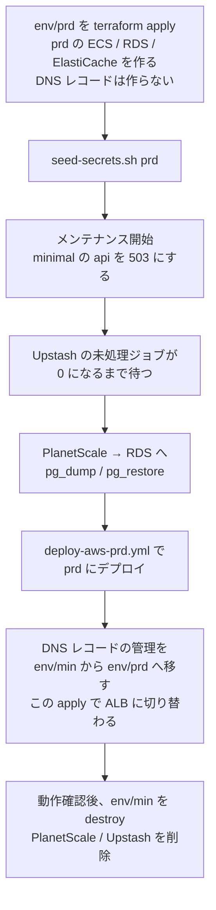

# minimal から prd（ECS）への移行（MVP 対象外）

minimal で始めた本番を、成長に合わせて prd 構成（ECS + ALB + RDS + ElastiCache）に移すための設計案。MVP（[`./README.md`](./README.md)）では実装しない。

## 着手トリガー

次のどれかが起きたら着手する。

- 月のリクエスト数が数百万を超え、minimal の従量課金が prd の固定費（月 ~$140）に近づいた
- コールドスタート（1〜2 秒）や 30 秒のリクエスト上限が、プロダクトの要件として許容できなくなった
- IP 単位のレート制限やデプロイの承認ゲートが必要になった
- DB に冗長化（HA）が必要になった

## 対象範囲

| 項目 | MVP（minimal） | 本ドキュメント（移行） |
| --- | --- | --- |
| prd 構成の Terraform / deploy workflow | 既存のまま使える | DNS レコードの管理を引き継ぐための変数を `env/prd` に 1 つ足す（下記）。それ以外はそのまま apply する |
| アプリのコード | env で切り替え可能にする | **変更なし**（env の値を変えるだけ） |
| DB のデータ | PlanetScale | RDS へ移す |
| Queue | BullMQ（Upstash） | BullMQ（ElastiCache）へ切り替える（Upstash の未処理ジョブを流し切る） |
| refresh token | Upstash（Redis） | **移さない**。prd は ElastiCache を使い、全ユーザーが一度再ログインする（下記） |
| DNS | `api.<domain>` → API Gateway | `api.<domain>` → ALB に切り替える |

## 設計案

### 手順の概要

- **データの移し替えは停止時間を取って `pg_dump` / `pg_restore` で行う。** minimal の規模ならデータ量は小さく、数分の停止で済む想定。停止できない規模になっていたら、Postgres の論理レプリケーションで差分を流し続けてから切り替える方式を検討する（PlanetScale が publication を作れるかを確認する）
- **`pg_dump` は PgBouncer（6432）ではなく port 5432 に直接つなぐ。** `pg_dump` はセッション単位の `SET` を使うため、transaction pooling の PgBouncer 経由では正しく動かない
- **migration の履歴（`drizzle.__drizzle_migrations`）も一緒に移す。** 移さないと prd の migration が初期マイグレーションから流れて `relation already exists` で失敗する
- **DNS を切り替えるまでは minimal が本番。** prd の ALB には先に独自ドメインの証明書を付け、ALB の DNS 名で動作確認してから Route53 を切り替える（[DNS レコードの管理の引き継ぎ](#dns-レコードの管理の引き継ぎ)）

### DNS レコードの管理の引き継ぎ

`api.<domain>` の A レコードは、`env/min`（`aws_route53_record.api`、API Gateway 向け）と `env/prd`（`module.route53_api`、ALB 向け）の両方が定義している。別々の state が同じレコードを管理すると、`env/prd` の最初の apply がレコードの作成で失敗するか、移行の途中で DNS が ALB に切り替わってしまう。そこで **DNS を切り替えるまではレコードを `env/min` だけが管理し、切り替えの 1 回の apply で `env/prd` に引き渡す。**

1. `env/prd` に変数 `manage_api_dns_record`（bool、既定 `true`）を足し、`module.route53_api` に `count = var.manage_api_dns_record ? 1 : 0` を付ける。prd の state がすでにある場合は `moved`（`module.route53_api` → `module.route53_api[0]`）も足す
2. `env/prd` の最初の apply は `-var manage_api_dns_record=false` で行う。レコードには触れないので、DNS は API Gateway のまま
3. メンテナンス・データの移し替え・prd へのデプロイを終え、ALB の DNS 名で動作を確認する
4. `env/min` の `aws_route53_record.api` を `removed` ブロック（`lifecycle { destroy = false }`）に置き換えて apply する。レコードは消えずに `env/min` の管理から外れる。DNS はまだ API Gateway のまま
5. `env/prd` に `import` ブロック（`to = module.route53_api[0].aws_route53_record.api`、`id = "<zone_id>_api.<domain>_A"`）を足し、`manage_api_dns_record = true`（既定値）で apply する。**この apply が DNS の切り替え。** plan に出るのが「既存レコードの import」と「alias の向き先を ALB に変える in-place の変更」だけであることを確認してから apply する
6. 切り替えた後は、`import` / `removed` ブロックを消してよい

- 2〜4 の apply では DNS は変わらない。切り替えは 5 の 1 回だけ
- 切り戻すときは 4・5 を逆向きに行う（`env/prd` で `removed`、`env/min` で `import` して API Gateway に向け直す）

### refresh token は移さない（全員が一度再ログインする）

minimal は refresh token を Upstash に、prd は ElastiCache に保存する。**移行では refresh token を移さず、DNS を切り替えた後に全ユーザーが一度ログインし直す。** メンテナンスの告知に、再ログインが必要になることを含める。

- JWT の署名鍵（`JWT_ACCESS_SECRET` / `JWT_REFRESH_SECRET`）も minimal と prd で別々に生成しているため、切り替えた直後から access token も refresh token も検証に失敗し、クライアントはログイン画面に戻る
- 再ログインを避けたくなった場合は、JWT の署名鍵を minimal から prd の secret に移し、Upstash の `refresh_token:*` を TTL ごと ElastiCache にコピーする（本ドキュメントでは採らない）

### Queue の切り替え

Queue の実装は minimal も prd も BullMQ なので、アプリの設定は変わらない。Redis が Upstash から ElastiCache に変わるだけ。

- worker を作っている（`enable_worker = true`）場合: メンテナンス中に、Upstash の BullMQ のキューに待ち（wait）・遅延（delayed）・実行中（active）のジョブが無くなるのを待ってから切り替える。最終失敗した（failed）ジョブは、内容を確認してから捨てる
- worker を作っていない場合: Queue にジョブは入っていない（api は `EVENT_TRACKER_TYPE=none`）ので、待つものは無い。prd では api が既定値の `queue` に戻り、行動イベントの記録が始まる

## 既存仕様との差分（着手時のチェックリスト）

- [ ] メンテナンスの告知に、移行後に再ログインが必要になることを含めた
- [ ] `env/prd` に `manage_api_dns_record` を足し、最初の apply を `false` で行って DNS が API Gateway のままであることを確認した
- [ ] `env/min` の DNS レコードを `removed`（`destroy = false`）で管理から外してから、`env/prd` で `import` して切り替えた
- [ ] prd の RDS に PlanetScale のデータと `drizzle.__drizzle_migrations` が移っている
- [ ] Upstash の BullMQ のキューが空になっている（worker を作っていた場合）
- [ ] Route53 の `api.<domain>` の alias が ALB を指している
- [ ] `env/min` の destroy 前に、PlanetScale の最終バックアップを取得した
- [ ] PlanetScale のデータベースを削除し、課金が止まったことを確認した
- [ ] Upstash のデータベースを削除し、課金が止まったことを確認した
- [ ] GitHub Environment `min` と `deploy-aws-min.yml` を残すかを決めた（再び minimal に戻す可能性が無ければ削除する）
