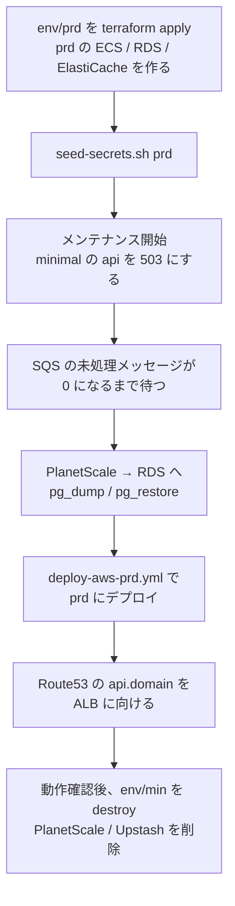

# minimal から prd（ECS）への移行（MVP 対象外）

minimal で始めた本番を、成長に合わせて prd 構成（ECS + ALB + RDS + ElastiCache）に移すための設計案。MVP（[`./README.md`](./README.md)）では実装しない。

## 着手トリガー

次のどれかが起きたら着手する。

- 月のリクエスト数が数百万を超え、minimal の従量課金が prd の固定費（月 ~$140）に近づいた
- コールドスタート（1〜2 秒）や 30 秒のリクエスト上限が、プロダクトの要件として許容できなくなった
- IP 単位のレート制限やデプロイの承認ゲートが必要になった
- DB に冗長化（HA）が必要になった

## 対象範囲

| 項目 | MVP（minimal） | 本ドキュメント（移行） |
| --- | --- | --- |
| prd 構成の Terraform / deploy workflow | 既存のまま使える | 変更なし。そのまま apply する |
| アプリのコード | env で切り替え可能にする | **変更なし**（env の値を変えるだけ） |
| DB のデータ | PlanetScale | RDS へ移す |
| Queue | SQS | BullMQ へ切り替える（未処理メッセージを流し切る） |
| refresh token | Upstash（Redis） | **移さない**。prd は ElastiCache を使い、全ユーザーが一度再ログインする（下記） |
| DNS | `api.<domain>` → API Gateway | `api.<domain>` → ALB に切り替える |

## 設計案

### 手順の概要

- **データの移し替えは停止時間を取って `pg_dump` / `pg_restore` で行う。** minimal の規模ならデータ量は小さく、数分の停止で済む想定。停止できない規模になっていたら、Postgres の論理レプリケーションで差分を流し続けてから切り替える方式を検討する（PlanetScale が publication を作れるかを確認する）
- **`pg_dump` は PgBouncer（6432）ではなく port 5432 に直接つなぐ。** `pg_dump` はセッション単位の `SET` を使うため、transaction pooling の PgBouncer 経由では正しく動かない
- **migration の履歴（`drizzle.__drizzle_migrations`）も一緒に移す。** 移さないと prd の migration が初期マイグレーションから流れて `relation already exists` で失敗する
- **DNS を切り替えるまでは minimal が本番。** prd の ALB には先に独自ドメインの証明書を付け、ALB の DNS 名で動作確認してから Route53 を切り替える

### refresh token は移さない（全員が一度再ログインする）

minimal は refresh token を Upstash に、prd は ElastiCache に保存する。**移行では refresh token を移さず、DNS を切り替えた後に全ユーザーが一度ログインし直す。** メンテナンスの告知に、再ログインが必要になることを含める。

- JWT の署名鍵（`JWT_ACCESS_SECRET` / `JWT_REFRESH_SECRET`）も minimal と prd で別々に生成しているため、切り替えた直後から access token も refresh token も検証に失敗し、クライアントはログイン画面に戻る
- 再ログインを避けたくなった場合は、JWT の署名鍵を minimal から prd の secret に移し、Upstash の `refresh_token:*` を TTL ごと ElastiCache にコピーする（本ドキュメントでは採らない）

### Queue の切り替え

- メンテナンス中に SQS の `ApproximateNumberOfMessagesVisible` と `ApproximateNumberOfMessagesNotVisible` が 0 になるのを待ってから切り替える
- DLQ に残っているメッセージは、移行前に redrive して処理し切るか、内容を確認して捨てる
- prd に切り替えた後に SQS へ届くメッセージは無い（api が BullMQ に enqueue するため）

## 既存仕様との差分（着手時のチェックリスト）

- [ ] メンテナンスの告知に、移行後に再ログインが必要になることを含めた
- [ ] prd の RDS に PlanetScale のデータと `drizzle.__drizzle_migrations` が移っている
- [ ] SQS（本体と DLQ）が空になっている
- [ ] Route53 の `api.<domain>` の alias が ALB を指している
- [ ] `env/min` の destroy 前に、PlanetScale の最終バックアップを取得した
- [ ] PlanetScale のデータベースを削除し、課金が止まったことを確認した
- [ ] Upstash のデータベースを削除し、課金が止まったことを確認した
- [ ] GitHub Environment `min` と `deploy-aws-min.yml` を残すかを決めた（再び minimal に戻す可能性が無ければ削除する）
