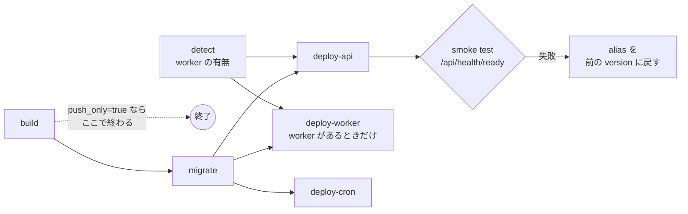

# step4-ci-deploy-min

minimal 環境へのデプロイ workflow（`.github/workflows/deploy-aws-min.yml`）を作り、初回デプロイと AWS 上での動作確認を行う。worker は ECS Service がある（`enable_worker = true`）ときだけデプロイし、api の `EVENT_TRACKER_TYPE` もそれに合わせて切り替える。prd の `deploy-aws-prd.yml` には手を入れない。

設計: [`../README.md`](../README.md#デプロイ) / [secret と環境変数の注入](../README.md#secret-と環境変数の注入) / [worker を作るかどうかの切り替え](../README.md#worker-を作るかどうかの切り替え)

前提: [step3-infra-env-min](./step3-infra-env-min.md)

## 対応内容

### workflow の全体



- `on: workflow_dispatch`、入力は `push_only`（boolean、既定 `false`）。初回だけ `true` で実行し、Lambda と worker の ECS Service の作成に使うイメージを用意する
- `concurrency: { group: deploy-aws-min, cancel-in-progress: false }`（prd と同じく並列デプロイを禁止する）
- GitHub Environment は `min`。Secrets の `AWS_ROLE_ARN` は step3 で登録した deploy 用の `github_actions_min` role（必要な権限だけ。Terraform 用の admin role は使わない）
- API の URL は GitHub Environment `min` の **variable `API_URL`** から受け取る（ドメインはプロダクトごとに違うため、workflow に書かない）。未設定、または `https://` で始まらない値なら、Lambda を更新する前に job を止める
- 環境ごとの値は prd の workflow と同じく先頭の `env:` に並べる

```yaml
env:
  AWS_REGION: ap-northeast-1
  PROJECT_NAME: project-template
  ENVIRONMENT: min

  ECR_API_REPO: project-template-api-server
  ECR_WORKER_REPO: project-template-worker
  ECR_MIGRATION_REPO: project-template-migration
  ECR_CRON_REPO: project-template-cron

  LAMBDA_API_FUNCTION: project-template-min-api
  ECS_CLUSTER: project-template-min-cluster
  ECS_WORKER_SERVICE: project-template-min-worker
  ECS_MIGRATION_TASK_DEF: project-template-min-migration
  ECS_CRON_TASK_DEF: project-template-min-cron
  ECS_SECURITY_GROUP_NAME: project-template-min-ecs
  PUBLIC_SUBNET_NAME_PREFIX: project-template-min-public

  APP_SECRET_NAME: /project-template-min/app
```

### detect

worker の ECS Service があるかを調べ、`worker_enabled` を output にする。**worker を作るかどうかの正本は Terraform の `enable_worker` だけ**にし、workflow 側に同じ設定を持たない。

```bash
STATUS=$(aws ecs describe-services \
  --cluster "${ECS_CLUSTER}" --services "${ECS_WORKER_SERVICE}" \
  --query 'services[0].status' --output text)
# Service が無いと services が空になり "None" が返る。削除中は "DRAINING" / "INACTIVE"
if [ "${STATUS}" = "ACTIVE" ]; then
  echo "worker_enabled=true" >> "$GITHUB_OUTPUT"
else
  echo "worker_enabled=false" >> "$GITHUB_OUTPUT"
fi
```

`push_only=true` の初回は Terraform を apply する前なので、cluster が無く `describe-services` が失敗する。detect にも `if: ${{ !inputs.push_only }}` を付ける。

### build

prd の build job と同じく、4 つのイメージをコミット SHA（12 桁）のタグで push する。worker のイメージは `enable_worker` に関係なく毎回作る（後から worker を有効にしたときに、すぐ使えるイメージを ECR に置いておくため）。prd との違いは 2 点。

- **`--provenance=false` を付ける。** buildx の既定の provenance は OCI image index になり、Lambda はこれを受け付けない（api 以外も揃えて付ける）
- `push_only=true` のときは api / worker に `initial` タグも付ける（`env/min` の `bootstrap_image_tag` の既定値。Lambda と worker の ECS Service の作成時だけ使う）

```bash
IMAGE="${{ steps.ecr.outputs.registry }}/${{ env.ECR_API_REPO }}"
TAGS=(-t "${IMAGE}:${{ steps.meta.outputs.image_tag }}")
if [ "${{ inputs.push_only }}" = "true" ]; then
  TAGS+=(-t "${IMAGE}:initial")
fi
docker buildx build \
  --platform linux/amd64 \
  --provenance=false \
  -f apps/api/Dockerfile \
  "${TAGS[@]}" \
  --push \
  .
```

build 以外の job にはすべて `if: ${{ !inputs.push_only }}` を付ける。

### migrate

prd の migrate job をそのまま使い、ネットワークだけ変える。

- subnet は `PUBLIC_SUBNET_NAME_PREFIX` で解決する（minimal の VPC には public subnet しか無い）
- `run-task` の `assignPublicIp=ENABLED`（NAT が無いので、public IP で ECR / Secrets Manager / PlanetScale に出る）

### deploy-api

Lambda に「環境変数の設定 → 新しいイメージで version を発行 → alias `live` を切り替え」を行う。

**secret から渡すキー**は、ECS の `secret_keys`（`env/prd/main.tf`）の api と同じものに絞る: `DATABASE_URL` / `FRONTEND_URL` / `GOOGLE_CLIENT_ID` / `GOOGLE_CLIENT_SECRET` / `JWT_ACCESS_EXPIRATION` / `JWT_ACCESS_SECRET` / `JWT_REFRESH_EXPIRATION` / `JWT_REFRESH_SECRET` / `NODE_ENV` / `PORT` / `REDIS_URL`

**固定値**（minimal で実装を切り替える値。workflow に直書きする）: `EVENT_TRACKER_TYPE`（detect の結果。worker があれば `queue`、無ければ `none`）/ `FLUSH_EVENTS_BEFORE_RESPONSE=true` / `AWS_LWA_PORT=8080` / `AWS_LWA_READINESS_CHECK_PATH=/api/health`

```bash
if [ "${{ needs.detect.outputs.worker_enabled }}" = "true" ]; then
  EVENT_TRACKER_TYPE=queue
else
  EVENT_TRACKER_TYPE=none
fi
FIXED_ENV_JSON=$(jq -n --arg tracker "${EVENT_TRACKER_TYPE}" '{
  AWS_LWA_PORT: "8080",
  AWS_LWA_READINESS_CHECK_PATH: "/api/health",
  EVENT_TRACKER_TYPE: $tracker,
  FLUSH_EVENTS_BEFORE_RESPONSE: "true"
}')
```

job の各 step で使う値は、step の `env:` で定義する（job の `env:` からは workflow の `env` を参照できないため）。

```yaml
      - name: Deploy Lambda function
        id: deploy
        env:
          API_URL: ${{ vars.API_URL }}
          FUNCTION: ${{ env.LAMBDA_API_FUNCTION }}
          IMAGE: ${{ needs.build.outputs.registry }}/${{ env.ECR_API_REPO }}:${{ needs.build.outputs.image_tag }}
          SECRET_KEYS_JSON: >-
            ["DATABASE_URL","FRONTEND_URL","GOOGLE_CLIENT_ID","GOOGLE_CLIENT_SECRET",
            "JWT_ACCESS_EXPIRATION","JWT_ACCESS_SECRET","JWT_REFRESH_EXPIRATION","JWT_REFRESH_SECRET",
            "NODE_ENV","PORT","REDIS_URL"]
          WORKER_ENABLED: ${{ needs.detect.outputs.worker_enabled }}
```

`registry` / `image_tag` は build job の output、`worker_enabled` は detect job の output。

**デプロイの手順**（`API_URL` の検証の後に行う）:

```bash
set -euo pipefail

# 1. secret のうち、この関数が使うキーだけを取り出し、固定値と合成する
SECRET_JSON=$(aws secretsmanager get-secret-value \
  --secret-id "${APP_SECRET_NAME}" --query SecretString --output text)
ENV_JSON=$(jq -n \
  --argjson secret "${SECRET_JSON}" \
  --argjson keys "${SECRET_KEYS_JSON}" \
  --argjson fixed "${FIXED_ENV_JSON}" \
  '{ Variables: (($secret | with_entries(select(.key as $k | $keys | index($k)))) + $fixed) }')

# secret に無いキーがあれば止める（ECS の valueFrom と同じく、欠けたまま起動させない）
MISSING=$(jq -rn --argjson secret "${SECRET_JSON}" --argjson keys "${SECRET_KEYS_JSON}" \
  '$keys - ($secret | keys) | join(",")')
if [ -n "${MISSING}" ]; then
  echo "::error::missing keys in ${APP_SECRET_NAME}: ${MISSING}"
  exit 1
fi

# 2. 環境変数を設定する（$LATEST に対する変更。次の publish で version に固定される）
aws lambda update-function-configuration \
  --function-name "${FUNCTION}" --environment "${ENV_JSON}" > /dev/null
aws lambda wait function-updated-v2 --function-name "${FUNCTION}"

# 3. 新しいイメージで version を発行する
VERSION=$(aws lambda update-function-code \
  --function-name "${FUNCTION}" --image-uri "${IMAGE}" --publish \
  --query Version --output text)
aws lambda wait published-version-active --function-name "${FUNCTION}" --qualifier "${VERSION}"

# 4. alias live を切り替える。切り戻し用に前の version を残す
PREVIOUS=$(aws lambda get-alias \
  --function-name "${FUNCTION}" --name live --query FunctionVersion --output text)
aws lambda update-alias \
  --function-name "${FUNCTION}" --name live --function-version "${VERSION}" > /dev/null

echo "previous_version=${PREVIOUS}" >> "$GITHUB_OUTPUT"
{
  echo "### ${FUNCTION}: version ${PREVIOUS} → ${VERSION}"
  echo "切り戻し: \`aws lambda update-alias --function-name ${FUNCTION} --name live --function-version ${PREVIOUS}\`"
} >> "$GITHUB_STEP_SUMMARY"
```

`ENV_JSON` には secret の値が入るので、`echo` やログに出さない。

初回デプロイの `PREVIOUS` は Terraform が作成時に発行した version（`initial` イメージで、環境変数が無い）なので、切り戻し先としては使えない。2 回目以降のデプロイから切り戻しが意味を持つ。

**smoke test と自動の切り戻し**: alias の切り替え後に `${API_URL}/api/health/ready` を叩き、`200` 以外なら alias を `PREVIOUS` に戻して job を失敗させる。prd の Blue/Green + 承認ゲートの代わりに、最低限「壊れたまま公開し続けない」ことを保証する。

DNS / TLS / API Gateway が応答しないときに待ち続けて切り戻しが走らない、ということが無いよう、接続（5 秒）・1 回のリクエスト（10 秒）・リトライ全体（60 秒）のすべてに上限を付ける。job にも `timeout-minutes: 20` を付ける。

```bash
if ! curl -fsS --connect-timeout 5 --max-time 10 \
  --retry 3 --retry-delay 5 --retry-max-time 60 --retry-all-errors \
  "${API_URL}/api/health/ready"; then
  echo "::error::smoke test failed, rolling back to version ${PREVIOUS}"
  aws lambda update-alias \
    --function-name "${FUNCTION}" --name live --function-version "${PREVIOUS}" > /dev/null
  exit 1
fi
```

### deploy-worker

prd の deploy-worker job と同じ（task definition を取得 → image を差し替え → `amazon-ecs-deploy-task-definition` で service を更新し、安定するまで待つ）。違いは `if: ${{ !inputs.push_only && needs.detect.outputs.worker_enabled == 'true' }}` を付けることだけ。

### deploy-cron

prd の deploy-cron job と同じ（task definition の image を差し替えて register するだけ。EventBridge Scheduler は最新の revision を起動する）。

### 初回デプロイの手順

Lambda（と worker の ECS Service）は作成時にイメージが必要なので、次の順で行う。

1. step3 の `account/` をローカルから apply し、GitHub の Environment `min` と `min-terraform` を作って、それぞれの Secrets に `AWS_ROLE_ARN`（`github_actions_min_role_arn` / `github_actions_min_terraform_role_arn`）を登録する。`min` には variable `API_URL`（例: `https://api.<domain>`）も登録する
2. PlanetScale のデータベースと Upstash の Redis を作る（step3。Upstash のプランは `enable_worker` に合わせる）
3. `deploy-aws-min.yml` を `push_only: true` で実行する（SHA と `initial` のタグでイメージが push される）
4. `terraform-aws-env-apply.yml` を `environment: min` で実行する（または `cd infra/terraform/aws/env/min && terraform apply`）。ACM の DNS 検証が終わるまで数分かかる
5. secret を投入する

    ```bash
    EXTERNAL_DATABASE_URL='postgresql://<user>:<password>@<host>:6432/<db>?sslmode=verify-full' \
    EXTERNAL_REDIS_URL='rediss://default:<password>@<endpoint>:6379' \
    GOOGLE_CLIENT_ID=... GOOGLE_CLIENT_SECRET=... \
    FRONTEND_URL=https://<web のドメイン> \
      ./scripts/seed-secrets.sh min
    ```

6. `deploy-aws-min.yml` を通常（`push_only: false`）で実行する。migrate → api / worker（あれば）/ cron の順にデプロイされる

### worker を有効にする・止める手順

**有効にする**（`enable_worker`: `false` → `true`）:

1. Upstash のプランを `Fixed` に変える
2. `env/min/variables.tf` の `enable_worker` の既定値を `true` にしてコミットし、apply する。worker の ECS Service が `initial` タグのイメージで作られる
3. `deploy-aws-min.yml` を実行する。worker が最新のイメージに更新され、api が `EVENT_TRACKER_TYPE=queue` に切り替わる（ここからイベントが記録される）

**止める**（`enable_worker`: `true` → `false`）:

1. `enable_worker` の既定値を `false` にしてコミットし、apply する。worker の ECS Service が消える
2. すぐに `deploy-aws-min.yml` を実行する。api が `EVENT_TRACKER_TYPE=none` に切り替わる
3. 1〜2 の間に enqueue されて処理されないジョブを捨てる。対象は api が enqueue する `track-event` のキューだけにする（BullMQ の既定の prefix `bull` + キュー名 `track-event`。`packages/queue` の `TRACK_EVENT_QUEUE_NAME`）。`bull:*` だと他のキューまで消える

    ```bash
    redis-cli --tls -u '<接続文字列>' --scan --pattern 'bull:track-event:*' \
      | xargs redis-cli --tls -u '<接続文字列>' DEL
    ```

4. Upstash のプランを `Pay as You Go` に戻し、月の予算を設定する

## 動作確認

minimal 環境にデプロイした状態で、AWS 上でしか確認できない項目を確かめる。結果は PR 本文に残す。worker の項目は、`enable_worker = false` と `true` の両方で確認する。

### api

- [ ] `curl https://api.<domain>/api/health` が `200`
- [ ] `curl https://api.<domain>/api/health/ready` が `200` で、`services` の `database` と `redis` がどちらも `ok`
- [ ] Google ログイン → `POST /api/auth/refresh` → `POST /api/auth/logout` が成功し、Upstash の `refresh_token:*` のキーが増減する（`redis-cli --tls -u '<接続文字列>' --scan --pattern 'refresh_token:*'`）。キーに TTL が付いている（`TTL refresh_token:<jti>` が正の値）
- [ ] メモの作成・更新・削除が成功する
- [ ] API Gateway の execute-api の URL（`https://<api-id>.execute-api...`）では呼べない（`disable_execute_api_endpoint`）

### コールドスタートと凍結

- [ ] 30 分以上アクセスしなかった後の初回リクエストが成功し、応答時間が 3 秒以内（[リスク](../README.md#リスクと実装時の確認事項)の「切れた DB 接続」の確認を兼ねる）
- [ ] 30 分以上アクセスしなかった後の初回の `POST /api/auth/refresh` が成功し、応答時間が 3 秒以内（[リスク](../README.md#リスクと実装時の確認事項)の「切れた Redis 接続」の確認）
- [ ] worker ありの場合: メモを 10 回作成した直後にアクセスを止め、worker のログに 10 件分の `track-event` の処理（ClickHouse が dummy の間は insert 失敗のログ）が出ている（flush middleware により、凍結の前に Upstash へ送り切れている）

### worker なし（`enable_worker = false`）

- [ ] Lambda の環境変数が `EVENT_TRACKER_TYPE=none` になっている
- [ ] メモを作成しても、Upstash に `bull:track-event:*` のキーが増えない

### worker あり（`enable_worker = true`）

- [ ] worker の ECS Service が 1 タスクで動き、`capacityProviderStrategy` が `FARGATE_SPOT` になっている（`aws ecs describe-services`）
- [ ] Lambda の環境変数が `EVENT_TRACKER_TYPE=queue` になっている
- [ ] メモ作成のイベントが worker で処理され、ログに `track-event: inserted`（ClickHouse が dummy の間は insert 失敗のログ）が出る
- [ ] `aws ecs stop-task` で worker のタスクを止めると（Spot の中断と同じく SIGTERM が届く）、graceful shutdown のログが出て、ECS が新しいタスクを起動する。止めている間に作成したメモのイベントも、新しいタスクが処理する
- [ ] 「有効にする」「止める」の手順どおりに切り替えられる

### cron / migration

- [ ] migrate job が exit 0 で終わり、PlanetScale に `drizzle.__drizzle_migrations` と全テーブルがある
- [ ] cron のスケジュールを手動で起動（`aws ecs run-task` に `assignPublicIp=ENABLED`）し、exit 0 で終わる

### デプロイと切り戻し

- [ ] 2 回目のデプロイで alias `live` の version が 1 つ進み、Step Summary に切り戻しのコマンドが出る
- [ ] Step Summary のコマンドで前の version に戻せ、戻した後も api が `200` を返す
- [ ] Environment の variable `API_URL` をわざと誤った値にして実行すると、smoke test が失敗して alias が前の version に戻る（確認後に値を戻す）
- [ ] variable `API_URL` を消して実行すると、Lambda を更新する前に job が止まる（確認後に値を戻す）

### コスト

- [ ] デプロイから数日後、Cost Explorer をタグ `Environment = min` で絞り込み、1 日あたりの費用が想定に収まっている。worker なしなら月 ~$2（1 日 ~$0.07）、worker ありなら月 ~$9（1 日 ~$0.3）。PlanetScale と Upstash は AWS の外
- [ ] Upstash が `Pay as You Go` の場合、1 日あたりのコマンド数が [Redis（Upstash）](../README.md#redisupstash) の見積もりから大きく外れていない
- [ ] 想定を超えていたら、内訳（API Gateway / Lambda / Fargate Spot / Public IPv4 / CloudWatch Logs）を `../README.md` の「コスト目標」に追記する
