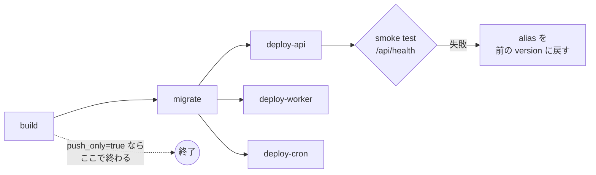

# step8-ci-deploy-min

minimal 環境へのデプロイ workflow（`.github/workflows/deploy-aws-min.yml`）を作り、初回デプロイと Lambda 上での動作確認を行う。prd の `deploy-aws-prd.yml` には手を入れない。

設計: [`../README.md`](../README.md#デプロイ) / [secret と環境変数の注入](../README.md#secret-と環境変数の注入)

前提: [step7-infra-env-min](./step7-infra-env-min.md)

## 対応内容

### workflow の全体



- `on: workflow_dispatch`、入力は `push_only`（boolean、既定 `false`）。初回だけ `true` で実行し、Lambda の作成に使うイメージを用意する
- `concurrency: { group: deploy-aws-min, cancel-in-progress: false }`（prd と同じく並列デプロイを禁止する）
- GitHub Environment は `min`（`AWS_ROLE_ARN` は step7 で登録した `github_actions_min` role）
- 環境ごとの値は prd の workflow と同じく先頭の `env:` に並べる

```yaml
env:
  AWS_REGION: ap-northeast-1
  PROJECT_NAME: project-template
  ENVIRONMENT: min

  ECR_API_REPO: project-template-api-server
  ECR_WORKER_REPO: project-template-worker
  ECR_MIGRATION_REPO: project-template-migration
  ECR_CRON_REPO: project-template-cron

  LAMBDA_API_FUNCTION: project-template-min-api
  LAMBDA_WORKER_FUNCTION: project-template-min-worker
  ECS_CLUSTER: project-template-min-cluster
  ECS_MIGRATION_TASK_DEF: project-template-min-migration
  ECS_CRON_TASK_DEF: project-template-min-cron
  ECS_SECURITY_GROUP_NAME: project-template-min-ecs
  PUBLIC_SUBNET_NAME_PREFIX: project-template-min-public

  APP_SECRET_NAME: /project-template-min/app
  API_URL: https://api.project-template.com # TODO: 実ドメインに変更してください
```

### build

prd の build job と同じく、4 つのイメージをコミット SHA（12 桁）のタグで push する。違いは 2 点。

- **`--provenance=false` を付ける。** buildx の既定の provenance は OCI image index になり、Lambda はこれを受け付けない
- `push_only=true` のときは api / worker に `initial` タグも付ける（`env/min` の `bootstrap_image_tag` の既定値。Lambda の作成時だけ使う）

```bash
IMAGE="${{ steps.ecr.outputs.registry }}/${{ env.ECR_API_REPO }}"
TAGS=(-t "${IMAGE}:${{ steps.meta.outputs.image_tag }}")
if [ "${{ inputs.push_only }}" = "true" ]; then
  TAGS+=(-t "${IMAGE}:initial")
fi
docker buildx build \
  --platform linux/amd64 \
  --provenance=false \
  -f apps/api/Dockerfile \
  "${TAGS[@]}" \
  --push \
  .
```

後続の job はすべて `if: ${{ !inputs.push_only }}` を付ける。

### migrate

prd の migrate job をそのまま使い、ネットワークだけ変える。

- subnet は `PUBLIC_SUBNET_NAME_PREFIX` で解決する（minimal の VPC には public subnet しか無い）
- `run-task` の `assignPublicIp=ENABLED`（NAT が無いので、public IP で ECR / Secrets Manager / PlanetScale に出る）

### deploy-api / deploy-worker

Lambda ごとに「環境変数の設定 → 新しいイメージで version を発行 → alias `live` を切り替え」を行う。2 つの job は同じ手順で、関数名・secret のキー・固定値だけが違う。

**secret から渡すキー**は、ECS の `secret_keys`（`env/prd/main.tf`）と同じく関数ごとに絞る。

| 関数 | secret から渡すキー |
| --- | --- |
| api | `DATABASE_URL` / `FRONTEND_URL` / `GOOGLE_CLIENT_ID` / `GOOGLE_CLIENT_SECRET` / `JWT_ACCESS_EXPIRATION` / `JWT_ACCESS_SECRET` / `JWT_REFRESH_EXPIRATION` / `JWT_REFRESH_SECRET` / `NODE_ENV` / `PORT` |
| worker | `DATABASE_URL` / `DATA_WAREHOUSE_DATABASE` / `DATA_WAREHOUSE_PASSWORD` / `DATA_WAREHOUSE_URL` / `DATA_WAREHOUSE_USER` / `NODE_ENV` |

**固定値**（minimal で実装を切り替える値。workflow に直書きする）:

| 関数 | 固定値 |
| --- | --- |
| api | `QUEUE_TYPE=sqs` / `REFRESH_TOKEN_STORE=database` / `FLUSH_EVENTS_BEFORE_RESPONSE=true` / `SQS_QUEUE_URL_PREFIX` / `AWS_LWA_PORT=8080` / `AWS_LWA_READINESS_CHECK_PATH=/api/health` |
| worker | `QUEUE_TYPE=sqs` / `SQS_QUEUE_URL_PREFIX` / `DATA_WAREHOUSE_TYPE=clickhouse` / `PORT=8080` / `AWS_LWA_PORT=8080` / `AWS_LWA_READINESS_CHECK_PATH=/healthz` / `AWS_LWA_PASS_THROUGH_PATH=/events` |

`SQS_QUEUE_URL_PREFIX` は命名規則から組み立てる（prd の workflow が VPC をタグから引くのと同じく、Terraform の output に依存しない）。

```bash
ACCOUNT_ID=$(aws sts get-caller-identity --query Account --output text)
SQS_QUEUE_URL_PREFIX="https://sqs.${AWS_REGION}.amazonaws.com/${ACCOUNT_ID}/${PROJECT_NAME}-${ENVIRONMENT}-"
```

**デプロイの手順**（api の例。worker も同じ）:

```bash
set -euo pipefail

# 1. secret のうち、この関数が使うキーだけを取り出し、固定値と合成する
SECRET_JSON=$(aws secretsmanager get-secret-value \
  --secret-id "${APP_SECRET_NAME}" --query SecretString --output text)
ENV_JSON=$(jq -n \
  --argjson secret "${SECRET_JSON}" \
  --argjson keys "${SECRET_KEYS_JSON}" \
  --argjson fixed "${FIXED_ENV_JSON}" \
  '{ Variables: (($secret | with_entries(select(.key as $k | $keys | index($k)))) + $fixed) }')

# secret に無いキーがあれば止める（ECS の valueFrom と同じく、欠けたまま起動させない）
MISSING=$(jq -rn --argjson secret "${SECRET_JSON}" --argjson keys "${SECRET_KEYS_JSON}" \
  '$keys - ($secret | keys) | join(",")')
if [ -n "${MISSING}" ]; then
  echo "::error::missing keys in ${APP_SECRET_NAME}: ${MISSING}"
  exit 1
fi

# 2. 環境変数を設定する（$LATEST に対する変更。次の publish で version に固定される）
aws lambda update-function-configuration \
  --function-name "${FUNCTION}" --environment "${ENV_JSON}" > /dev/null
aws lambda wait function-updated-v2 --function-name "${FUNCTION}"

# 3. 新しいイメージで version を発行する
VERSION=$(aws lambda update-function-code \
  --function-name "${FUNCTION}" --image-uri "${IMAGE}" --publish \
  --query Version --output text)
aws lambda wait published-version-active --function-name "${FUNCTION}" --qualifier "${VERSION}"

# 4. alias live を切り替える。切り戻し用に前の version を残す
PREVIOUS=$(aws lambda get-alias \
  --function-name "${FUNCTION}" --name live --query FunctionVersion --output text)
aws lambda update-alias \
  --function-name "${FUNCTION}" --name live --function-version "${VERSION}" > /dev/null

echo "previous_version=${PREVIOUS}" >> "$GITHUB_OUTPUT"
{
  echo "### ${FUNCTION}: version ${PREVIOUS} → ${VERSION}"
  echo "切り戻し: \`aws lambda update-alias --function-name ${FUNCTION} --name live --function-version ${PREVIOUS}\`"
} >> "$GITHUB_STEP_SUMMARY"
```

`ENV_JSON` には secret の値が入るので、`echo` やログに出さない。

初回デプロイの `PREVIOUS` は Terraform が作成時に発行した version（`initial` イメージで、環境変数が無い）なので、切り戻し先としては使えない。2 回目以降のデプロイから切り戻しが意味を持つ。

**smoke test と自動の切り戻し**（deploy-api のみ）: alias の切り替え後に `${API_URL}/api/health/ready` を叩き、`200` 以外なら alias を `PREVIOUS` に戻して job を失敗させる。prd の Blue/Green + 承認ゲートの代わりに、最低限「壊れたまま公開し続けない」ことを保証する。

```bash
if ! curl -fsS --retry 3 --retry-delay 5 --retry-all-errors "${API_URL}/api/health/ready"; then
  echo "::error::smoke test failed, rolling back to version ${PREVIOUS}"
  aws lambda update-alias \
    --function-name "${FUNCTION}" --name live --function-version "${PREVIOUS}" > /dev/null
  exit 1
fi
```

### deploy-cron

prd の deploy-cron job と同じ（task definition の image を差し替えて register するだけ。EventBridge Scheduler は最新の revision を起動する）。

### 初回デプロイの手順

Lambda は作成時にイメージが必要なので、次の順で行う。

1. step7 の `account/` をローカルから apply し、GitHub の Environment `min` を作って `AWS_ROLE_ARN` を登録する
2. PlanetScale のデータベースを作る（step7）
3. `deploy-aws-min.yml` を `push_only: true` で実行する（SHA と `initial` のタグでイメージが push される）
4. `terraform-aws-env-apply.yml` を `environment: min` で実行する（または `cd infra/terraform/aws/env/min && terraform apply`）。ACM の DNS 検証が終わるまで数分かかる
5. secret を投入する

    ```bash
    EXTERNAL_DATABASE_URL='postgresql://<user>:<password>@<host>:6432/<db>?sslmode=verify-full' \
    GOOGLE_CLIENT_ID=... GOOGLE_CLIENT_SECRET=... \
    FRONTEND_URL=https://<web のドメイン> \
      ./scripts/seed-secrets.sh min
    ```

6. `deploy-aws-min.yml` を通常（`push_only: false`）で実行する。migrate → api / worker / cron の順にデプロイされる

## 動作確認

minimal 環境にデプロイした状態で、Lambda 上でしか確認できない項目を確かめる。結果は PR 本文に残す。

### api

- [ ] `curl https://api.<domain>/api/health` が `200`
- [ ] `curl https://api.<domain>/api/health/ready` が `200` で、`services` に `redis` が無い
- [ ] Google ログイン → `POST /api/auth/refresh` → `POST /api/auth/logout` が成功し、PlanetScale の `refresh_tokens` の行が増減する
- [ ] メモの作成・更新・削除が成功する
- [ ] API Gateway の execute-api の URL（`https://<api-id>.execute-api...`）では呼べない（`disable_execute_api_endpoint`）

### コールドスタートと凍結

- [ ] 30 分以上アクセスしなかった後の初回リクエストが成功し、応答時間が 3 秒以内（[リスク](../README.md#リスクと実装時の確認事項)の「切れた DB 接続」の確認を兼ねる）
- [ ] メモを 10 回作成した直後にアクセスを止め、30 分後に SQS の `NumberOfMessagesSent`（CloudWatch）が 10 になっている（flush middleware により、凍結の前に送り切れている）

### worker

- [ ] メモ作成のイベントが worker の Lambda で処理され、ログに `track-event: inserted`（ClickHouse が dummy の間は insert 失敗のログ）が出る
- [ ] `aws sqs send-message` で `process-memo` に壊れた body（`not-json`）と正常な body（`{"memoId":<存在する id>}`）を送ると、正常な方は 1 回で処理され、壊れた方だけが 3 回受信された後に DLQ に移る（3 回目だけ `job failed permanently` の error ログになる）
- [ ] 処理後、本体の queue の `ApproximateNumberOfMessagesVisible` / `NotVisible` が 0 になる

### cron / migration

- [ ] migrate job が exit 0 で終わり、PlanetScale に `drizzle.__drizzle_migrations` と全テーブルがある
- [ ] cron のスケジュールを手動で起動（`aws ecs run-task` に `assignPublicIp=ENABLED`）し、exit 0 で終わる

### デプロイと切り戻し

- [ ] 2 回目のデプロイで alias `live` の version が 1 つ進み、Step Summary に切り戻しのコマンドが出る
- [ ] Step Summary のコマンドで前の version に戻せ、戻した後も api が `200` を返す
- [ ] `API_URL` をわざと誤った値にして実行すると、smoke test が失敗して alias が前の version に戻る（確認後に値を戻す）

### コスト

- [ ] デプロイから数日後、Cost Explorer をタグ `Environment = min` で絞り込み、1 日あたりの費用が想定（月 ~$2 = 1 日 ~$0.07。PlanetScale の $5 は AWS の外）に収まっている
- [ ] 想定を超えていたら、内訳（API Gateway / Lambda / CloudWatch Logs）を `../README.md` の「コスト目標」に追記する
