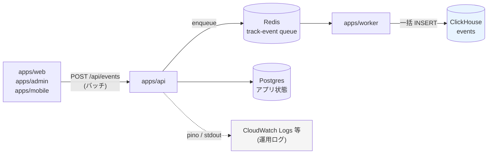
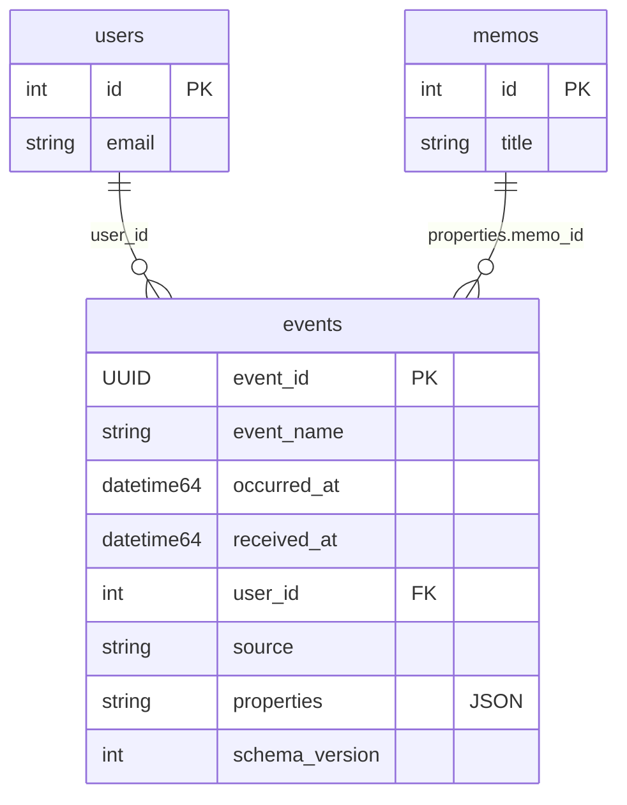
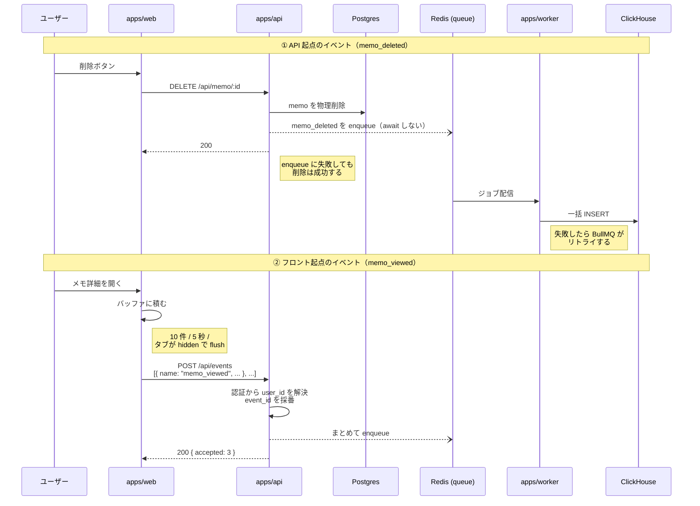

# ユーザー行動イベント基盤

ユーザーが「何をしたか」を時系列のイベントとして記録し、ClickHouse に蓄積してプロダクト分析に使えるようにする。

アプリケーション DB（Postgres）は **現在の状態** しか持たないため、「削除されたメモ」「閲覧されただけで書き込みが発生しなかった操作」「途中で離脱して行が作られなかった操作」は原理的に復元できない。これらは **記録していなければ永久に失われる** 一方、DB に残っている状態はいつでも後から取り込み直せる。この非対称性から、行動イベントの送出を先に用意する。

このドキュメントは **仕様（What）** と **設計（How）** を分けて記述する。

- **仕様**：どのイベントを、どの情報とともに記録するか
- **設計**：送出経路・保存先・欠落許容などの技術的な選択

## 関連 spec

- [`../dev-login/README.md`](../dev-login/README.md) — 開発環境ログイン。イベントに載せる `user_id` はこの認証を経たユーザー ID を使う
- [`./deferred-event-delivery.md`](./deferred-event-delivery.md) — MVP 対象外。ログ経由の配送・匿名ユーザー追跡・DB レプリケーション

## 目次

- [仕様](#仕様)
  - [記録するイベント](#記録するイベント)
  - [すべてのイベントが持つ共通項目](#すべてのイベントが持つ共通項目)
  - [記録しないもの](#記録しないもの)
  - [欠落の扱い](#欠落の扱い)
- [設計](#設計)
  - [全体構成](#全体構成)
  - [フロントは ClickHouse に直接書かない](#フロントは-clickhouse-に直接書かない)
  - [パッケージ構成](#パッケージ構成)
  - [配送経路](#配送経路)
  - [フロントのバッチ送信](#フロントのバッチ送信)
  - [ローカル環境](#ローカル環境)
  - [MVP 対象外（将来検討）](#mvp-対象外将来検討)
- [必要な画面](#必要な画面)
- [必要な API](#必要な-api)
- [必要な DB 設計](#必要な-db-設計)
- [フロー図](#フロー図)

---

## 仕様

### 記録するイベント

テンプレートの見本として memo の全操作を網羅する。実プロジェクトではここに自分のドメインのイベントを足していく。

| イベント名 | 送出元 | 固有プロパティ | DB から復元できるか |
| --- | --- | --- | --- |
| `memo_created` | API | `memo_id` | ✅ できる（`Memo` 行が残る） |
| `memo_viewed` | web | `memo_id` | ❌ **できない**（読み取りは書き込みを伴わない） |
| `memo_updated` | API | `memo_id` | △ 最新状態のみ。更新回数と履歴は残らない |
| `memo_deleted` | API | `memo_id` | ❌ **できない**（物理削除で行ごと消える） |

`memo_created` / `memo_updated` は DB からでも概ね復元できるため分析上の必須度は低いが、**利用側がイベント定義を追加するときの見本**として一式そろえる。

### すべてのイベントが持つ共通項目

| 項目 | 型 | 説明 |
| --- | --- | --- |
| `event_id` | UUID | 送出側で採番。再送時の重複排除に使う |
| `event_name` | string | `memo_viewed` などのイベント種別 |
| `occurred_at` | datetime(ms) | **イベントが起きた時刻**。送出側の時計 |
| `received_at` | datetime(ms) | サーバーが受け取った時刻。遅延や時計ずれの調査に使う |
| `user_id` | number | 実行したユーザー。**ログイン済みであることが前提** |
| `source` | enum | `api` / `web` / `admin` / `mobile` |
| `properties` | JSON | イベント固有の値（`memo_id` など） |
| `schema_version` | number | イベント定義の版。破壊的変更時に上げる |

### 記録しないもの

- **運用ログ**（pino が出している `API Request Received` / 例外など）。用途・保持期間・クエリの形がすべて異なるため別系統にする（→ [設計](#全体構成)）
- **個人を特定する値**（メールアドレス・氏名・メモ本文）。`user_id` で join できれば足りる
- **未ログインユーザーの行動**。匿名 ID を発行しない方針のため（→ [MVP 対象外](#mvp-対象外将来検討)）

### 欠落の扱い

**ユーザーのリクエストはイベント送出の失敗で失敗させない。** ClickHouse が落ちていてもメモの削除は成功する。

ただし **イベント自体は可能な限り落とさない**。Queue を挟んでリトライさせる（→ [配送経路](#配送経路)）。

行動イベントは請求や監査には使わないため厳密な exactly-once までは求めない。しかし **欠落が「デプロイ時」「障害時」に偏るのは避ける**。最もデータが欲しい瞬間に限って記録が消えると、分析結果そのものが歪むため。

---

## 設計

### 全体構成



運用ログ（点線）は ClickHouse に載せない。障害調査用で保持期間が短く、量が行動イベントの数十倍あるため、混ぜると分析基盤のコストが跳ね上がりスキーマが汚れる。

### フロントは ClickHouse に直接書かない

web / admin / mobile は **DB を直接触らず必ず API を経由する** という既存の設計不変条件（`@repo/eslint-config/frontend-boundary` が lint で強制）をイベントでも守る。

- フロントから ClickHouse に直接書くと、接続情報がクライアントバンドルに載る
- フロントは `@repo/api-schema` 以外の `@repo/*` を import できないため、イベント定義も API スキーマ側に置く必要がある

したがってフロントのイベントは `POST /api/events` に送り、API が ClickHouse へ書く。

### パッケージ構成

| パッケージ | 役割 | フロントから import 可 |
| --- | --- | --- |
| `@repo/data-warehouse` | `DataWarehouse` interface + ClickHouse 実装 + `createDataWarehouse` factory（`@repo/storage` と同じ流儀） | ❌ |
| `@repo/events` | イベント名の定義と `EventTracker` 抽象、Queue 実装 | ❌ |
| `@repo/queue` | `track-event` queue の名前と Job 型（既存パッケージに追加） | ❌ |
| `@repo/api-schema` | `POST /api/events` のリクエストスキーマ（フロントが使う） | ✅ |

`@repo/data-warehouse` を技術名ではなく役割名にしている理由は 3 つ。

1. **テストで ClickHouse を立てずに済む**（fake の `DataWarehouse` を渡せば worker の Repository をユニットテストできる）
2. **技術名を `apps/worker/src/index.ts` の 1 箇所に封じ込められる**（`apps/worker` の他のコードは ClickHouse を知らない）
3. ClickHouse Cloud / Tinybird のような **同じ SQL 方言のマネージドサービスへの乗り換えが容易になる**

interface は `insertAll` / `close` だけに絞る。クエリ・DDL・マイグレーションはバックエンドごとに差が大きく、汎用化すると必ず漏れるため。

なお **BigQuery のような別方言への移行はこの抽象化ではほとんど楽にならない**（吸収できるのは書き込み経路だけで、移行コストの大半はクエリとダッシュボードの作り直し）。詳細は [`deferred-event-delivery.md`](./deferred-event-delivery.md)。

`EventTracker` を interface にしているのは、**送出の transport を後から差し替えられるようにするため**。MVP の実装は Queue に enqueue するだけで、ClickHouse への書き込みは `apps/worker` が持つ。将来ログ経由に切り替える場合も service 層のコードは変わらない（→ [`deferred-event-delivery.md`](./deferred-event-delivery.md)）。テストでは fake に差し替え、Redis も ClickHouse も無しで service をテストする。

### 配送経路

**API から ClickHouse へ直接書かず、`@repo/queue` に enqueue して `apps/worker` が書く。**

```
service → EventTracker.track() → Redis (track-event queue) → worker → ClickHouse
```

API から直接書く（fire-and-forget）案も検討したが採用しなかった。直接書くとプロセス再起動でバッファが失われるため、**デプロイ時と障害時に集中してイベントが落ちる**。最もデータが欲しい瞬間に偏って欠けるのは分析用途として質が悪い。

Queue を挟む判断が成り立つ根拠:

- **Redis は新しい依存ではない。** `apps/api` は refresh token とヘルスチェックで既に `@repo/redis` を使っている
- **worker はローカルでも動いている。** `pnpm dev` は `turbo run dev` なので worker の `dev` script も起動する
- **BullMQ のリトライが効く。** ClickHouse の一時的な障害を吸収できる

代わりに払うコスト:

- 調査の経路が増える（api → Redis → worker → ClickHouse）。イベントが届かないときは queue の滞留量を先に見る
- **BullMQ は at-least-once なので重複しうる。** `event_id` を送出側で採番し、ClickHouse 側は `ReplacingMergeTree` で吸収する

worker は queue から取り出したイベントを **まとめて 1 回の INSERT にする**。ClickHouse は小さな INSERT を大量に受けるとマージ負荷で劣化するため。

### フロントのバッチ送信

フロントのイベント（`memo_viewed` など）を 1 件ずつ送ると 1 セッションで数十回 API を叩き、その都度認証を通ることになる。**クライアント側でバッファリングしてまとめて送る。**

| flush する条件 | 理由 |
| --- | --- |
| バッファが 10 件に達した | 上限を設けないと離脱時にまとめて失う |
| 前回の flush から 5 秒経過 | 操作が止まっても滞留させない |
| `visibilitychange` で hidden になった | タブを閉じる・バックグラウンドへ回る瞬間を捕まえる |

離脱時は通常の `fetch` が中断されうるため `sendBeacon`（または `fetch` の `keepalive: true`）を使う。

`POST /api/events` が配列を受け取る仕様にしているのはこのため。1 セッションあたりのリクエストが数十回から数回に減る。

### ローカル環境

`docker-compose.yaml` に ClickHouse を追加する。既存の postgres / redis と同じく **既定ポートをずらす**（他プロジェクトとの衝突を避けるため）。

| サービス | コンテナ内 | ホスト側（既定） | env |
| --- | --- | --- | --- |
| ClickHouse HTTP | 8123 | **8124** | `CLICKHOUSE_HTTP_PORT` |
| ClickHouse native | 9000 | **9003** | `CLICKHOUSE_NATIVE_PORT` |

### MVP 対象外（将来検討）

詳細は [`deferred-event-delivery.md`](./deferred-event-delivery.md)。

- **ログ経由の配送**（`logger` → Vector 等 → ClickHouse）。多言語化や serverless 化で常駐 worker が使えなくなったとき
- **匿名ユーザーの追跡**（`anonymous_id`）。獲得ファネルを分析したくなったとき
- **DB 状態のレプリケーション**（Postgres → ClickHouse）。DB にある状態はいつでも取り込めるため後回し
- **admin への分析画面**

---

## 必要な画面

**なし。** 本機能は画面を追加しない。web は既存のメモ詳細画面から `memo_viewed` を送出するだけで、表示内容は変わらない。

## 必要な API

| メソッド | パス | 用途 | 認証 |
| --- | --- | --- | --- |
| `POST` | `/api/events` | フロント（web / admin / mobile）からのイベント受信 | 必要（`user_id` を server 側で解決する） |

- リクエストボディは **イベントの配列**（画面遷移で複数たまることがあるため）
- `user_id` は **リクエストボディから受け取らない**。認証済みユーザーから server 側で解決する（クライアントが他人の ID を詐称できないようにするため）
- `received_at` も server 側で付与する
- レスポンスは受理件数のみ。**イベントの内容が不正でも 4xx にせず、壊れたものだけ捨てて 200 を返す**（分析のためにユーザー体験を壊さない）

## 必要な DB 設計

**Postgres（Prisma）のスキーマ変更はない。** イベントは ClickHouse 側にのみ保存する。



ClickHouse のテーブル定義:

| カラム | 型 | 備考 |
| --- | --- | --- |
| `event_id` | `UUID` | **送出側で採番**し、`ReplacingMergeTree` の重複排除キーにする |
| `event_name` | `LowCardinality(String)` | 種別が少ないので辞書圧縮が効く |
| `occurred_at` | `DateTime64(3)` | **ソートキーに含める** |
| `received_at` | `DateTime64(3)` | |
| `user_id` | `UInt64` | |
| `source` | `LowCardinality(String)` | `api` / `web` / `admin` / `mobile` |
| `properties` | `String` | JSON 文字列。よく使う値は後から MATERIALIZED カラムに昇格させる |
| `schema_version` | `UInt16` | |

- エンジン: **`ReplacingMergeTree`** — BullMQ が at-least-once なので同じイベントが 2 回届きうる。`ORDER BY` 末尾の `event_id` で重複を畳む
- `PARTITION BY toYYYYMM(occurred_at)` — 月単位で TTL 削除できるようにする
- `ORDER BY (event_name, occurred_at, user_id, event_id)` — 「特定イベントを期間で絞る」が最頻クエリのため
- `TTL occurred_at + INTERVAL 2 YEAR`

`properties` を JSON 型ではなく `String` にしているのは、ClickHouse の JSON 型がバージョン依存で扱いが変わるため。分析で多用する値が固まった時点で MATERIALIZED カラムを足す方が安全。

## フロー図


