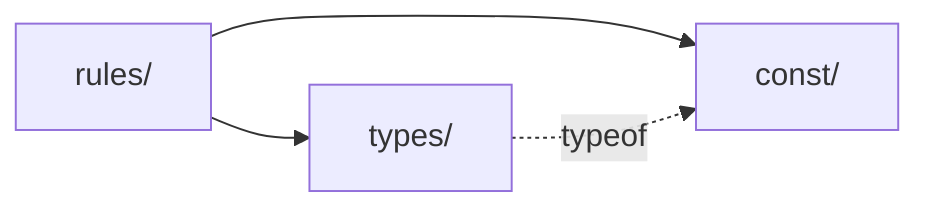

# @repo/domain

バックエンド側が共有する **ドメイン** を置くパッケージ。フロントエンド からは import しない（[フロントからは使わない](#フロントからは使わない)）。

## 目次

- [なぜ共有するのか](#なぜ共有するのか)
- [domain型の変換](#domain型の変換)
- [値の集合は domain が SSOT](#値の集合は-domain-が-ssot)
- [フロントからは使わない](#フロントからは使わない)
- [置くもの / 置かないもの](#置くもの--置かないもの)
- [ディレクトリ構成](#ディレクトリ構成)
- [DB の取得結果が絡むルール](#db-の取得結果が絡むルール)
- [app 固有の絞り込み](#app-固有の絞り込み)
- [使い方](#使い方)

## なぜ共有するのか

`apps/api` / `apps/cron` / `apps/worker` などの各バックエンドで同じDBのテーブルを触る可能性がある。そのためdomain 型を app ごとに複製しても独立性は得られず、片方だけ更新される drift のリスクだけが増える。

## domain型の変換
Repository 実装が「DB row → domain」を変換し、Controller が「domain → API 契約」を変換する。

| 層 | 定義場所 | 例（`Memo.createdAt`） |
| --- | --- | --- |
| DB row | `packages/db/generated/`（Prisma が生成） | `createdAt: Date`（列は `created_at`） |
| **domain** | **`packages/domain`（このパッケージ）** | `createdAt: Date` |
| API 契約 | `packages/schema/src/api-schema/` | `created_at: string`（JSON 直列化 + snake_case） |

## 値の集合は domain が SSOT

会員種別のような enum 的な値の集合は domain にだけ定義し、DB と API 契約はそれを参照する。オブジェクト型（`Memo` など）は層ごとに形が違うため層ごとに定義するが、文字列の集合はどの層でも同じ値なので 1 か所に寄せられる。

会員種別のサンプル（値・型・ルールを `const/` / `types/` / `rules/` に分ける。詳細は[ディレクトリ構成](#ディレクトリ構成)）:

```typescript
/** src/const/membership-tier.ts ── 値だけを持つ */
export const MEMBERSHIP_TIERS = ["bronze", "silver", "gold"] as const

/** src/types/membership-tier.ts ── 型は定数から導出する（値を書き写さない） */
export type MembershipTier = (typeof MEMBERSHIP_TIERS)[number]

/** src/rules/membership-tier.ts ── 検証用の type guard */
export const isMembershipTier = (value: string): value is MembershipTier =>
  (MEMBERSHIP_TIERS as readonly string[]).includes(value)

/** src/rules/memo.ts ── 業務ルール */
export const canShareMemo = (tier: MembershipTier): boolean => tier === "silver" || tier === "gold"
```

| 参照する側 | 参照方法 |
| --- | --- |
| API 契約（`@repo/api-schema`） | `z.enum(MEMBERSHIP_TIERS)` のように domain の定数から作る。値を直接書かない |
| DB（`packages/db`） | Prisma の `enum` は使わず `String` 列にする（`schema.prisma` は TS の定数を参照できないため）。Repository の `_toDomain()` で `isMembershipTier` により検証してから domain 型に変換する |
| フロント | domain は import せず、api-schema のスキーマから取る（例: 選択肢一覧は `membershipTierSchema.options`） |

- TS の `enum` ではなく `as const` の配列 + union 型で定義する（`z.enum` にそのまま渡せる）
- DB 側では値を保証していないため、Repository は未知の値を `as` でキャストせずエラーにする
- **domain に値を足すと API 契約も変わる。** 値の追加は API 契約の変更としてレビューする（ストア配布済みの古い mobile アプリは新しい値に追従できない）

## フロントからは使わない

web / admin / mobile は DB を直接触らず、必ず Express API からデータを受け取る。フロントの手元に届くのは API 契約の形（`created_at: string`）であって domain 型（`createdAt: Date`）ではないため、domain 型で型付けすると実際のデータと食い違う。フロントが使う型は `@repo/api-schema` 側になる。

この制限は `@repo/eslint-config/frontend-boundary` が lint で強制している（フロントに許可する `@repo/*` は `@repo/api-schema` のみ）。

domain の純粋関数や定数がフロントで必要になった場合も、domain を import せずに次のように対応する。

- 純粋関数（例: `canShareMemo`）の結果: API が計算結果をレスポンスに含める（例: `can_share_memo: boolean`）。ルールが server 側の 1 か所に閉じる
- 値の集合（例: 選択肢一覧）: api-schema のスキーマから取る。api-schema は domain の定数から作られているので値はずれない

## 置くもの / 置かないもの

| 置く | 置かない |
| --- | --- |
| ドメイン型（`Memo` / `User` / `AuthAccount`） | ❌ Repository interface |
| ドメインの不変条件を表す純粋関数（例: `canShareMemo(tier)`） | ❌ Prisma の型 / `PrismaClient` |
| ドメインエラー | ❌ logger / env / I/O / 外部通信 |
| 値の集合を表す定数（例: `MEMBERSHIP_TIERS`） | ❌ Node 専用 API（`fs` / `Buffer` など） |

**Repository interface を置いてはいけない。** 必要な操作は app ごとに異なる（api は CRUD 5 メソッド / cron は `deleteOlderThan` のみ / worker は `findById` のみ）ため、共有 interface を作ると不要なメソッドが各 app に漏れ出す。interface は各 app の `src/repository/` に残す。

**依存ゼロを保つ。** `dependencies` は空のまま維持する。型・定数・純粋関数だけなので runtime 依存は不要で、これが「api / cron / worker のどこからでも安全に import できる」根拠になる。

**ブラウザ / React Native でも動くコードだけを書く。** api-schema が domain の定数を import するため、domain のコードは api-schema 経由でフロントのバンドルにも入る。Node 専用 API を使うとフロントのビルドや実行が壊れる。

## ディレクトリ構成

| 場所 | 置くもの | 例 |
| --- | --- | --- |
| `src/const/` | 値の集合を表す定数。値だけを持ち、型や関数は置かない | `membership-tier.ts`（`MEMBERSHIP_TIERS`） |
| `src/types/` | ドメイン型。**型だけ**を置き、実行時のコードを持たない | `membership-tier.ts`（`MembershipTier`） / `memo.ts` / `user.ts` |
| `src/rules/` | 純粋関数。業務ルールと type guard | `memo.ts`（`canShareMemo`） / `membership-tier.ts`（`isMembershipTier`） |
| `src/index.ts` | バレル。re-export はファイル名順に並べる | |



- 依存の向きは `rules/` → `types/` → `const/` の一方向。逆向きの import はしない
- **`const/` から作れる型は `types/` で導出する。** 値を型に書き写さない（`"bronze" | "silver" | "gold"` と手書きしない）。値を足せば型も自動で追従する
- `types/` の型が会員種別などを持つときは、導出済みの型を参照する（例: `user.ts` に `membershipTier: MembershipTier` を足す）
- 利用側は必ず `@repo/domain` から import し、`@repo/domain/dist/...` のようにファイルを直接参照しない

## DB の取得結果が絡むルール

**取得は各 app の service、判定は `rules/`** に分ける。rules は取得済みの値を引数で受け取る純粋関数にし、Repository は受け取らない。

例: 「ブロンズは月 10 件までメモを作成できる」

```typescript
/** packages/domain/src/rules/memo.ts ── 判定だけ。件数は引数で受け取る */
export const canCreateMemo = (tier: MembershipTier, monthlyMemoCount: number): boolean =>
  tier !== "bronze" || monthlyMemoCount < BRONZE_MONTHLY_MEMO_LIMIT

/** apps/api/src/service/memo-service.ts ── 取得して rules を呼ぶ */
const monthlyMemoCount = await repo.memoRepository.countCreatedSince(userId, startOfMonth)
if (!canCreateMemo(user.membershipTier, monthlyMemoCount)) {
  return err(forbiddenError("Monthly memo limit exceeded"))
}
```

| やらないこと | 理由 |
| --- | --- |
| rules に Repository を渡す | domain が I/O を持ち、依存ゼロ・純粋関数の前提が崩れる。テストにモックが必要になる |
| 判定を Repository の中に書く | 業務ルールがクエリに埋もれて見えなくなる |

この分け方にすると、rules はモックなしの単体テストで境界値まで検証でき、service のテストは「取得して rules を呼んでいるか」だけを見ればよくなる。

### 例外

- **条件を DB の WHERE で評価する必要がある場合**（例: 共有できるメモの一覧）: 全件を取得してメモリ上で絞り込むわけにはいかない。条件の値を `const/` に置き（例: `MEMO_SHAREABLE_TIERS`）、rules の関数と Repository のクエリ（`where: { user: { membershipTier: { in: MEMO_SHAREABLE_TIERS } } }`）の両方がそれを参照する。ルールを 2 か所に書き写さない
- **判定から書き込みまでの間に競合しうる場合**（上限チェックの後、作成前に別のリクエストが作成するなど）: 判定は rules で行うが、正しさはトランザクション / ロック / ユニーク制約で保証する。これは service と Repository の責務

## app 固有の絞り込み

app が一部のフィールドしか使わない場合は、共有型から派生させる。

```typescript
import type { Memo } from "@repo/domain"

/** 一覧表示では id と title しか使わない */
export type MemoSummary = Pick<Memo, "id" | "title">
```

## 使い方

```typescript
import type { Memo, MembershipTier, User } from "@repo/domain"
import { canShareMemo, isMembershipTier, MEMBERSHIP_TIERS } from "@repo/domain"
```
